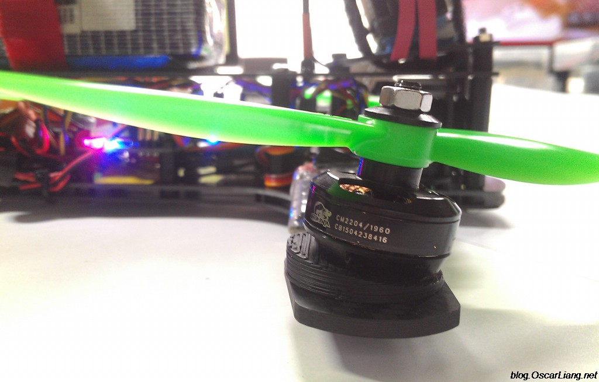

FPV evolves at a pace that leaves ideas by the roadside. Every few months someone proposes a new way to build a quad: cleaner wiring, less weight, better vibration isolation, easier repairs or more integration. Some proposals become the standard and others vanish quietly. And vanishing does not always mean they were bad: in many cases the technology simply took another path, another solution turned out cheaper or simpler, and in some cases the idea arrived a few years early. The retrospective by Oscar Liang gathers seven of those concepts that never caught on, and reading it today helps explain why current drones are built in such a different way.

## FPV mounts left behind: canted motors and vibration isolation

Canted motors were one of the first experiments of the golden age of racing FPV, around 2014 and 2015. Instead of mounting the four motors flat on the arms, wedges were placed underneath to tilt them forward. The logic was sound: when a quadcopter flies fast it has to pitch its whole body forward, which is why racing drones need such extreme camera angles —up to 50° or 60°— to see the horizon at full speed. By tilting the motors, the aircraft generates forward thrust without pitching as far, and the airframe can stay more level and reduce air resistance. They were a genuinely popular accessory for a couple of seasons.

Why did they disappear? Mainly because the extra hardware, weight and complexity were not worth it. Racing frames became lighter and more aerodynamic, and pilots simply got used to flying with an aggressive camera tilt.

Years later came motor soft mounting, around 2017. With more powerful motors, higher gyro sampling rates and more aggressive PID loop times, vibration and gyro noise became a serious problem. The proposed solution was to physically isolate the motors from the frame with rubber, TPU, foam or another damping material. The idea made sense: if the vibration is born in the motor, cut it before it enters the frame. But it introduced other problems. Motor screws could loosen, because the isolation only works if you do not tighten them all the way; the mounts added weight and complexity, and damping the motor itself was not always necessary.

What really ended the trend was integration: flight controller makers began mounting the gyro on soft mounts and, over time, isolating the whole board with rubber grommets. On top of that, software filtering in Betaflight improved enormously.

## Custom boards and ESCs: when wiring was the enemy

There was a time when only a handful of FPV frames were truly popular, and manufacturers began making PCBs shaped exactly like their bottom plate so all the electronics could be soldered directly onto them. The best-remembered case is the ZMR250, a clone of the iconic Blackout Mini H that, being much cheaper and more accessible, became one of the best-selling frames of its day. The idea was to replace the bottom plate with a frame-shaped PDB and solder onto it the flight controller, the BEC, the ESCs, the XT60 battery lead, the camera, the OSD, the VTX, the receiver and the buzzer. Seen at the time, it looked like the future: builds came out spotless because much of the wiring disappeared.

The problem was compatibility. Those PDBs only existed for a handful of specific frames, so they limited your choice of airframe. Today there are more frames than anyone can count and the formula is no longer practical. On top of that, flight controllers and ESCs became increasingly integrated: a modern FC includes a BEC, a current sensor and an OSD, and 4-in-1 ESCs also handle power distribution, so a separate PDB is barely needed anymore.

The modular 4-in-1 ESC fits the same logic. The Xracer Quadrant 25A was perhaps the first attempt —and the last— to combine the flexibility of individual ESCs with the convenience of a 4-in-1: they were standalone ESCs that could be assembled four at a time. On paper it offered the best of both worlds: individual ESCs for an unusual aircraft, four soldered under the flight controller for a stack build, and the ability to replace a single module instead of throwing away a whole 4-in-1 board if one burned out. The reason for its disappearance was prosaic: conventional 4-in-1 ESCs became very affordable, reliable and compact. They won out, and individual ESCs, once the standard, are now a niche option.

## Cameras and stacks that arrived ahead of their time

Before digital FPV became widespread, pilots were stuck in a trade-off: either low latency in the video feed, or high-quality recording. Action cameras recorded excellent footage, but had too much latency to use as a flight feed. Some manufacturers responded by putting two sensors in the same module: one for the low-latency analogue feed and another to record 1080p or even 4K to a card. The RunCam Hybrid, in 2019, was one of the best-known implementations. What wiped it off the map was digital FPV: systems like the DJI O4 Pro deliver the flight feed and record at high resolution onboard, and those who demand the best possible image still carry a dedicated camera, such as the DJI Action 6.

The other clear example of an idea ahead of its time is the 3D FPV camera. Instead of a single camera, two were mounted some distance apart to mimic human eyes, and the system sent stereoscopic video to compatible VR goggles so you perceived depth instead of a flat image. It worked. For flying close to obstacles, the sense of depth sounds ideal, because it lets you judge the distance to a branch more naturally. But the whole system became more complex: two cameras, specific video processing, transmission and compatible goggles. It added cost, weight and complications to solve something the brain already estimates surprisingly well through motion, perspective and experience. Meanwhile, conventional FPV improved in resolution, field of view and latency. 3D never fully disappeared as an experiment, but nor was it the revolution people imagined.

The last one on the list is the modular flight controller stack. In 2016, Chickadee proposed an ecosystem where you started with the FC and stacked boards, or "mods", depending on what you needed: a microSD card module for blackbox storage, another for the specific receiver, a breakout to add serial connections. All the boards used high-density connectors and were plug and play, several could be chained in the same stack, and the project was open source. The philosophy was flawless: why replace a whole flight controller just to add one feature? The problem is that modularity costs money and takes up space: the FC was already relatively expensive and you still had to buy the modules, and anyone who needed many features ended up with a bulky stack. Right at that moment, ordinary flight controllers began including OSD, BEC, barometer, blackbox memory and several UARTs as standard on a single cheap board.

## Is it worth looking back?

The takeaway from the retrospective is that most of these initiatives were not bad ideas; they were attempts to solve real problems. What killed them was integration: instead of adding specialised hardware, the components that already existed learned to do more. It is the direction FPV repeats over and over: fewer boards, fewer wires, fewer connectors and more functions packed into each part.

At the same time, FPV has a habit of recycling old ideas. With ever more powerful electronics, it would not be surprising if some of these concepts returned in a completely different form. Sometimes a trend disappears because it was a dead end, and sometimes it simply arrived ten years too early. For the enthusiast, the practical reading is another one: understanding this history explains why a drone today is built with a single integrated flight controller and a 4-in-1 ESC, instead of the tangle of boards and wires from a decade ago. If you are interested in where that integration is heading, the [Antigravity A1 and its integrated 360 camera](/en/news/drones/antigravity-a1-360-drone/) are a good example of the next turn of the screw.
