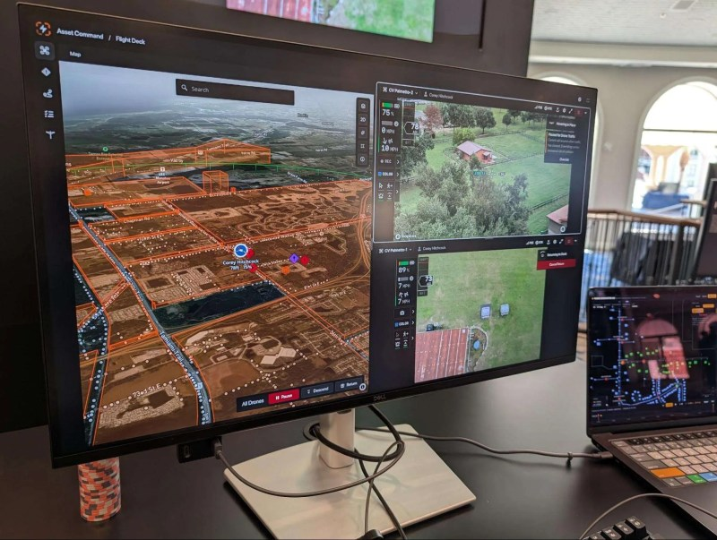
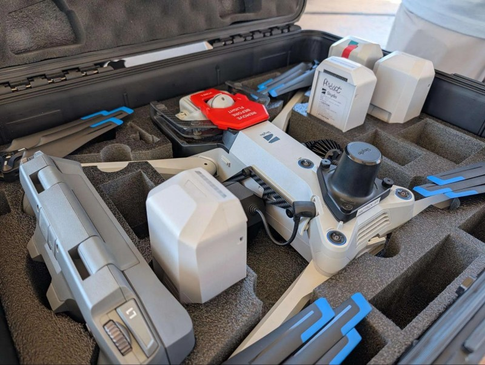

Skydio held its Ascend 2026 conference at the JW Marriott in Las Vegas in September, and the headline announcement was the F10 Lightrunner: an autonomous fixed-wing aircraft the company places at around 100 mph (160 km/h) and pairs with the MegaDock, a dock able to manage several aircraft. But the interest of the event was not only in the figure: Skydio turned the hotel itself into a live testbed, with R10 aircraft flying inside the rooms, live video feeds into different command centres and an outdoor station for the X10.

## The R10, built to go where a person cannot

The most striking demo moved tactical flight into several hotel rooms turned into training environments, with breached walls, broken window frames and narrow hallways. The R10 was flown through the cutouts in the drywall, crossed a simulated bedroom and reached inside a dark closet to inspect the corners, capturing photos and video live.

The aircraft carries strobe lights, night vision sensors and a perch mode that lets it set down on a surface or ledge to keep a steady watch without burning battery while hovering. Beyond law enforcement use and tactical entry units, the maker points to industrial applications where the value lies in not exposing people: toxic storage tanks, abandoned mines, confined passages or dangerous areas of a power plant.

## The X10, the Controller 2 and the modular attachments

Outside, on the terrace, the focus shifted to the X10, the larger aircraft, paired with the new Controller 2. The point that stood out most in the hands-on was the controller's screen: it stays readable in direct sunlight without a sun hood.

To measure flight precision, attendees took part in the so-called Dropper Challenge: an X10 fitted with the new Dropper accessory, loaded with an emergency water rescue flotation device, had to drop it into an inflatable pool. The platform also accepts a modular set of payloads: a high-output spotlight for night missions, a loudspeaker system for crowd control and negotiation, an emergency ballistic parachute, an RTK module for centimetre-accurate positioning and the NightSense payload for navigating in total darkness.

## Remote docks and fleet command: Skydio's DFR Command and Asset Command

The Drone as First Responder (DFR) station was presented as a real operations centre, not as the handling of a single controller. With DFR Command, an X10 was launched from an outdoor dock to investigate some coordinates; the aircraft reached the area and found an open door. Without stopping its flight to keep the overhead view of the entrance, an R10 sitting in another dock was activated remotely: it took off, crossed the open door and began clearing the interior rooms, with the video feeds from both drones and an integrated map shown at once.

At the Asset Command station, control crossed the country: from the Las Vegas hotel, the operator took over an X10 sitting in a dock at an active utility site in Florida. Skydio holds a system-wide BVLOS (beyond visual line of sight) waiver from the FAA, allowing it to fly remote missions without an on-site visual observer. The workflow is built on the infrastructure's GIS data: a company loads its mapping files and the system knows the location, height and count of every pole along the line. The operator selects the segment on the digital map, presses "Start" and the drone leaves the dock, visits each pole, lines up the shots and lands back on the dock. The cloud tags the media with the matching asset ID; in a storm-response drill, an autonomous patrol could be dispatched and archive photos compared side by side with the live feed to spot damaged insulators.

## What changes for anyone operating drones

The common thread across every demo was not a flight figure but the reduction of operational friction. The traditional workflow demands long checklists, compass calibration, waiting for satellite lock and careful manual flying; the mix of drones that fly themselves, automated docks and centralised software removes much of that work: you set down the dock, draw the boundaries on screen and the aircraft does the rest.

The argument fits organisations whose staff already have a full-time job — police, power companies, security — and need the drone to be one more tool, not another profession. The trade-off is the usual one in closed ecosystems: getting the most out of that integration means buying Skydio hardware, software and docks, something worth weighing against alternatives such as DJI before committing. For anyone already working with autonomy in defence and security, the detail of the [order for an autonomous warfare command in the US](/noticias/drones/comando-guerra-autonoma-hegseth/) points the same way: fewer operators, more system. The relevant question is no longer what flies, but what it costs per operation and what falls outside the ecosystem.
