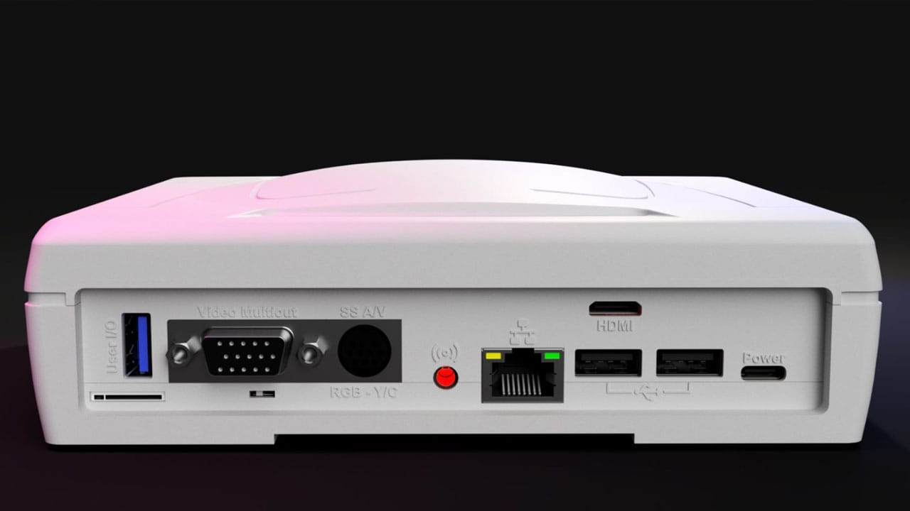
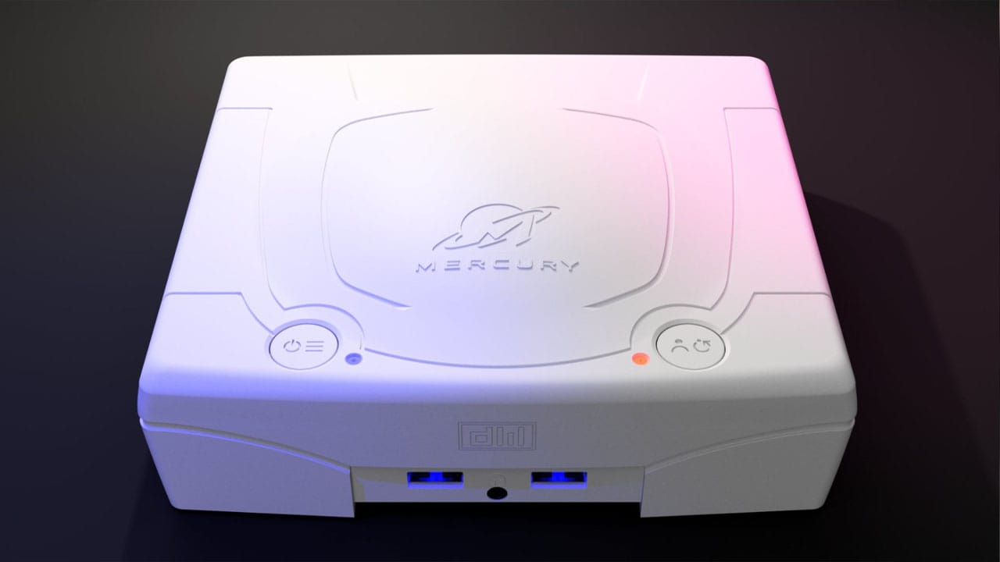

Df3mod has opened pre-orders for the **Mercury**, a complete kit that dresses the MiSTer FPGA in the shell and layout of a Sega Saturn. The name refers to the internal codename Sega used while developing its 32-bit console, as reported by Retro Dodo citing RetroRGB. The manufacturer had already drawn attention with the MiSTer Ironclad, its mini-ITX take on the same ecosystem.

What sets it apart from a software emulator is the MiSTer approach: it recreates each console's hardware on an FPGA, so behaviour is reproduced in silicon rather than translated instruction by instruction. The Mercury does not change that foundation, only the look of the machine, which now resembles Sega's hardware physically.

## What the Mercury kit includes and what it leaves out

The Mercury ships as a set of parts the user assembles. It includes the shell, a VGA output, a Sega Saturn-style MiniDIN connector and a 24-bit audio converter. It does not include the **DE-10 Nano**, which is the heart of the MiSTer and must be supplied by the buyer separately.

The starting price is **€229**, although the final figure depends on the configuration. Df3mod's listing lets buyers add a larger heatsink (+€10), a basic remote control (+€9) or an MX3 Air Mouse model (+€19), among other connectivity and storage extras.

## Memory, controller and video options

Alongside the kit, the configurator offers SDRAM modules —128 MB for €55 or dual SDRAM for €75— and a family of SNAC adapters for connecting original controllers and arcade hardware. The full SNAC set costs €99.99, while the IRONSNAC-N and IRONSNAC-S variants sit at €49 and €46 respectively.

On the video side there are add-ons such as a YPbPr component adapter (+€18) and an RGB to composite or S-Video converter (+€35). Even so, the Mercury does not natively support composite video. What it does include is a **passive luma trap** built into the circuitry, a detail that lets users reuse Saturn S-Video cables without adding more hardware.

## Pre-orders, final price and warnings

Df3mod insists on its listing that buyers read all the information before confirming an order, especially because **pre-orders cannot be cancelled** once placed. The manufacturer's advice is to take time choosing the right combination of modules and adapters, since the price climbs with each add-on.

For anyone who already has a MiSTer built and wants to give it a real console finish, the Mercury is a customisation route rather than a hardware revision. Game compatibility still depends on the MiSTer core in use, not the shell: the real state of each system is whatever its core delivers at the time of purchase.
