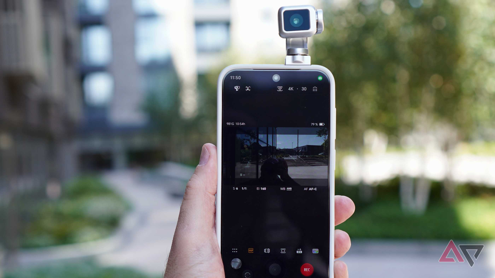
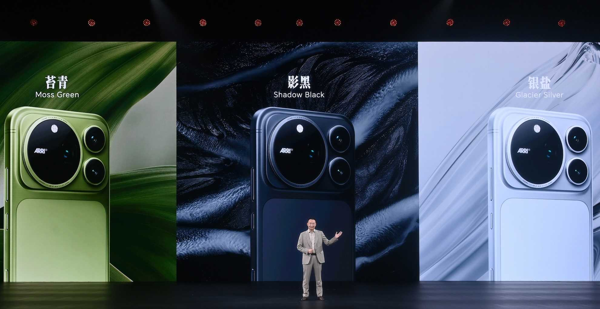
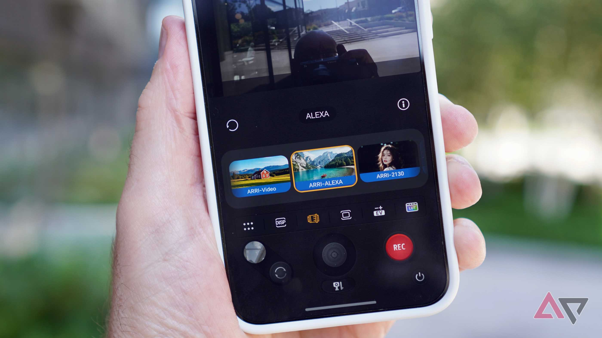

Honor has made video the headline selling point of the Honor Magic 9 Pro Max. Together with ARRI, the manufacturer of the cameras used on film sets, the phone offers what the company describes as a complete cinematography workflow inside the device itself, without the large cinema camera that normally takes years of experience to operate. Android Police, which has already tried the feature on the Honor Robot Phone, admits the results are impressive, but questions whether that level of demands interests anyone outside a studio.

## The ARRI video mode: a cinema workflow inside the phone

Before judging the proposal, it is worth understanding what the system actually does. The Magic 9 Pro Max camera records with ARRI's native Log C3 gamma curve: the footage comes out flat and washed out, but it holds the detail and information needed to develop it later with ARRI Wide Gamut (AWG) and one of ARRI's 14 LUT profiles. The company also offers an extended library of 87 LUT profiles.

That whole process is handled from a joint Honor and ARRI camera app, with an interface inspired by cinema cameras and highly complex in nature. On the optics side, the phone carries a 200 MP main camera, a 200 MP telephoto camera and a 50 MP wide-angle camera. Audio is not left out either: four cinema-grade directional microphones, combined with software processing, suppress unwanted sounds and focus on audio that is far from the camera.

The partnership answers two parallel interests, as Android Police reports: ARRI wants to establish itself in mobile, and Honor is looking for a camera partner to rival Hasselblad and Leica, the names other brands display on their phones. Add to that a piece of context: in the outlet's view, still photography is now so hard to differentiate that Oppo and Google have that ground covered in 2026, while Apple has made a big push on video and its ProRes format.

## Honor promises to teach people how to use it, but without strict tutorials

Android Police's own first impression is that the ARRI mode looks impressive, but also very complicated. Honor told the outlet that the Magic 9 Pro Max will include some educational elements to help people get to grips with cinematic recording, though there will be no strict tutorials. It is a delicate decision: Log curves and LUT profiles are professional filming concepts, and a user with no prior training has no obvious place to start.

There is also a practical barrier the outlet quantifies: a minute of 4K video can take up around 350 MB, and shooting in LOG takes up even more. Faced with that, many users will prefer to stay at 1080p at 30 fps and call it a day, especially if the terms LUT, LOG and gamut mean nothing to them and the learning resources do not guide them along.

The consumption context does not help either. People are shooting more video than ever, particularly in China, where the Magic 9 Pro Max will debut first, but most of that footage is not directed like a movie. For readers wondering whether it is worth color grading every clip by hand, the outlet's answer is that in most cases a quick tool such as CapCut is more practical and good enough. Android Police also cites research showing that 70% of the photos we take with our phones are never looked at again, and suspects video suffers the same fate.

## Sony's precedent as a warning

The industry's own history offers a warning. For years, Sony leaned on videography to sell its Xperia range, with devices such as the Xperia XZ2, the Xperia 1V and the Xperia 1. Xperia phones have a small but dedicated fanbase, and still Sony's video expertise did not manage to make a difference in the global smartphone market. Honor takes its video modes further than Sony ever did, and the ARRI name adds credibility for those who know the field, but the strategic risk is the same.

The question Android Police raises is what is gained by putting video ahead of the rest of the proposition: the performance of the still camera, the Qualcomm Snapdragon 8 Elite Extreme Gen 6 processor, or the 8,800 mAh silicon-carbon battery. The rest of the package has already shown itself elsewhere: this same model [scored 5.52 million points in AnTuTu](/noticias/honor-magic9-pro-max-antutu/) and beat the OnePlus 16.

## Price and availability of the Magic 9 Pro Max

The Honor Magic 9 Pro Max will launch first in China, priced at around $1,000. There are no official details yet on a possible global release, though the outlet expects it to arrive eventually. For context, the only price published so far in the family is that of the standard Honor Magic 9, which [starts at 6,499 yuan](/noticias/honor-magic-9-precio/).

It remains to be seen whether the learning curve, the storage it demands and the appetite for color grading video convince anyone beyond professionals and enthusiasts. Honor has a solid technical argument; the question is whether it is also a selling one.
