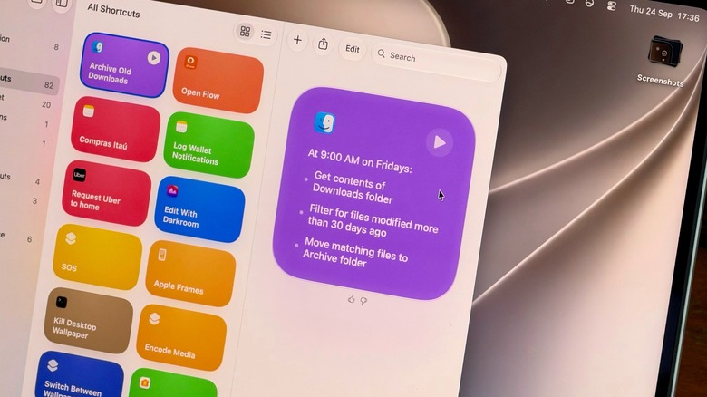

Shortcuts has shipped with macOS since Monterey and, even so, it remains one of
those applications many people never end up opening. On first launch it looks
complicated: you have to pick the right actions, chain them together and hope the
whole thing works. With macOS 27 Golden Gate the barrier to entry drops: the
**Describe a Shortcut** feature lets you type what you need and have the app build
the shortcut with the help of artificial intelligence. It does not always get it
right on the first try, but it makes the app far more accessible to anyone who
does not want to learn to script.

This guide explains step by step how to create shortcuts on a MacBook, how to keep
them within reach and what you need for the AI part to work.

## What Shortcuts is and what it is for

Shortcuts is an automation tool: you build sequences — called *shortcuts* — that
carry out tasks on your devices. Apple's own example is a shortcut that, when you
leave work, texts your partner an estimated arrival time based on traffic. There
are far more elaborate versions, such as a shortcut that checks your calendar and
the weather to summarize what to expect from the day.

The value lies in the tasks almost nobody remembers to do. Almost nobody cleans
out their Downloads folder until they need the space, for example, and that is
exactly where a shortcut earns its keep.

## Prerequisites

- A Mac with the **Shortcuts** application: it comes built into macOS.
- **macOS 27 Golden Gate** to use *Describe a Shortcut*, the written-instruction
  way of creating shortcuts, which is the new feature in this version.
- A Mac with an **Apple M1 or later** chip if you want to use Apple Intelligence
  inside Shortcuts and Siri AI. Intel Macs are left out.

## Steps

### Step 1: describe the shortcut you want to create

1. Open the **Shortcuts** application on your Mac.
2. Click the **Plus** button to enter the prompt.
3. Type what the shortcut should do with as much detail as possible. The more
   specific you are, the more likely the app is to get it right.

The instruction matters more than the phrasing. "Clean up my Downloads" is too
vague: the app does not know what you consider tidy. Something like this works
better: "Every Friday, move anything in my Downloads folder older than 30 days
into a folder called Archive."

It also works for summarizing text with Apple Intelligence. An instruction such as
"take the text on my clipboard, summarize it in three sentences and save it to a
new note" is enough for the app to assemble the sequence.

### Step 2: check the result and refine the instruction

The result can be checked on the spot. If the shortcut tidies the Downloads
folder, open the folder and see what moved. Downloads is a good first case
precisely because the result is visible at a glance.

If the app went too far and moved too much, re-enter the instruction with more
specific details instead of taking the shortcut as finished.

### Step 3: keep the shortcut within reach

A shortcut that is not part of your routine gets forgotten. There are two ways to
prevent that:

1. Select the shortcut and click **Edit**.
2. Go to the **Shortcut Details** menu (the one with the information icon).
3. Choose **Add Keyboard Shortcut** to assign it a key combination.

To pin it to the Control Center or the menu bar:

1. Open the **Control Center** on your Mac (top right).
2. Select **Edit Controls**.
3. Add the action from the Shortcuts application.

It is also worth exploring the **Automation** tab: it lets you chain shortcuts
that run on their own when you need them, without opening the app.

### Step 4: run shortcuts with Visual Intelligence and Siri

macOS 27 also ships Visual Intelligence with its own key combination: **Shift +
Command + Space**. Press it, select a window on screen and ask Siri to answer
questions about it or take action, such as adding an event to the calendar. An
email with a date buried in it is a good test case.

Siri can also run your shortcuts by voice. To control which assistant is active,
this portal has already explained [how to switch to Siri AI or back to Siri
Classic in iOS 27](/noticias/siri-ai-ios-27/).

## How to verify it worked

- If the shortcut sorts files, open the affected folder and check what moved: it
  is the most direct test.
- If it summarizes text, copy a long article or email, run the shortcut and open
  **Notes** to see the short version.
- If you assigned a key combination, press it and check that the shortcut runs
  without having to open the application.

## Warnings and limitations

- **AI does not always get it right.** Describe a Shortcut makes the app much
  easier to use, but the result should always be reviewed before you take it as
  correct.
- **Apple Intelligence is required** for the AI features in Shortcuts and for Siri
  AI: you need a Mac with an M1 chip or later. Intel Macs are left out, in line
  with what we already covered about [the end of the Intel Mac era in macOS
  27](/noticias/macos-27-removes-bootcamp-intel/).
- **Usage limits may apply** when Apple's artificial intelligence models run
  inside Shortcuts: more complex prompts could hit that limit sooner.
