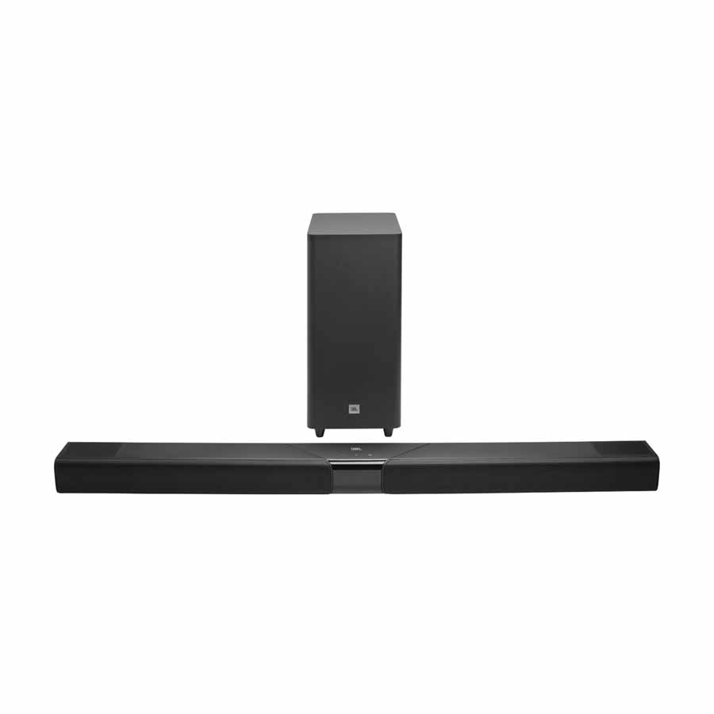

JBL has announced the **Cinema SB MK2** range, made up of four 3.1-channel soundbars that share one central novelty: for the first time, the brand's bars can connect wirelessly to a pair of compatible portable speakers and use them as rear channels. The series will arrive in selected markets from 1 October 2026.

## SurroundPlay: the new feature of the JBL Cinema SB MK2 range

The proprietary **SurroundPlay** technology turns two compatible portable speakers into the left and right rear channels, giving the user a surround effect without running cables across the room. The connection relies on Bluetooth and Auracast, Bluetooth's audio broadcasting system.

JBL notes that, at launch, the only compatible model is the **Flip 7**: not just any Bluetooth speaker will work, even one from the same brand. The idea is meant as a gradual upgrade path: you can start with the bar alone and add the rear pair later, if the room and the budget allow.

## Four models for different budgets

All four bars share a dedicated centre channel — intended to make dialogue easier to follow than with a television's built-in speakers — plus Bluetooth and Auracast. They differ in power, subwoofer and Dolby support:

| Model | Power | Subwoofer | Audio | Connection |
| --- | --- | --- | --- | --- |
| SB510MK2 | 200 W | Built-in | Dolby Audio | HDMI ARC |
| SB550MK2 | 360 W | Wireless 5.25" | Dolby Audio | HDMI ARC |
| SB580MK2 | 440 W | Wireless 6.5" | Dolby Atmos with virtual processing | HDMI eARC + HDMI input |
| SB595MK2 | 440 W | Wireless 6.5" | Dolby Atmos with two upward-firing drivers | HDMI eARC + HDMI input |

The SB510MK2 is the entry model, an all-in-one system with the subwoofer built in. The SB550MK2 adds a separate 5.25-inch wireless subwoofer. The SB580MK2 and SB595MK2 climb to 440 W and a 6.5-inch wireless subwoofer; the SB595MK2 is also the only one in the range with two drivers that fire upwards, bouncing height information off the ceiling. The SB580MK2, for its part, creates the Atmos effect through processing, without height drivers.

The SB550MK2, SB580MK2 and SB595MK2 models fold into a U-shape for transport and packaging, a solution that, according to the company, reduces packed volume by up to 20 %. It is a shipping feature, not a listening mode: the bar must be unfolded before use.

## Price and availability

The Cinema SB MK2 range will be available in selected markets from 1 October 2026. European prices start at €199.99 for the SB510MK2 and continue with €249.99 for the SB550MK2, €349.99 for the SB580MK2 and €449.99 for the SB595MK2. In the United Kingdom, the announced prices are £300 for the SB580MK2 and £350 for the SB595MK2; local prices should be checked before ordering.

The announcement adds to a month with plenty of movement in consumer audio: in late September, Xiaomi revealed [the Redmi Buds 8S](/noticias/redmi-buds-8s/), an example of how manufacturers refresh their audio line-ups ahead of the autumn season.
