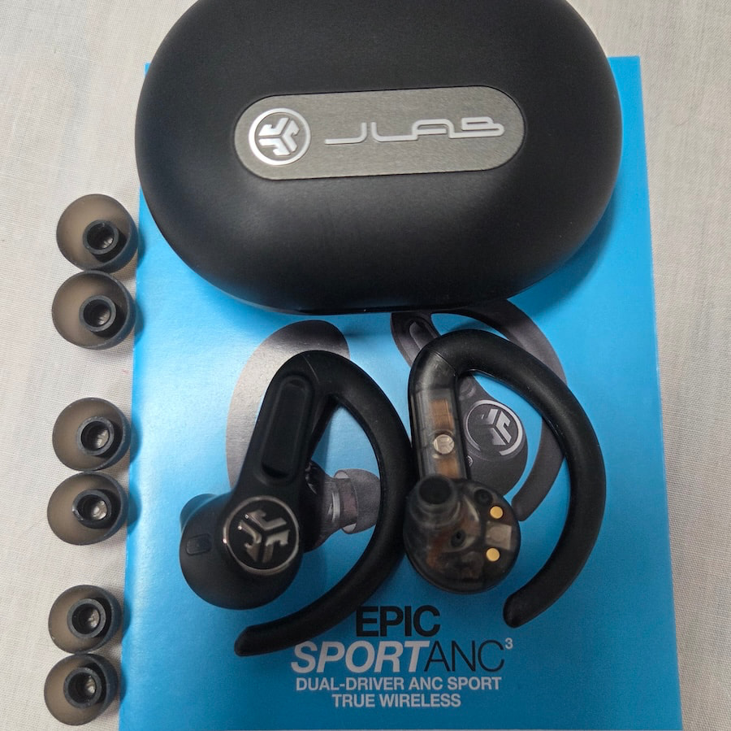
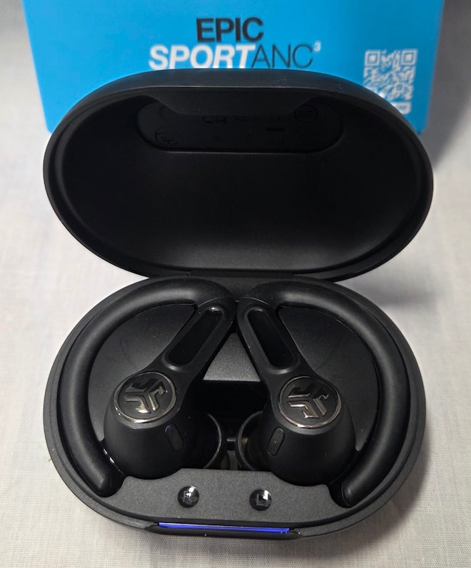

The **JLab Epic Sport ANC 3** is JLab's latest bet on a very specific audience: people who regularly destroy cheap earbuds. At $104.99, this model combines fixed earhooks, dual drivers, hybrid active noise cancellation (ANC) and IP66 dust and water resistance, according to the review published by [eCoustics](https://www.ecoustics.com/reviews/jlab-epic-sport-anc-3-earbuds/).

The approach is clear. At the premium end, Apple, Bose and Sony have built closed ecosystems, mature apps and increasingly effective noise cancelling. At the budget end, nearly every product promises studio sound, all-day battery life and ANC, at an ever-lower price. JLab competes in neither camp: it targets runners, cyclists and gym users who need earbuds that will not move and will survive sweat, rain or an intense session.

## Built not to move

The most visible design decision is the earhook. These are not discreet earbuds meant to disappear into the ear: the hook wraps around the outside of the ear and adds a second point of support beyond the ear tip. That extra grip is exactly what athletes are after, though it comes with trade-offs.

The hook is not removable and competes for the same space as the arms of a pair of glasses, an awkward detail for everyday glasses wearers. It also takes up more room than stem-style models, making it less practical as a pocketable earbud for the rest of the day. JLab includes three sizes of silicone ear tips, and getting the size right matters: the seal determines passive isolation, bass response, comfort and ANC performance.

The housing is plastic, consistent with the price, but with a build eCoustics describes as sturdy. The charging case is larger than many rivals' — expected given the hooks and the battery — and includes a built-in USB-C cable, an extra USB-C port for longer cables and wireless charging.

## Two drivers, LDAC and up to 56 hours

On the technical side, JLab has packed a lot of hardware into each earbud. The Epic Sport ANC 3 uses a dual-driver setup: a 10mm dynamic driver for the low frequencies and a Knowles balanced armature for the highs. The advantage is specialization — bass needs to move more air while treble demands faster, smaller movements — though dividing the workload does not by itself guarantee better sound: the crossover, the acoustic chamber and the final tuning still matter just as much.

The model includes Bluetooth 5.3 with support for SBC, AAC and LDAC, plus multipoint. LDAC is the most notable inclusion at this price range, because it gives users of compatible Android devices access to a higher-bitrate connection. It also adds spatial audio, Google Fast Pair and an app with four EQ profiles: JLab Signature, Knowles Preferred, Bass Boost and Custom.

Rated battery life is up to 56 hours with the case and up to 12 hours in the earbuds themselves with ANC off. With ANC and LDAC enabled, that figure drops to close to 7.5 hours. As with almost every wireless earbud, those are numbers measured under favorable conditions: with ANC, LDAC, multipoint and normal volume, expect less.

## What it gains and what it gives up

The strong point is the fit. The flexible hooks keep the earbuds firmly in place without becoming uncomfortable, even with glasses, and the IP66 rating protects them against dust, sweat and rain — though not against immersion: swimmers should look elsewhere. Noise cancellation does its job at reducing steady sounds such as gym machinery, air conditioning or traffic noise, but it does not create the same quiet bubble as the best Bose or Sony models. Outdoors, wind remains a difficult opponent, and Be Aware mode makes more sense for staying aware of your surroundings.

Sonically, the factory tuning is clearly warm, with boosted bass that gives workout playlists energy, at the cost of vocals that can sound a little recessed and dense mixes that crowd in the lower midrange. These earbuds do not pretend to be audiophile, but the Custom EQ lets you balance the signature if you want something more neutral. For calls, quality is acceptable indoors, while in wind, traffic or background noise the microphones fall short and the noise reduction sometimes cuts out part of the speaker's own voice.

A note for anyone comparing against alternatives: the audio category is moving fast on connectivity and platforms. A good example is [Qualcomm Snapdragon Sound Elite Gen 2](/noticias/qualcomm-snapdragon-sound-elite-gen-2/), which aims precisely to improve wireless audio and noise-cancellation management in upcoming earbuds.

## What changes for the reader

On paper, the Epic Sport ANC 3 gets the most important part of workout earbuds right: they do not fall out. In exchange for that fit, it gives up compactness, high-end noise cancelling and refined sound. For anyone who prioritizes durability, a broad feature list and a price near $100, it belongs firmly on the shortlist; anyone after maximum comfort, reference-grade ANC or frequent outdoor calls will have to raise their budget.

Comparing it with other workout earbuds covered by this outlet helps place it. Against more gaming-oriented alternatives such as the [Arctis GameBuds](/noticias/arctis-gamebuds-xbox-review/), JLab's focus is clearly physical exercise: less ecosystem and more resistance. The decision, as almost always, depends on what you are going to use them for.
