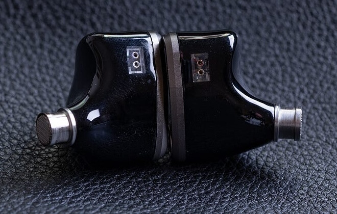
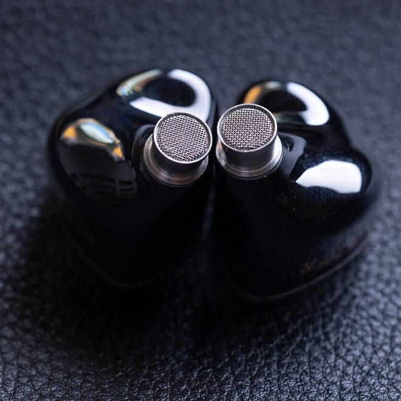
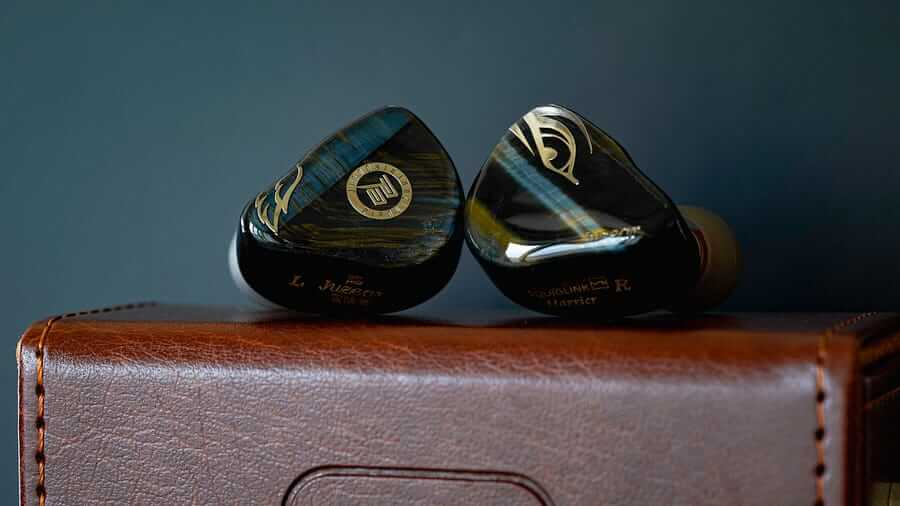
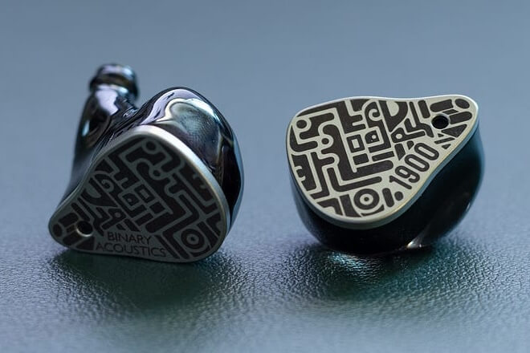

Juzear, a Chinese high-fidelity brand founded in 2016 with a background in custom monitors and stage monitors, has released the Light Shuttle, an IEM (in-ear monitor) with a seven-driver tribrid configuration per earpiece that stays under $200. The company has chained launches over recent months — the Fiesta, the Nimbus, the Nebula and a special edition of the Defiant — and the Light Shuttle is its latest proposal. The specialist outlet eCoustics has already published its review.

## Seven drivers for under $200

The Light Shuttle's main argument is inside. Each earpiece packs seven drivers split across three technologies: a 10 mm dynamic driver with an MACCD diaphragm (multi-layered amorphous carbon composite) handling the bass, four balanced-armature drivers — two for the midrange and two for the treble — and two micro planar drivers for the upper end of the spectrum. The whole setup is arranged with a physical four-way crossover and four independent acoustic tubes built on the brand's ATI-SW spiral acoustic waveguide technology.

| Specification | Value |
| --- | --- |
| Configuration | 7 drivers per earpiece: 1 x 10 mm dynamic, 4 balanced armature and 2 micro planar |
| Driver allocation | Dynamic for bass; 2 BA for midrange; 2 BA for treble; 2 micro planar for upper treble |
| Crossover | Physical 4-way |
| Acoustic architecture | 4 independent tubes with Juzear ATI-SW waveguide |
| Frequency response | 20 Hz – 20 kHz |
| Sensitivity | 113 dB ±1 dB SPL/mW |
| Impedance | 32 ohms |
| Total harmonic distortion | ≤0.2% at 1 kHz |
| Passive isolation | Up to 26 dB |
| Shell | High-precision DLP 3D-printed resin |
| Faceplate | Five-axis CNC-machined aluminium alloy with an iridescent finish |
| Weight | About 6.4 grams per earpiece |
| Connector | 0.78 mm 2-pin |
| Cable | 4-core, 400-strand 6N OCC silver-plated copper |
| Termination | Interchangeable 3.5 mm single-ended and 4.4 mm balanced |

## Build and accessories

The resin shell follows a conventional design, while the more elaborate faceplate is decorative rather than structural. The 2-pin sockets sit flush with the top and the metal nozzles integrate debris filters, with machining that eCoustics describes as sturdy and precise.

The cable is of average thickness and uses an all-metal modular termination with a threaded locking mechanism. The box includes the 3.5 mm and 4.4 mm balanced connectors, but there is no 2.5 mm or USB Type-C option: anyone who needs those will have to turn to an adapter or an alternative cable.

The accessory package includes a semi-hard carrying case, a microfibre cloth, one pair of foam eartips, six pairs of silicone eartips, the 2-pin cable and both connectors. The review considers it complete and enough to use the earphones out of the box.

## How the Light Shuttle sounds

On listening, the Light Shuttle delivers cohesive tuning with a gentle V-shaped curve. The upper treble rises carefully above a restrained lower treble, and the whole blends into a natural upper-midrange lift. The lower midrange sits slightly back before picking up a touch of warmth around 200 Hz; the mid-bass is somewhat scooped, though not enough to feel absent. Below 100 Hz the bass becomes more prominent, with extension that reaches below 20 Hz.

According to the review, the Light Shuttle prioritises the sub-bass and keeps the mid-bass in check: the result is restrained but not shallow bass, with enough punch in the drums and some loss of definition in very dense electronic passages. In the midrange, that measured warmth gives body to deep vocals and low-register instruments, while the lift around 2–3 kHz adds energy and separation. In the treble, eCoustics detects no sibilance or harshness: hi-hats and cymbals come through clearly and dense layers resolve without blurring. The sense of space is decent, although tracks with more upper-treble presence benefit from it more.

## Comparison and verdict

The Light Shuttle lands in a crowded segment, where it competes with equally capable options. Against the $329 Juzear Harrier, the new model offers a little more sub-bass, a more forward upper midrange and airier treble, while the Harrier keeps better separation on very complex tracks and a sturdier finish. Against the $235 Binary Acoustics 1900, the Light Shuttle pushes the 2–3 kHz region harder and reaches lower in the sub-bass, at the cost of a less contrasting timbre.

In the cheaper tiers, the Melody Wings Venus ($168) and the SIVGA Lyrebird ($165) go for brighter, more resolving profiles up top, while the Light Shuttle keeps a warmer tone and more present bass. The review concludes that the differences in enjoyment are small and that the choice depends above all on the kind of sound each listener prefers.

For eCoustics, the Light Shuttle is a very good IEM under $200, although in a category full of alternatives its appeal depends on whether its balance of warmth, clarity and restraint matches the listener. The rundown of pros and cons sums up that idea.

### Pros

- Cohesive, appealing V-shaped tuning.
- Excellent midrange and vocal clarity.
- Strong, well-controlled sub-bass.
- Detailed treble without excessive sharpness.
- Good accessory package with a modular cable.

### Cons

- Mid-bass punch and impact are somewhat restrained.
- The treble can lack some air and openness.
- Technical performance does not clearly separate it from the strongest rivals.
- The resin shells feel less substantial than some competitors'.
- The light-coloured foam eartips show dirt quickly.

## Price and availability

The Juzear Light Shuttle sells for $189.99 on both Amazon and HiFiGo. It is an option to keep in mind for anyone after a seven-driver tribrid IEM with a balanced profile and a contained budget, and a sign of the pace at which the Chinese brand refreshes its catalogue, in line with other makers betting on planar drivers in ever more affordable products, such as [Sony's Pulse headsets](/noticias/playstation-pulse-headsets/).
