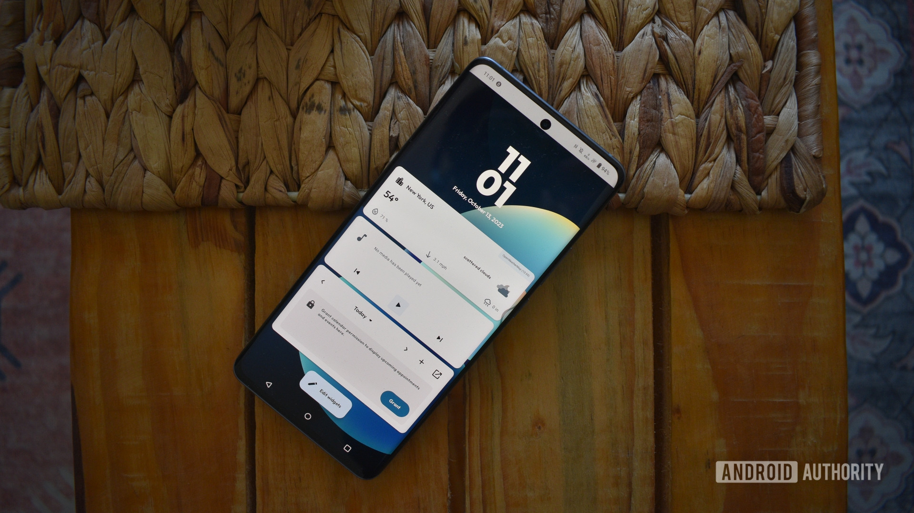
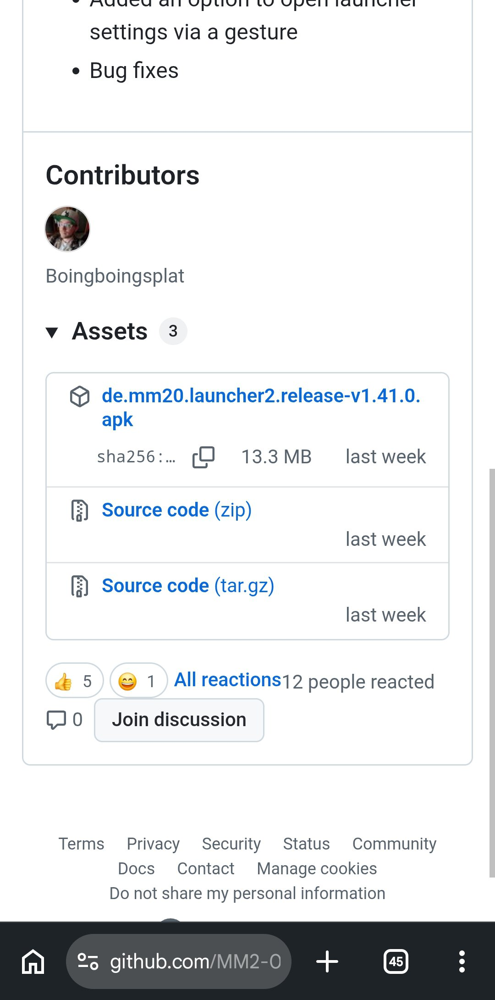
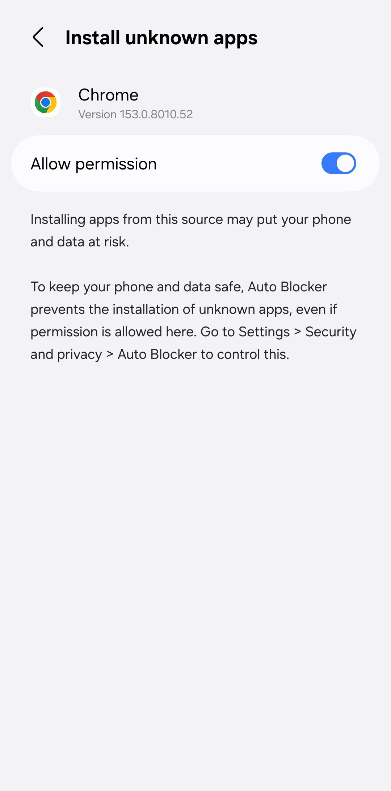
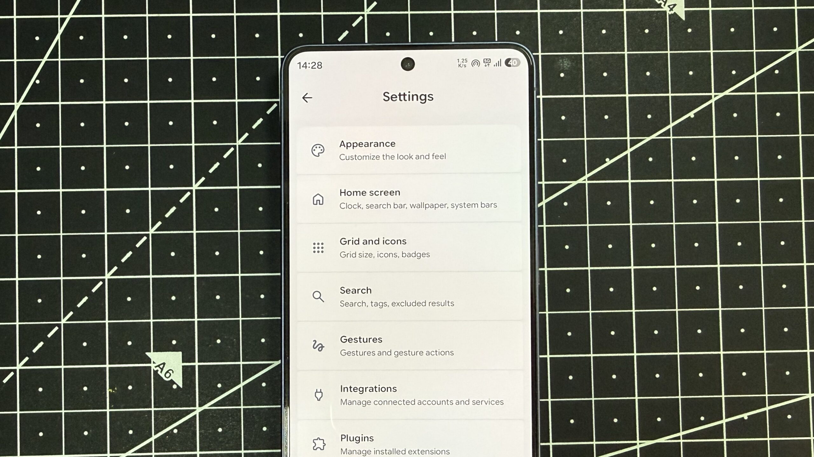
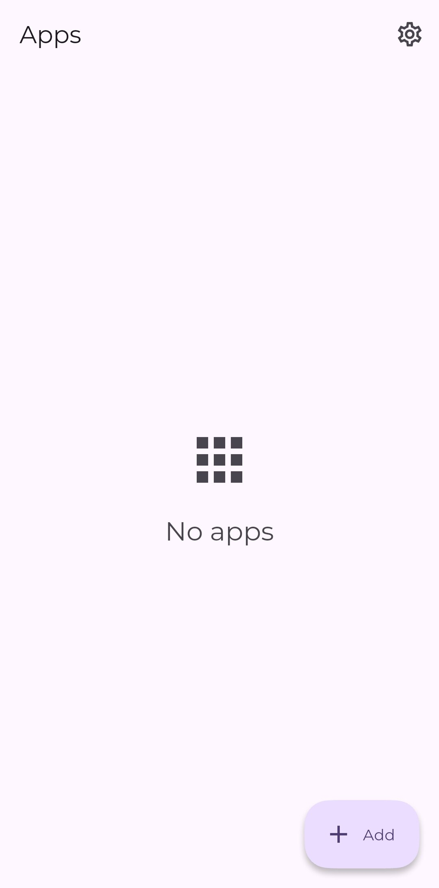
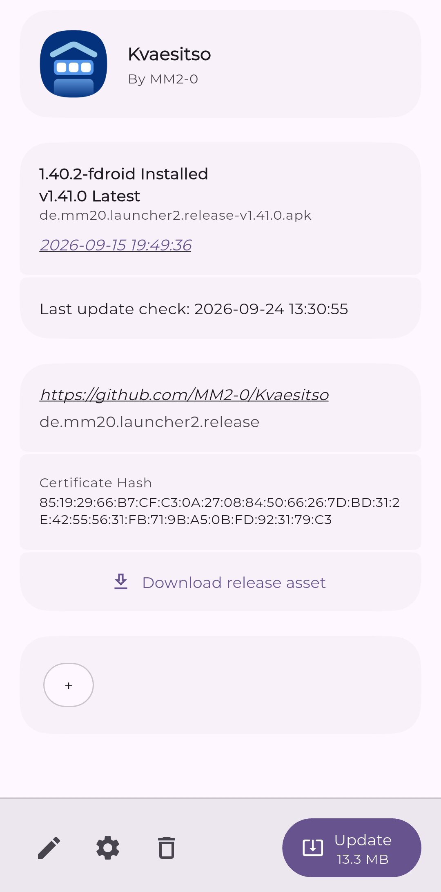

Kvaesitso is an open source, search-first Android launcher with no Play Store listing. That does not make it hard to use, only something you have to install by hand: download the package, authorise installation from outside the store and, if you want, give it a way to receive updates. This guide walks through the whole process step by step, with the menu paths exactly as they appear in Android Authority's original guide.

## Why Kvaesitso is not on the Play Store

The developer has not given a specific reason. Generally speaking, free and open source projects tend to skip the Play Store to avoid listing fees, reviews and the policy hoops involved: publishing the app on GitHub or F-Droid is far more straightforward. The result is a few extra installation steps, but it is a one-time thing.

## Prerequisites

- An Android phone with an internet connection and a browser installed (Chrome is used in the examples).
- Permission to install apps from unknown sources. The system grants it during the first installation, but you have to accept it.
- On Samsung Galaxy phones, additionally: turn off **Auto Blocker**, which blocks the installation of APK packages.

## How to download and install Kvaesitso on Android

1. Open any browser on your phone and go to Kvaesitso's GitHub page: [github.com/MM2-0/Kvaesitso](https://github.com/MM2-0/Kvaesitso).
2. Scroll down to the **Releases** section and tap the **latest version**.
3. Under **Assets**, tap the **launcher APK file** to download it.
4. Open the APK file to install it. If this is the first time you sideload an app, you will need to grant your browser permission to install unknown apps.
5. Tap **Install** to install the launcher.

The whole process takes barely a minute. On a Galaxy phone, if the installation is blocked, go to **Settings -> Security and privacy** and turn off **Auto Blocker**: among other things, it prevents apps from outside sources being installed.

### Alternative: install from F-Droid

If you already have F-Droid on your phone, you can get Kvaesitso straight from there. F-Droid is a repository exclusively for free and open source apps, working much like the Play Store. If you do not have it yet, first download F-Droid from its [GitHub repository](https://github.com/f-droid/fdroidclient) and install it manually, and only then search for Kvaesitso inside the app.

## How to make Kvaesitso the default launcher

Once it is installed, one step remains: choose it as the home app. Go to **Settings -> Apps -> Default apps -> Home app** and select **Kvaesitso** from the list. Head back to the home screen: the new launcher will be waiting for you.

## How to verify that the installation worked

- When you press the home button or swipe up from the bottom edge, Kvaesitso's interface should appear instead of the previous launcher's.
- The search bar should be usable: besides apps and contacts, it searches Wikipedia, YouTube, Maps and the Play Store itself, and can even create alarms, reminders or run basic calculations without leaving the launcher.
- In **Settings -> Apps -> Default apps -> Home app**, **Kvaesitso** should be the selected option.

## How to keep Kvaesitso updated

Apps installed outside the Play Store do not receive updates automatically, and Kvaesitso has no built-in option to check for them. You do not need to revisit the GitHub page every few weeks, though: there are two routes.

### Option 1: F-Droid

If you installed the launcher from F-Droid, updates are managed from the app itself, much like the Play Store: search for the project and tap **Update** to install the latest version. You can also enable automatic updates in F-Droid's **Settings** by turning on **Automatically install updates**. Note that this applies to every app installed through F-Droid, not just Kvaesitso.

### Option 2: Obtainium

If you would rather not install F-Droid just for this, the alternative is [Obtainium](https://github.com/ImranR98/Obtainium), a free and open source app built to update apps you sideloaded: it automatically checks the source for newer versions and installs them from there.

It has two advantages over F-Droid. First, you get updates without any delay, sometimes even before they show up on F-Droid, because Obtainium pulls them straight from the source. Second, if you have sideloaded APKs from different places over time, Obtainium tracks all of them and lets you update everything from a single place.

The only catch is the initial setup. First, install Obtainium from GitHub or from [F-Droid](https://f-droid.org/en/packages/dev.imranr.obtainium.fdroid/). Then open it, tap the **Add** button and paste the GitHub or F-Droid URL of Kvaesitso **whichever source you originally installed it from**: an app's digital signature can vary by source, and with the wrong link the updates may not work.

In that same menu, Obtainium offers a few toggles — installing prereleases, silencing update notifications — that are optional: you can ignore them and tap the **plus icon** to add the app. From then on, Obtainium automatically checks for updates every six hours.

## Why the extra steps are worth it

Installing and keeping Kvaesitso takes more work than grabbing anything off the Play Store, but it pays off. Its strongest point is the search bar: alongside apps and contacts, it searches Wikipedia, YouTube, Maps and the store itself, and handles tasks like setting an alarm or running a calculation, which means you do not have to switch apps for simple stuff.

It is also big on customization. By default it keeps the home screen clean and tucks widgets into a separate panel, but from the settings you can switch back to the traditional look with widgets front and center — for example, to combine them with generative widgets such as those of Create My Widget. The app grid, icon packs, themes and fonts are all configurable, and you can even assign home screen gestures: a swipe or a double tap to launch an app, lock the phone, open quick settings or pull up the notifications panel.

And above all: it is hard to find a launcher this capable that is also completely free.

## Warnings and limitations

- Apps installed outside the Play Store do not update themselves: without F-Droid or Obtainium, you have to check GitHub manually.
- Updates only work if the configured source matches the original installation, because of the package's digital signature.
- On Galaxy phones, **Auto Blocker** must stay off while you want to install external APKs; turning it back on will block subsequent installations.
- Installing apps from unknown sources is a door worth opening only for packages that come from official repositories.
