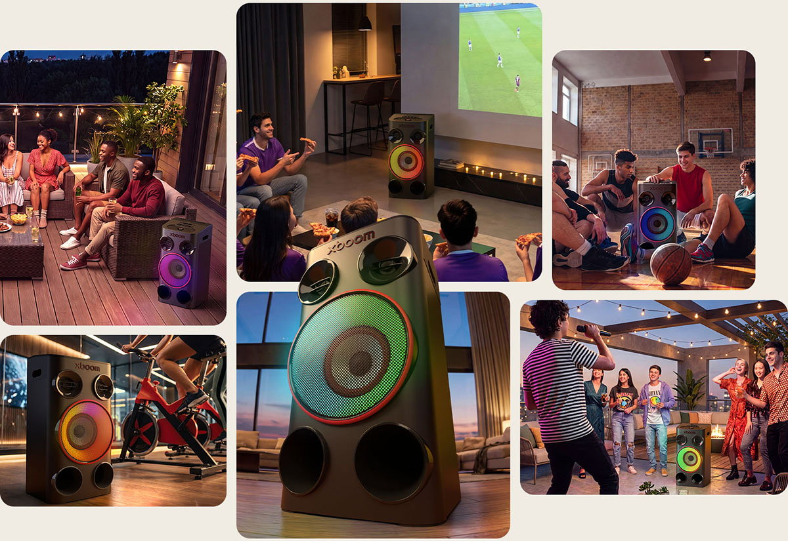
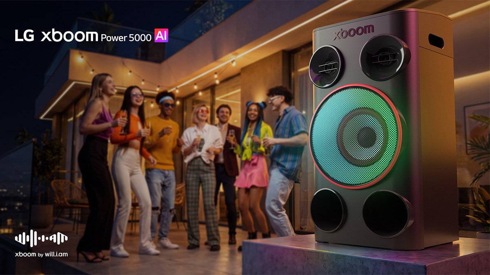

LG has expanded its party speaker lineup with the new **LG xboom Power** series, a family of three models that combines acoustic power with artificial intelligence features. The headline addition is AI Karaoke Master, a system that turns any song in your library into a karaoke track, without relying on pre-prepared versions.

The range arrives amid a boom in party speakers, a segment LG has been pushing for some time. This time the company keeps its bet on loud sound but places the emphasis on AI: not so much on playing music better, but on adding features that until now required apps or extra gear.

## Three LG xboom Power models for every kind of gathering

The series splits into three models that share many of their features but differ in power. The **LG xboom Power 9000** is the flagship, with **440 W**, aimed at large celebrations and open spaces. The **Power 7000** sits at **340 W** and targets terraces, gardens and entertainment areas. The **Power 5000** closes the family with a **more compact format and 260 W**.

Beyond the numbers, all three include the so-called LG xboom Absolute Sound, an acoustic profile the firm says it refined together with will.i.am, a multiple Grammy winner, to achieve greater balance and a warmer tone. The idea is that even the smallest model keeps the karaoke, lighting and sound-tuning features.

## AI karaoke: removing the vocals and adjusting the key

The core of the new series is **AI Karaoke Master**. Instead of using instrumental versions, the system works on the original recording: **AI Vocal Remover** uses AI to reduce the lead vocal and leaves room for the user to sing. On top of that, **Key Changer** adapts the key of the track to each person's vocal range so nobody has to strain on the chorus.

The company stresses simplicity: the karaoke function starts with a single button press, with no prior setup. It is an approach in line with the trend of bringing AI audio processing to the device itself, the same ground other audio chip makers are exploring, such as the AI audio platform Qualcomm unveiled days earlier: [Snapdragon Sound Elite Gen 2](/noticias/qualcomm-snapdragon-sound-elite-gen-2/).

## Lights to the beat and sound tuned to the room

As befits a party speaker, the lighting carries weight. **Multicolour AI Lighting** adapts the lights to the music and is complemented by various DJ effects for extra dynamism. The range also includes the **Smart Stand**, a built-in stand where you can place a phone or tablet to control the music or follow the lyrics during a karaoke session.

On the acoustic side there are three automatic functions. **AI Sound** analyses the content in real time and adjusts the configuration by genre; **Space Calibration Pro** assesses the size and layout of the room and adapts the output, both indoors and outdoors; and **Sound Field Enhance** widens the soundstage for a more spacious result. All of it is backed by **Auracast**, the technology that wirelessly links several compatible speakers from the xboom family, syncing the audio and extending sound coverage.

## Availability and price

The new **LG xboom Power family is already on sale**. Official prices are **€349 for the Power 5000**, **€449 for the Power 7000** and **€549 for the Power 9000**. At the time of writing, LG's store applies a 5% discount on those prices.

For anyone after a party speaker, the appeal of this series is that it bundles karaoke, lighting and automatic sound calibration into a single unit, features that often require combining several devices. The fair question is how well the AI karaoke works with any song and not just the most popular ones; real-world use will settle that.

