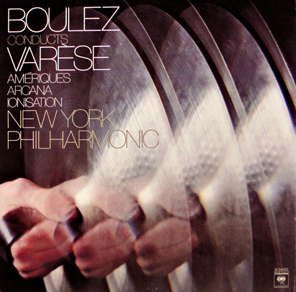

Luxman is marking a century in business with the L-100 Centennial, a pure class-A integrated amplifier that sits one step below its current flagship, the L-509Z, at a price of $11,995. Stereophile has published its review of the unit, written by Ken Micallef, in which he goes over the technology it packs and how it behaves with different loudspeakers and cartridges.

## Pure class A in the Luxman L-100 Centennial

The L-100 Centennial delivers 20 Wpc into 8 ohms and 40 Wpc into 4 ohms in class A. According to Randy Bingham, of US importer-distributor Rhythm Audio, those are the class-A figures and its output power at clipping is considerably higher, which in practice makes it a class-AB design heavily biased into class A.

Its output stage relies on Darlington bipolar transistors in a quadruple-parallel push-pull configuration. For the input stage, Luxman selects transistors from Isahaya Electronics, known for their low-noise characteristics, while the second and output stages use Toshiba parts.

On the technology side there is LIFES 1.1, the latest version of Luxman's feedback engine, and the LECUA1000 attenuator. The company quantifies the LIFES 1.1 improvements with measurable figures: total harmonic distortion falls from 0.003% to 0.002% at 1 kHz, from 0.002% to 0.001% at 100 Hz and from 0.007% to 0.006% at 20 kHz. As for volume, the LECUA attenuator detects the signal's zero-crossing point and switches exactly at that instant, so level changes are virtually silent.

## What it keeps and what it simplifies versus the L-509Z

At $11,995, the L-100 sits just below the L-509Z, so the obvious question is what has been trimmed to reach that price. Luxman's answer is that it prioritised what you can hear: it gave up costly external elements, such as the L-509Z's custom-machined, Mount Fuji–inspired control knob, and redirected that budget into the internal components with the greatest influence on sound. It also replaced the high-quality analogue switches it had used until now with relays, which the company says offer better sonic performance.

The power supply keeps the flagship's standard: a custom EI-core transformer developed jointly with Homerun Electric and eight 10,000 µF filter capacitors made by Nippon Chemi-Con, the same ones fitted in the L-509Z. The MC/MM phono stage shares its architecture with the 509Z's, with the caveat that the L-100 fixes the MC load at 100 ohms instead of offering an adjustable value.

Physically, the chassis measures 17.3" wide, 7" high and 17.9" deep, and weighs 56 lb (about 25 kg). It combines a 3 mm aluminium top panel with 5 mm extruded aluminium front and side panels in a bead-blasted finish, over a steel structure. It is made in Japan, in a cell production system in which four specialists assemble, inspect and fine-tune each unit by hand in Kanagawa Prefecture. The remote control is the same one supplied with the L-507Z.

## What the critics say

Micallef puts the integrated amp through its paces with loudspeakers such as the DeVore Fidelity Super Nines, the Voxativ Ampeggio 2024 and the Volti Audio Lucera, as well as the Ortofon MC X30 and Sumiko Oriole moving-coil cartridges. His verdict is blunt: he describes it as the best Luxman he has heard and as a landmark product for the brand, with a very high recommendation. As a criticism, he notes a slight mechanicalness next to the ease of a tubed class-A SET.

Among the recordings he uses for his listening sessions are Foo Fighters' *Wasting Light*, *Boulez Conducts Varèse* with the New York Philharmonic and Bass Desires' debut, a repertoire he uses to assess soundstage, dynamics and bass control.

The review reinforces the profile of a unit aimed at listeners who already have a loudspeaker system to match and are looking for an audiophile-grade source of amplification, a field in which the [review of the Thorens TD 404 turntable](/noticias/thorens-td-404/) also lives.

## Price and availability

The L-100 Centennial is announced at $11,995, below the L-509Z. The Stereophile review does not detail prices or availability for Europe, so for now the available reference is the US market figure.
