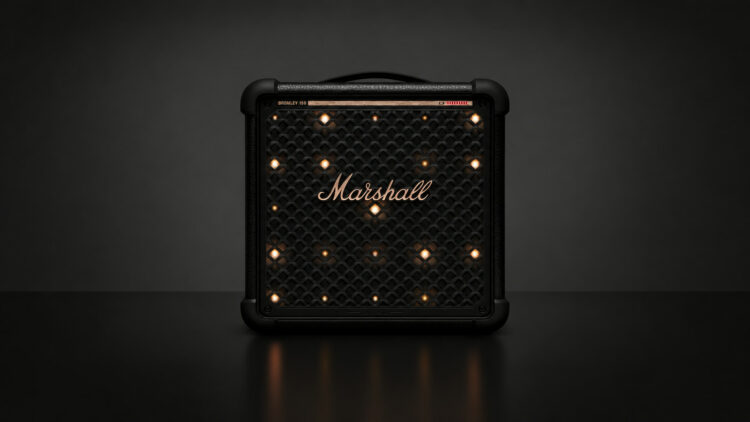

Marshall is expanding its family of party speakers in the opposite direction to the usual one: instead of making the product bigger, it has shrunk it. The new **Marshall Bromley 150** arrives as the most compact model in the Bromley range, below the Bromley 450 and Bromley 750, while keeping much of what its larger siblings offer.

Compact, in this context, is a relative term: the Bromley 150 weighs 6.3 kg, compared with 12.2 kg for the Bromley 450 or almost 24 kg for the Bromley 750. Marshall has added a retractable handle on top, and its dimensions are 290 × 297 × 208 mm, according to the manufacturer's specifications.

## 360° sound from the Bromley 150 with speakers front and back

The cornerstone of the Bromley 150 is the system Marshall calls **True Stereophonic 360°**. Rather than concentrating the output at the front, the speaker combines drivers facing both forwards and backwards to spread sound around the unit and avoid a single sweet spot.

On the technical side there is a 6.5-inch woofer, two 2-inch full-range drivers and a 7.5-inch passive radiator. Amplification is Class D, with a 90 W amplifier for the woofer and two 55 W amplifiers for the full-range drivers, while the declared maximum sound pressure level reaches 97 dB at one metre. The stated frequency response spans 42 Hz to 20,000 Hz, and bass and treble can be adjusted from the speaker's own panel.

## More than 40 hours with a replaceable battery

Marshall promises **more than 40 hours of playback** on a single charge with the Bromley 150, but the relevant detail is the kind of battery it uses: an LFP (LiFePO4) unit that is **removable and replaceable**. That lets you carry a second charged battery and swap it in when the first runs out, without being tied to a cable. The included battery is the Marshall 415, already fitted at the factory.

Fast charging is well handled too: 20 minutes plugged in delivers up to five extra hours of playback, and a full charge takes around three hours. The speaker can also be used while plugged into the mains. As for external protection, its **IP55** rating leaves it ready for dust and splashes, though not for being submerged in water.

## Lights, microphones and Auracast

As a proper party speaker, the Bromley 150 includes **lighting behind the front grille** with three modes, including effects that can react to the rhythm of the music. Marshall has gathered almost all the controls on one side to keep the front area clear.

On the connectivity side it adds **Bluetooth 5.3**, multipoint connection and support for **Auracast**, the technology that lets several compatible devices be linked together. The manufacturer also claims a Bluetooth range of more than 70 metres in unobstructed conditions. There is also a 3.5 mm auxiliary input and output, plus USB-C. The Bromley 150's wireless approach sits alongside other recent audio efforts, such as Qualcomm's [Snapdragon Sound Elite Gen 2 platform](/noticias/qualcomm-snapdragon-sound-elite-gen-2/), focused on earbuds with AI and adaptive cancellation.

Its most eye-catching feature is the pair of **6.35 mm combo XLR/jack connectors**, designed to hook up microphones or instruments and fitted with independent level and effects controls. With them, the Bromley 150 is not limited to playing music: it can also work as a small karaoke system or for plugging in a guitar directly.

## Price and availability

The **Marshall Bromley 150** will arrive in the **Black and Brass** finish, the brand's classic black with gold details. In Europe, Marshall places it at **449 euros**, with the first units expected in October. The enclosure uses FSC-certified wood and the manufacturer lists the battery among the product's repairable parts.
