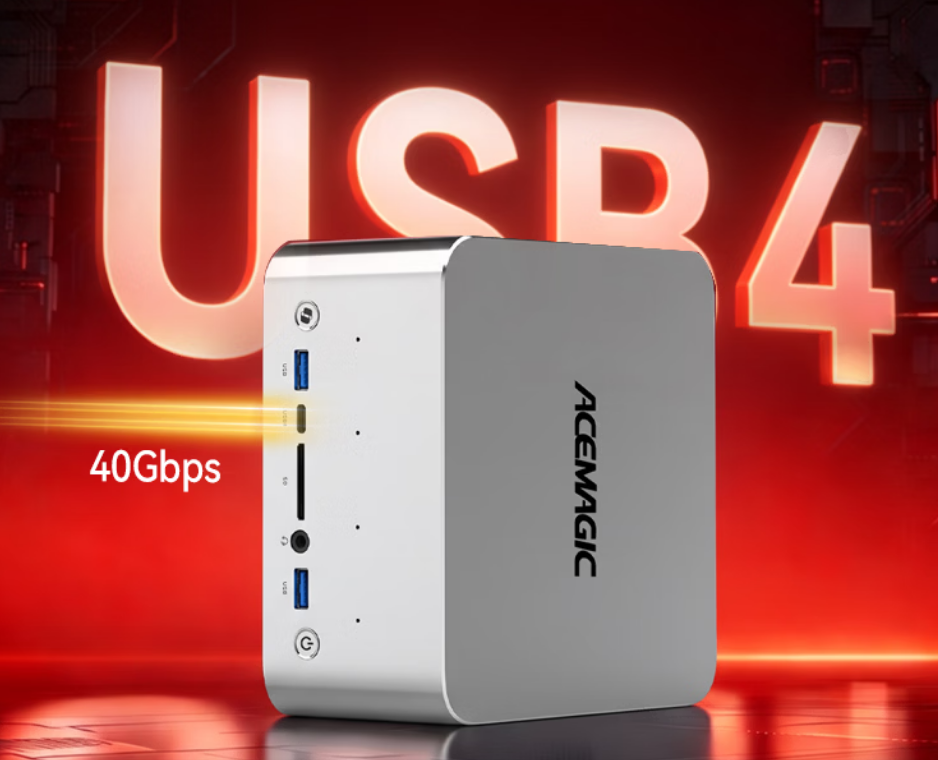

# ACEMAGIC F9A: Unified 192 GB of LPDDR5X and Ryzen AI Max+ Pro 495 in a Mini PC

ACEMAGIC has launched the F9A, a compact workstation arriving on the Chinese market with a configuration that is somewhat unusual for this format. The defining feature of the system is not the processor, but the memory: unified 192 GB of LPDDR5X-8533, of which up to 160 GB can be allocated to the GPU. The company targets AI developers and professional creators, offering a launch price of 50,999 yuan, reduced to 49,998 yuan as a launch offer.

## What ACEMAGIC has presented

The F9A is a small-form factor system built on an aluminum chassis with ventilation grilles on both sides. Its dimensions are 158.5 × 158.5 × 81.5 mm and it weighs 1.4 kg, placing it in the territory of mini PCs that can be left on a desk without sacrificing high-end hardware. The company describes it as a workstation oriented towards local AI workloads, not as a gaming device.

In terms of computing, the system is supported by a Ryzen AI Max+ Pro 495 with 16 cores and 32 threads, capable of reaching a maximum frequency of 5.2 GHz. The chip integrates a Radeon 8065S graphics card and an XDNA 2 architecture NPU, with a declared total capacity of 131 TOPS for AI tasks. It is the same family of APU that we have already seen in other compact workstations, such as the [Minisforum MS-S1 MAX-P495](/noticias/componentes/minisforum-ryzen-ai-max-495-workstation/) or the [Framework Desktop](/noticias/componentes/framework-desktop-ryzen-ai-max-pro-495/).

## Unified LPDDR5X, the real key of the F9A

The 192 GB of LPDDR5X-8533 is the system's selling point. Since it is unified memory, the same block feeds the CPU, graphics card, and NPU, and ACEMAGIC allows reserving up to 160 GB for the Radeon 8065S VRAM. According to the company, that capacity is enough to run language models of up to 300 billion parameters locally, a scenario that in consumer hardware would require splitting the model across several devices.

It is worth being precise about what this means. The advantage does not lie in timings or low CAS latency, but in **capacity**: here there is no EXPO/XMP profile to adjust because the LPDDR5X is soldered to the board and operates at a fixed speed of 8533 MT/s. What you gain is the ability to keep models in memory that would otherwise not fit, at the cost of losing any possibility of later expansion. It is a closed configuration platform: you buy it with the memory it comes with and it does not allow changes.

## Storage and connectivity

The internal expansion section is limited to storage. The F9A includes two M.2 2280 slots for SSD NVMe PCIe 4.0 x4, with support for up to 8 TB in total, so that disk capacity remains in the user's hands.

In terms of connectivity, the machine offers USB4, DisplayPort, OCuLink, HDMI, several USB-A ports, and a 2.5 GbE Ethernet port. Wi-Fi 7 and Bluetooth 5.4 are added to this. The equipment is completed with two 2 W speakers, a set of four digital microphones in an array, and an ARGB light strip integrated into the base.

## What changes for the buyer

The F9A is a niche proposal with a very clear condition: its soldered 192 GB of LPDDR5X are non-negotiable and cannot be expanded later, so the purchase decision is made all at once. If your workflow depends on running large models locally and you need that capacity in a 1.4 kg device, the form factor makes sense; if not, there are cheaper mini PCs that cover the rest of uses without that extra cost.

There remains an important platform nuance: the published prices correspond to the Chinese market (the device appears listed with a link to JD) and are in yuan, so there is no confirmation of availability or pricing for Spain. As with any unified memory APU, stability and actual performance will depend on the platform's firmware and drivers, not just the figure in the spec sheet. Before buying, it is advisable to verify that the specific version supports the memory allocation to VRAM announced by the manufacturer.
