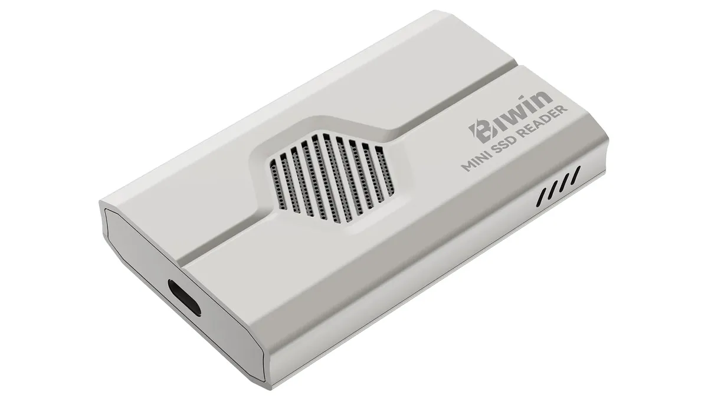

Biwin has unveiled the CL100 Mini, a consumer SSD it bills as the smallest on the market. It measures 15.0 × 17.0 × 1.4 mm, weighs about one gram and has a footprint comparable to that of a microSD card. The manufacturer has launched it for the European market and pairs it with a dedicated external reader.

## What changes versus a microSD: PCIe 4.0 x2 and 3,700 MB/s

The CL100 Mini does not use a conventional memory card interface. It runs PCIe 4.0 x2 with the NVMe 1.4 protocol, which translates into up to 3,700 MB/s sequential read and 3,400 MB/s sequential write. In random operations, Biwin claims 550,000 read IOPS and 650,000 write IOPS. For context, the ceiling of a microSD Express card sits at around 985 MB/s: the gap is not a nuance, it is an order of magnitude.

The module relies on an LGA package that integrates the controller and the memory chips into the same part. Biwin adds dynamic SLC cache, wear leveling and thermal control, plus IP68 dust and water resistance and protection against drops of up to three meters.

## How the CL100 Mini is installed: slot and RD510 reader

Installation is that of a card, not an M.2 drive. The CL100 Mini sits in a standardized slot and is completed in three steps: open the bay, insert the module and lock it. That tool-free removal is precisely what makes it interesting in portable devices.

Biwin has also introduced the RD510 reader, with a USB4 40 Gbps interface and an active cooling fan, designed to turn the CL100 into high-speed external storage. The approach echoes other USB4 portable SSDs already on the market, such as the [Samsung P9 8 TB](/noticias/samsung-p9-8tb-portable-ssd/), although here the format is far smaller.

## Pricing, capacities and adoption

The CL100 Mini comes in 512 GB, 1 TB and 2 TB for 599, 1,099 and 2,199 yuan respectively. Biwin has not detailed its euro equivalent or the availability date in each country. The product has received one of Time magazine's best inventions of 2025 awards and is already used in handhelds such as the OneXPlayer and the GPD Win5.

## What the handheld user gains

For anyone gaming on a portable device, the CL100 Mini offers something a microSD does not: it keeps the convenience of swapping the module in and out without opening the device, but with far higher bandwidth. The fine print is in the platform: performance depends on the host exposing PCIe 4.0 x2 and on the slot being ready, which is not the case in every handheld or mini PC. In storage, compatibility decides more than the headline figure.
