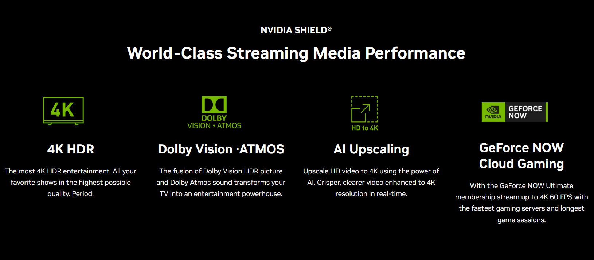

NVIDIA has decided to raise the price of its Shield TV Pro to $299.99, $100 more than the previous $199.99, starting October 2. In the same move, the company has stopped producing the standard Shield TV and is concentrating manufacturing on the Pro variant. The reason it gives is not the product but its component bill: the cost of memory, DRAM included, has soared across the industry.

## Memory costs push up the device's price

The adjustment lands in the middle of a memory shortage, with DRAM prices climbing as capacity is diverted toward the HBM that artificial intelligence demands. NVIDIA sums it up in a statement that attributes the increase to the industry-wide rise in component costs, confirms the Shield TV Pro now costs $299 as of October 2, and says it has stopped producing the standard model to focus production on the Pro variant.

The pattern is not unique to NVIDIA. Other manufacturers have already passed that same cost pressure on to the final price of their machines: [XMG raised its laptop prices by up to 300 euros over the memory crisis](/noticias/xmg-sube-precios-portatiles-ram/), a move that shares the same underlying diagnosis even though it applies to a different product category.

## What changes and what stays the same on the Shield TV Pro

There is nothing new on the technical side. The Shield TV Pro still relies on the Tegra X1 SoC with a 256-core GPU, 3 GB of memory and up to 16 GB of storage. It keeps its 4K HDR output with Dolby Vision and HDR10, plus AI-assisted upscaling that reaches 4K at 60 FPS. Only the price changes: the same hardware now costs 50% more than before.

It is worth remembering where the family comes from. The Shield began as NVIDIA's bet on mobile gaming with the Shield Portable and its Tegra 4, and in 2015 the Shield TV arrived in standard and Pro versions. Since then the product has received SoC and capacity updates, but it has not seen a new generation in a while.

## What it means if you want to buy one

The decision has two practical effects. The first is that the cheapest entry point into the Shield platform disappears: anyone who wanted the basic model will now have to go through the Pro, which is more expensive. The second is that the price leaves the Shield TV Pro in an awkward bracket against other living-room streamers, especially when compared with newer devices that carry more memory.

For gamers, the main argument remains GeForce NOW, which keeps the Shield TV Pro as a simple way to bring cloud gaming to the television. For everyone else, the purchase becomes harder to justify unless this specific device was already the target. And with memory as a cost driver, it would not be surprising if other consumer-electronics makers follow the same path in the coming months.
