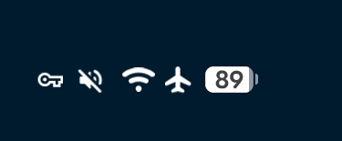
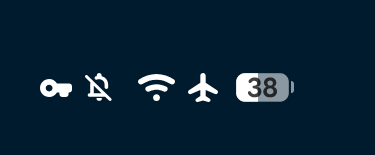

Google has begun rolling out **Android 17 QPR3 Beta 1**, the first release of a new testing cycle that follows quickly on the previous phase and points to a stable version expected in **March 2027**. There are no major changes: this is a maintenance beta, focused on interface tweaks and on fixing long-standing bugs rather than redefining the system. Even so, there are a few things worth knowing before deciding whether it is worth installing.

## What is new in Android 17 QPR3 Beta 1

The most visible change for anyone with a Pixel 11-series phone is a **new Notes tile in Quick Settings**. Google had already enabled the quick access to Notes from the lock screen and its desktop shortcut in the QPR2 cycle, and that base remains. This beta adds direct access from the Quick Settings panel, although the feature still does not appear on a Pixel 10.

The **status bar** also gets some retouching. The changes introduced in the stable Android 17 QPR1 release were intentional, so QPR3 Beta 1 consolidates them: the VPN icon gains presence, the silent icon lines up with the volume menu, and some indicators, such as Bluetooth and Airplane mode, appear slightly larger.

The **Gemini Intelligence boot animation** that had so far been exclusive to the Pixel 11 also shows up on the Pixel 10 series. **Proactive Assistance** is added to the system Settings, placed above Magic Cue, which remains available. It is a move that was already seen in the QPR2 beta and was later removed, so its continuity is not guaranteed. For now it has no reflection in the Gemini app settings.

## Which Pixels can install it and when the stable version lands

The beta is available for a broad catalogue of Google phones and tablets: from the **Pixel 6a** and the **Pixel 7, 7 Pro and 7a**, through the **Pixel Tablet** and the **Pixel Fold**, up to the **Pixel 8, 8 Pro, 8a, 9, 9 Pro, 9 Pro XL, 9 Pro Fold, 9a, 10, 10 Pro, 10 Pro XL, 10 Pro Fold, 10a** and the whole **Pixel 11** family (11, 11 Pro, 11 Pro XL and 11 Pro Fold).

Installing it is a manual process, not an update that arrives on its own. Anyone who joins the beta programme will receive these builds before anyone else, but takes on the usual risk: features that break, unpredictable battery use and changes that may disappear in the next release. The stable version is not expected until **March 2027**, so months of back and forth still lie ahead.

## Fixes: the least flashy and most useful part

The bulk of the release is the list of fixed bugs, and there are problems in there that have been bothering users for a while. This beta fixes issues such as the device freezing when unlocking with a fingerprint, crashes in the Settings app when opening the battery section, excessive idle battery drain with Flip to Shh enabled, Wi-Fi reconnection problems during background wakes, loss of the eSIM profile, audio dropouts on LHDC v5 Bluetooth devices and several freezes and ANR errors in applications.

For anyone suffering from one of these bugs, QPR3 Beta 1 is the first release to address it directly. For everyone else, the interest is lower: it is a transition beta, not the version worth waiting for to make the jump.

At this price there is no purchase to make: if your Pixel works well on the stable version, **do not install a mid-cycle maintenance beta**. The logical step is to wait for the stable version, expected in March 2027, or at most to follow the QPR2 evolution if you are already inside the programme. For a user who depends on their phone every day, the risk does not outweigh a Notes tile or slightly larger icons.

As a reference for how recent this cycle is, the previous release on the branch fixed similar bugs and temporarily pulled features, as we covered in [Android 17 QPR2 Beta 6](https://www.techspain24.com/noticias/android-17-qpr2-beta-6/).
