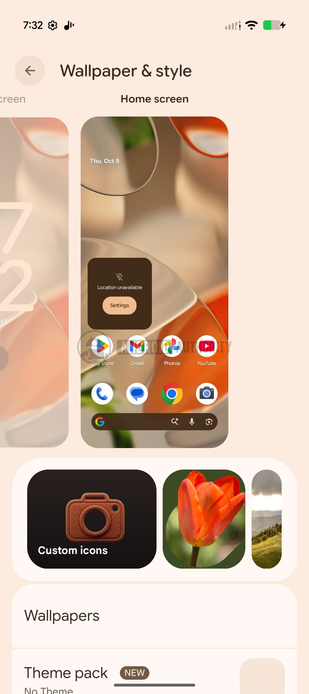
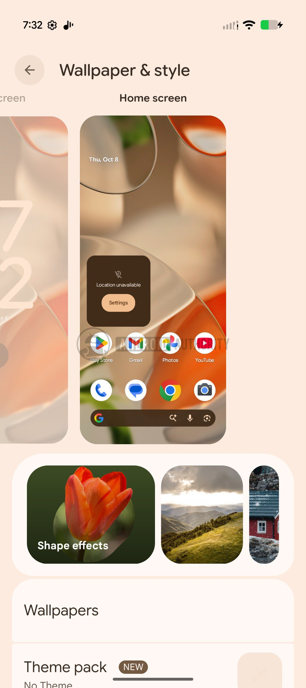
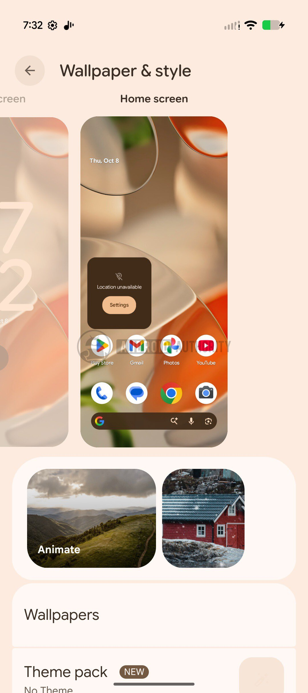
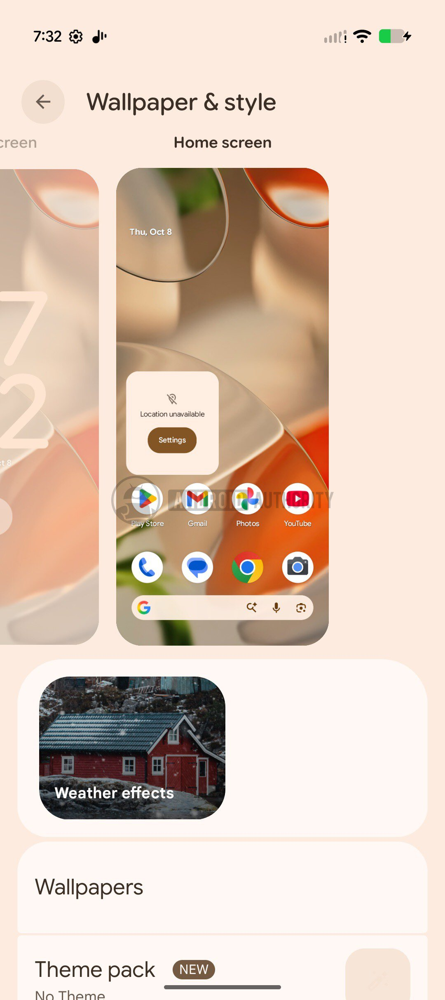
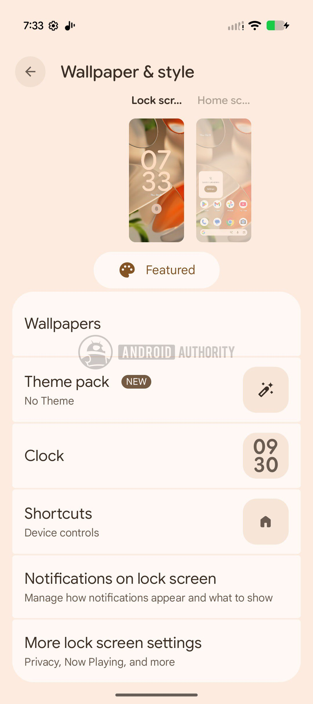

# Android Canary 2610 refreshes Pixel customization and prepares WhatsApp for HiLight

Google has released **Android Canary 2610**, the latest release of its experimental channel for Pixel phones. The build, numbered ZP11.260918.007, is aimed at developers and enthusiasts who want to test ahead of everyone else where the system is heading. It’s worth remembering from the first line: Canary is testing software, not an update for your daily-use phone.

The analysis, signed by Adamya Sharma with collaboration from AssembleDebug for Android Authority, points out two areas of interest: a redesign of Pixel customization and new hints at WhatsApp support for the HiLight LED on the [Pixel 11 Pro XL](/noticias/google-pixel-11-pro-xl-review/).

## Pixel Customization in Android Canary 2610

The *Wallpaper & style* (wallpaper and style) section debuts a **carousel** with options to customize icons and apply theme packs. In the same move, Google removes from that carousel *AI wallpaper* (AI-generated background) and *Emoji Workshop* (emoji workshop), which no longer appear among available options.

The old entry *Live Effects* (live effects) is now split into three independent sections: *Shape effects*, *Animate*, and *Weather effects*. At the top of the carousel, a button labeled *Featured* reappears; tapping it expands it again.

## HiLight Points to WhatsApp

The second novelty touches on the **HiLight** LED of the Pixel 11 Pro. Android 17 QPR2 Beta 6.1 already introduced luminous notifications for messages via HiLight, but WhatsApp was left out of the compatible apps. Some strings found now in a Pixel 9 build indicate that Google is preparing its incorporation.

The interface texts mention `Google Messages, WhatsApp` and describe «subtle lights when your favorite contacts write to you with Google Messages or WhatsApp». With those strings on the table, HiLight should support WhatsApp messages on the Pixel 11 Pro with this Canary build, although the outlet has not yet verified the feature: the intent is in the code, but there’s no confirmation that it works in practice.

*Image credit: Shimul Sood / Android Authority.*

## Availability and Warnings Before Installing It

Android Canary 2610 is distributed as a system image for a wide list of devices: from the Pixel 6a and the Pixel 7 series up to the Pixel 11 series —including Pro, Pro XL, and Pro Fold models—, passing through the Pixel 8, Pixel 9, and Pixel 10 series, the Pixel a models, the Pixel Fold, the Pixel Tablet, and the GSI image. Once installed, the device receives OTA Canary updates approximately once a month, just like the rest of the [Android 17 beta channel](/noticias/moviles/android-17-qpr3-beta-1/).

The data that matters most if your Pixel is your daily phone: to leave the Canary channel you must flash a non-Canary build, and that process wipes all device data. Entering is simple; going back costs a format.

## Verdict

Canary remains Google’s testbed, and this 2610 makes it clear in both directions: there are features being redesigned and others being removed from one build to the next. It’s not advisable to confuse what appears here with what will end up in the stable version, and even less so with code analysis, which only anticipates features that may never reach the public.

If you have a secondary Pixel or develop for Android, the build shows where customization and HiLight are heading. If it’s your only phone, at that price —being without a phone for a while and losing data when going back— it’s not worth it: wait until these features land in the stable version.
