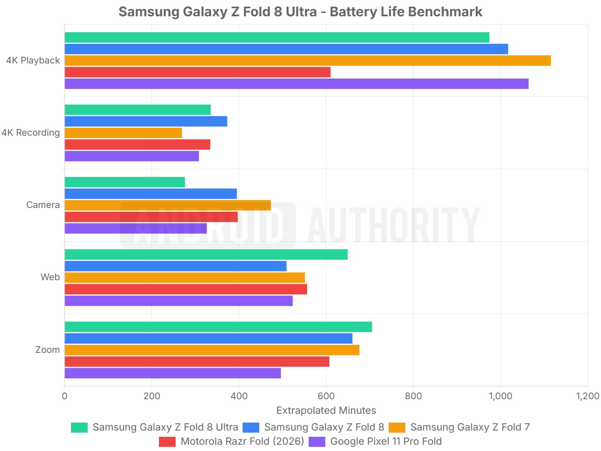
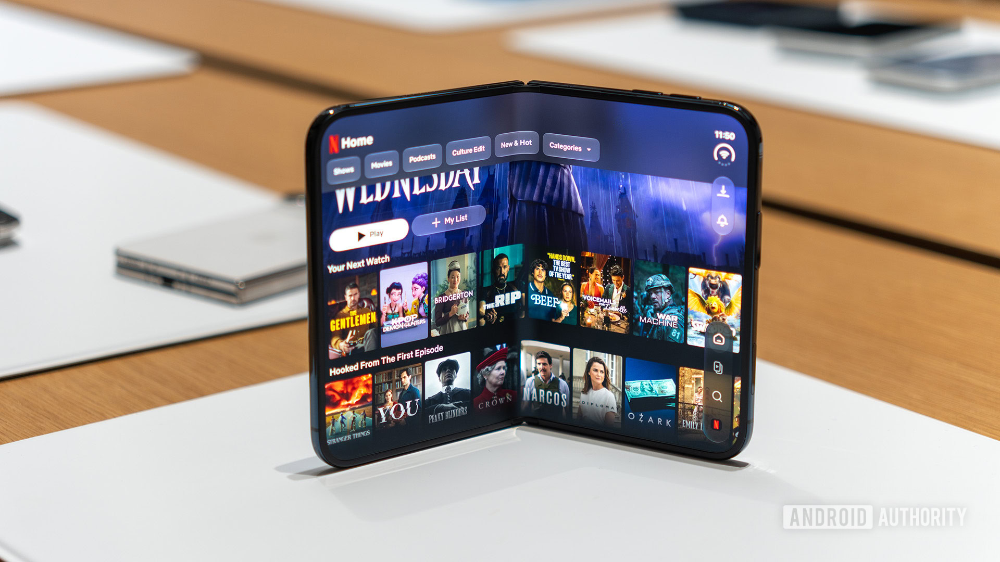

# Galaxy Z Fold 8 Ultra: Silicon-Carbon Isn't Enough for the Autonomy Leap

The Galaxy Z Fold 8 Ultra finally debuts a 5,000 mAh silicon-carbon battery, the technology that promised to break the autonomy ceiling of foldables. Against the previous year's model's 4,400 mAh lithium polymer cell, the change on paper is notable. But Android Authority's battery tests point in another direction: the new cell doesn't translate into a clear endurance leap, and what really moves the needle is the balance of the whole package.

## The Galaxy Z Fold 8 Ultra and the Silicon-Carbon Limit

According to the media outlet's data, the 5,000 mAh cell outperforms the previous generation's 4,400 mAh in almost all measured scenarios. The more compact Galaxy Z Fold mounts 4,800 mAh and also competes head-to-head, probably due to its slightly smaller screen. In 4K video playback, all three models are very close.

The problem is that other hardware changes eat up a good part of that advantage. The main 200 MP camera cuts into available photo time, to the point of leaving the foldable among the worst in the comparison in that section. Additionally, it's possible that the jump to a faster processor didn't deliver the expected efficiency improvement.

Silicon-carbon helps, but it doesn't produce the leap one would imagine. Not even the Motorola Razr Fold, with a 6,000 mAh cell, manages to pull away from the pack. In fact, Samsung's years of optimization on foldables mean its compact models score very close to the Razr and, sometimes, last longer. In practice, they all last similarly with a single charge, as reflected by the figures in the [Motorola Razr 2026](/noticias/moviles/motorola-razr-2026/).

All of them, however, surpass the Google Pixel 11 Pro Fold and its 4,800 mAh. The conclusion is that a foldable's autonomy depends on balance — efficiency of the large internal screen, processor optimizations, and camera hardware — more than the battery's raw capacity.

## What It Means for the iPhone Duo

Apple hasn't published the capacity of its iPhone Duo. It settles for a vague figure: 44 hours of video playback on the external screen, data that isn't very reassuring for a device designed to unfold. Some reports point to 5,400 mAh, a high capacity for the brand's first foldable, while others bring it closer to the 4,800 mAh more common in the market. A teardown won't be long in coming to confirm it.

What's interesting is that Apple doesn't need a larger battery to convince. It controls the processor, operating system, screen behavior, and power management, so it has plenty of room to squeeze consumption in two very different screen configurations. The Duo will have to undergo the same tests to know if it succeeded, but Samsung's foldable lesson is already on the table: the next autonomy battle won't be won with mAh alone.

## What Changes for the Buyer

For anyone who values autonomy above all else, the message is clear: the Galaxy Z Fold 8 Ultra's silicon-carbon doesn't justify by itself a change from the immediately preceding model. The improvement exists, but it's nuanced, and whoever only seeks more screen hours will do better waiting. As already made clear in the [Galaxy Z Flip8 review](/noticias/samsung-galaxy-z-flip8-review/), being a good foldable today isn't enough to mark differences.

For someone coming from a foldable of two or three generations ago, the opposite happens: they'll notice the advance, especially because it adds up across the rest of the phone's sections. If the price accompanies, the Z Fold 8 Ultra is a balanced purchase that gains some endurance; if only the battery leap is sought, none of the current foldables offers it in isolation.
