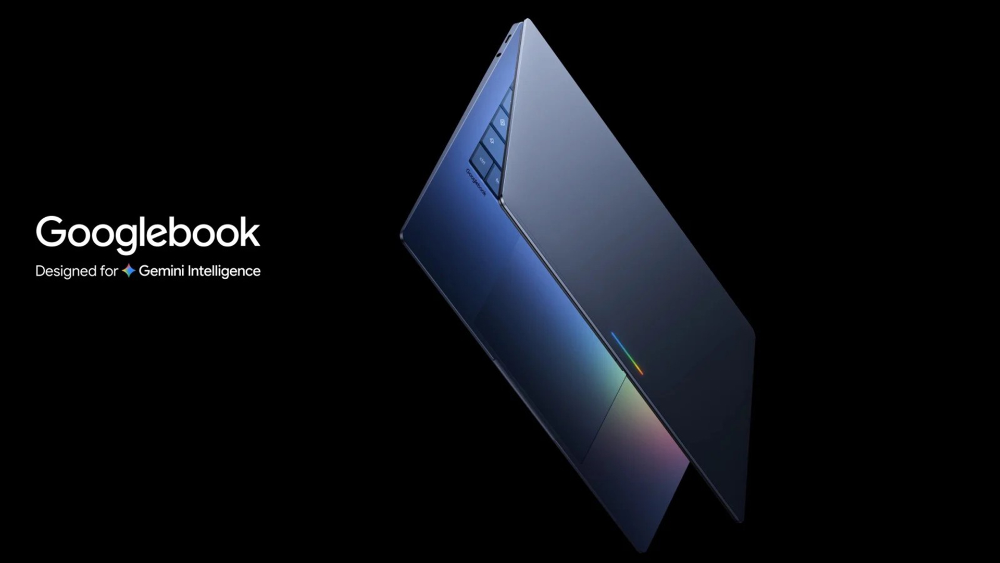
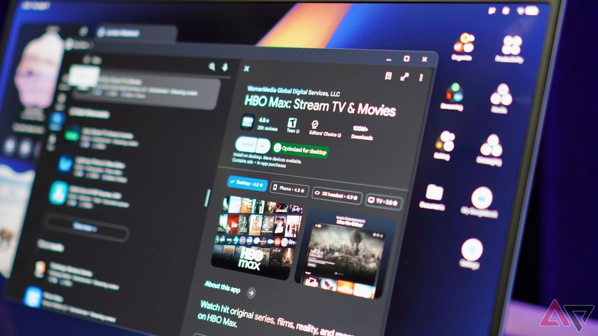

Google sold the Googlebooks as laptops "engineered to work with your Android phone right out of the box." They are now on sale from $899, but early buyers have found that promise comes with two pieces of fine print: the phone integration does not work with Samsung phones, and some Android apps do not perform the same on Intel models as on Qualcomm ones.

It is an awkward start for the product with which Google hopes to regain ground in the premium laptop market, and it is worth being clear about before paying: not every combination of Googlebook and phone delivers the same experience today.

## Googlebook integration leaves Samsung out

The features Google groups under "Better Together" require Android 17. With a compatible phone you can continue tasks started on the handset, reach its files from the laptop, mirror notifications or fire up an instant hotspot. The problem is that Samsung phones on Android 17, such as the Galaxy Z Fold 8, do not stay connected: the devices see each other, but the link drops.

Google has confirmed that these features are not currently supported on even the latest Samsung phones and that an update will enable them "in the coming weeks," as Ars Technica reports. Even then, it will only apply to Samsung phones running Android 17: anyone with an older or cheaper model may be left waiting. Manufacturers such as Motorola, which released its 2026 phones with Android 16, are still awaiting that version, and some brands are still testing it. In practice, Pixels are today the only family that guarantees full integration.

## Android apps: the Intel vs Qualcomm gap

The second front is performance. Google acknowledged to Android Authority that "the vast majority" of Android apps run fine on both Intel and Qualcomm Googlebooks, but that "a small handful" of complex applications needs developer tuning to run at their best on Intel platforms. The company has not listed which ones.

The reason is technical: the Android ecosystem was designed around Arm chips, while Intel models use the x86 architecture. Google insists its Intel-powered Googlebooks use a binary translation layer that compiles 64-bit Arm code into native Intel instructions, rather than legacy emulation, and puts compatibility at 96.6% of the 10,000 most-used Play Store apps. That percentage leaves out just over 300 apps, removed mainly for not adapting to large screens, according to the company. Even so, it is worth checking that your must-have apps work before buying.

The split across models does not make choosing easier: the Intel-powered Googlebooks are the Asus Googlebook 14, the Lenovo Googlebook 15 and the Acer Googlebook 14, while the Dell XPS Googlebook and the HP Googlebook 14 run Qualcomm's Snapdragon X Elite. The lineup and prices have been known since [the launch of the five models](/noticias/googlebook-launch/).

## What it means for buyers

At the prices involved — between $899 and $1,299, with 16 or 32 GB of RAM and 256 or 512 GB of storage — buyers are paying for a phone integration that, for now, is only complete if they own a Pixel. If you are coming from a Samsung, which is by far the largest Android base, the headline experience arrives late.

The advice is the same one several sources give: wait a few weeks for Google and its partners to iron out the kinks. At this price, today it is a "yes, but with caveats"; if you do not have a Pixel and want full integration from day one, you will have to wait. And if your purchase depends on a specific Android app, check it first: on Intel models, not all of them perform the same.
