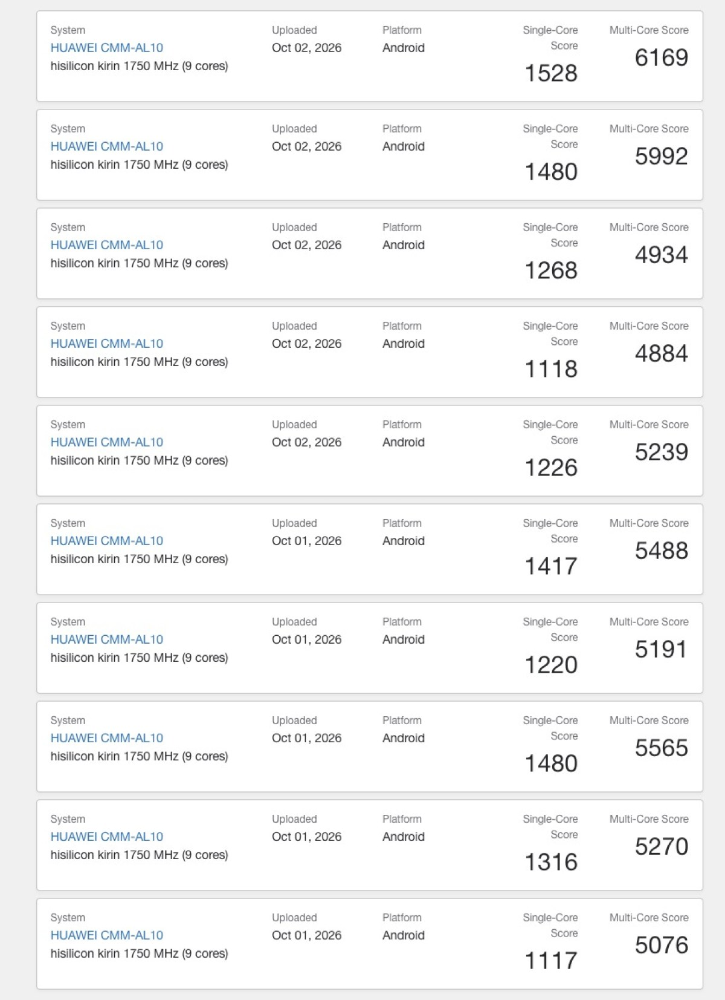

The Huawei Mate 90 Pro Max has shown up in the Geekbench database with its new Kirin 9050 Pro processor, the chip the company reserves for the most capable versions of the Mate 90 series it has just launched in China. The run, uploaded from a device with the CMM-AL10 identifier, returns an average of 1,317 single-core points and 5,381 multi-core points, with a top recorded score of 1,528 and 6,169 points.

Those figures place the Kirin 9050 Pro in the territory of the Snapdragon 8 Gen 1 and its successor, the Snapdragon 8 Gen 2: 2021 and 2022 flagship chips. The gap with current chips is not small, and it should be treated with caution, because this is a leaked result that Huawei has not confirmed.

## What Geekbench reveals about the Kirin 9050 Pro

Geekbench lists a nine-core CPU with an unusual layout. The main core, which the listing calls "ultra", runs at 3.1 GHz; it is joined by six performance cores split into two blocks (two at 2.7 GHz and four at 2.2 GHz) and two efficiency cores at 1.75 GHz. On the graphics side, the listing points to a Maleoon 955 GPU with six cores at 1.05 GHz.

The reported system is Android 16 and the detectable memory is around 15.2 GB. The runs are spread across 1 and 2 October, which fits the launch of the series in China.

## A score range that calls for caution

Not every CMM-AL10 measurement is the same. Besides the best result of 1,528 and 6,169 points, the list includes runs as low as 1,117 single-core and 4,884 multi-core. That spread is common in freshly published tests and in pre-production devices running unpolished software, so the average is the useful figure, not the peak.

That said, even the best result leaves the chip below what current flagship processors deliver. For Huawei, the relevant question is not whether it catches Qualcomm in a synthetic benchmark, but whether its sustained performance and power efficiency hold up in daily use.

## What remains unconfirmed

The information about how the Kirin 9050 Pro is built does not come from Geekbench, but from a Bernstein Research report covered by SCMP. According to that analysis, the chip would use a 7 nm-class node with SMIC's N+2 or N+3 technology, the Chinese foundry. Huawei has not confirmed this, and it is the point that shapes the story the most: a 7 nm process would limit both density and power draw against more advanced nodes.

There is also no confirmed price or availability for Spain, and the Mate 90 series has so far been launched in the Chinese market. Anyone following this model closely already has a precedent in [the external telephoto lens that leaked for this same handset](/noticias/huawei-mate-90-pro-max-teleconverter-leak/): it is worth separating what the manufacturer confirms from what only appears in a database or a third-party report.
