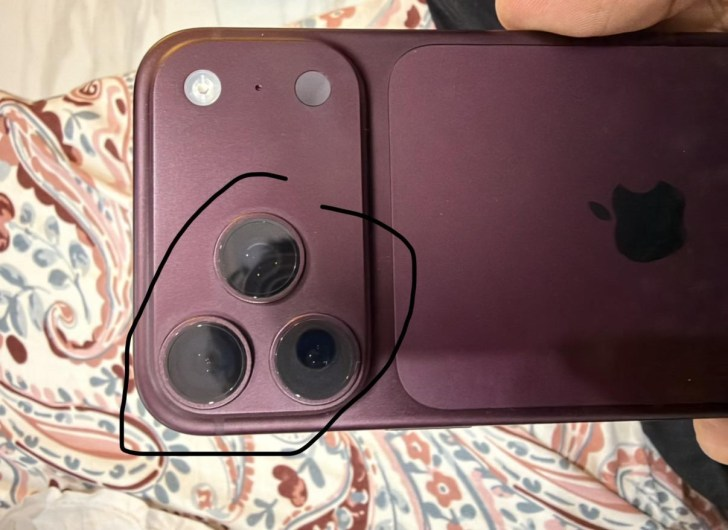

The iPhone 18 Pro and iPhone 18 Pro Max, the premium tier Apple put on sale a few weeks ago, are starting to pile up reports of discolouration. Several users have posted pictures in which the Burgundy finish — this generation's hero colour — loses tone and turns pinker around the camera modules. GSMArena has collected the cases and stresses that, for now, Apple has confirmed no defect.

## Discolouration that starts around the cameras

The reports are concentrated on Reddit, in threads dedicated to the iPhone 18 Pro. In the shared images, the loss of colour begins in the area around the three lenses and, according to the affected users themselves, then spreads to the aluminium chassis. Although Burgundy is the majority case, Black units showing the same pattern have also been seen.

It is worth being cautious about the scale: there is no official confirmation and no figure for the number of affected units. Some owners say the colour change persists even after cleaning the phone; others attribute the marks to the grease and fingerprints this finish readily shows and claim they disappear with a microfibre cloth.

## The iPhone 17 Pro precedent

It is a script that already played out last year. A few weeks after the launch of the iPhone 17 Pro and 17 Pro Max, their owners began reporting a similar discolouration, focused back then on Cosmic Orange and, to a lesser extent, Deep Blue. On that occasion Apple ended up replacing the faulty units, GSMArena recalls, and it expects a similar move this time.

On the cause there are only hypotheses. The most repeated one points to ultraviolet light: many of the cases would have appeared after using the phone outdoors, just as happened with the previous generation. The Chinese outlet MyDrivers (快科技) adds a technical explanation: the aluminium chassis is coloured by anodising and, if the sealing of the porous layer is incomplete, the grease and sweat from the skin seep into the oxide and alter the dye. It is plausible, but it is not an official diagnosis.

## What users can do (and what does not change)

For now, the most repeated advice among the affected users themselves is the usual one: use a case, especially if the phone spends time outdoors, and wait for Apple to comment. In that regard, it is worth remembering that [the iPhone 18 Pro keeps the same external design as the 17 Pro](/noticias/iphone-17-18-same-design-cases/), so last generation's cases fit just the same.

If the finish is what weighs most in your decision, the news does not change the picture: [what was already on the table between the 17 Pro and the 18 Pro](/noticias/iphone-17-vs-18-pro/) still stands, and a colour that lightens with use does not help justify the outlay. At this price, my verdict is to wait: until Apple clarifies whether it will replace units — as it did last year — Burgundy is not a safe buy for anyone who would notice any change in the finish. If you already own one and spot the discolouration, document the case with photos and contact Apple; last year the company ended up replacing the affected units.
