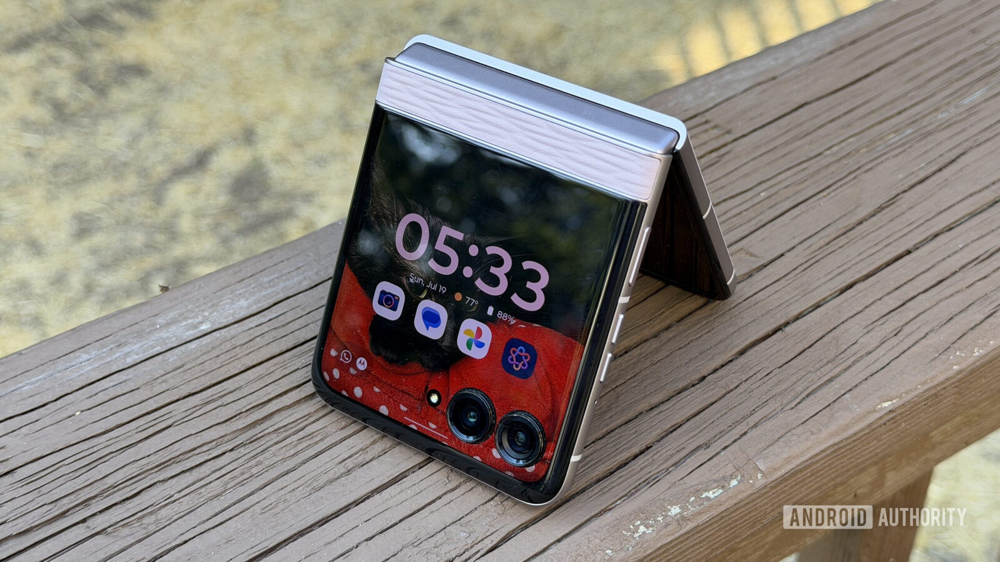
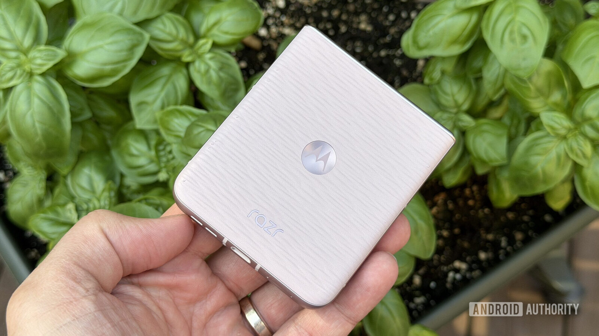
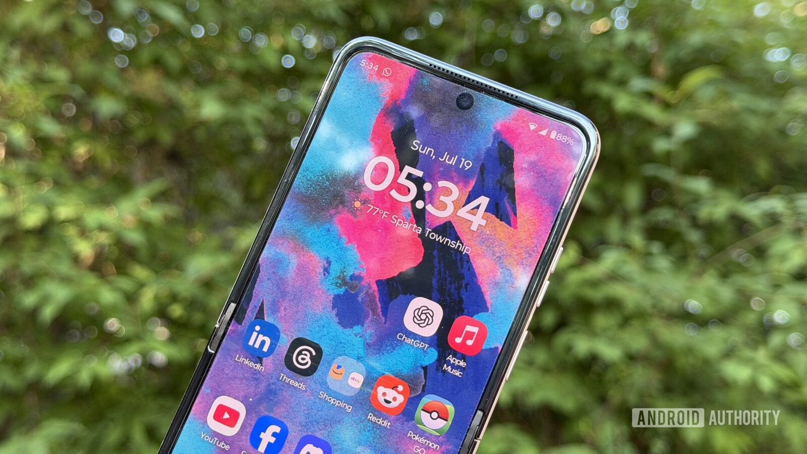
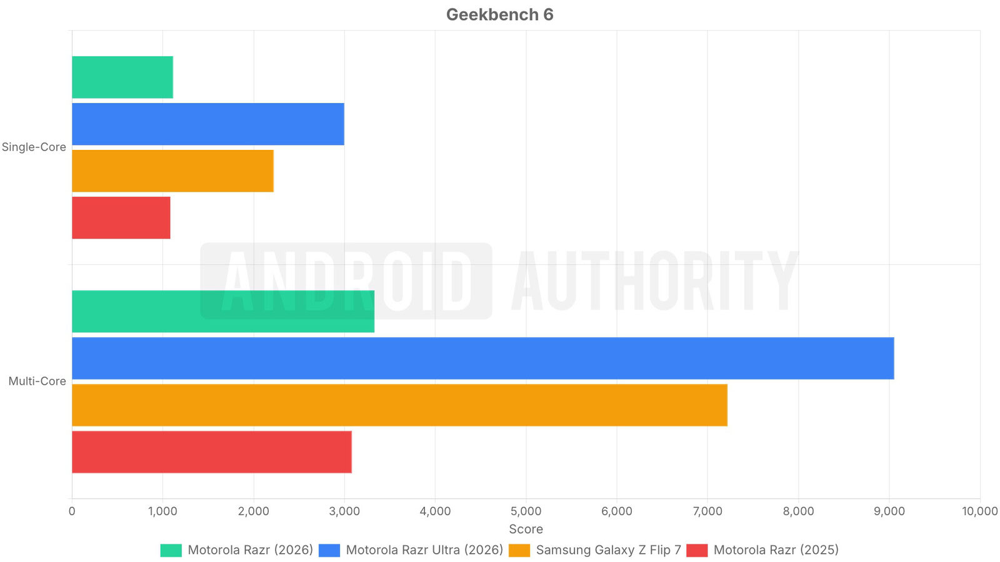
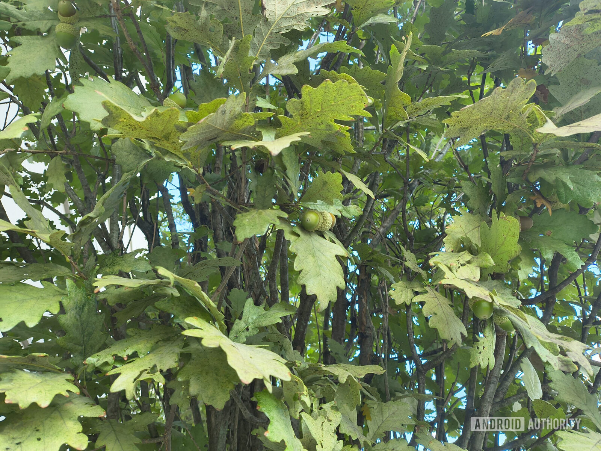
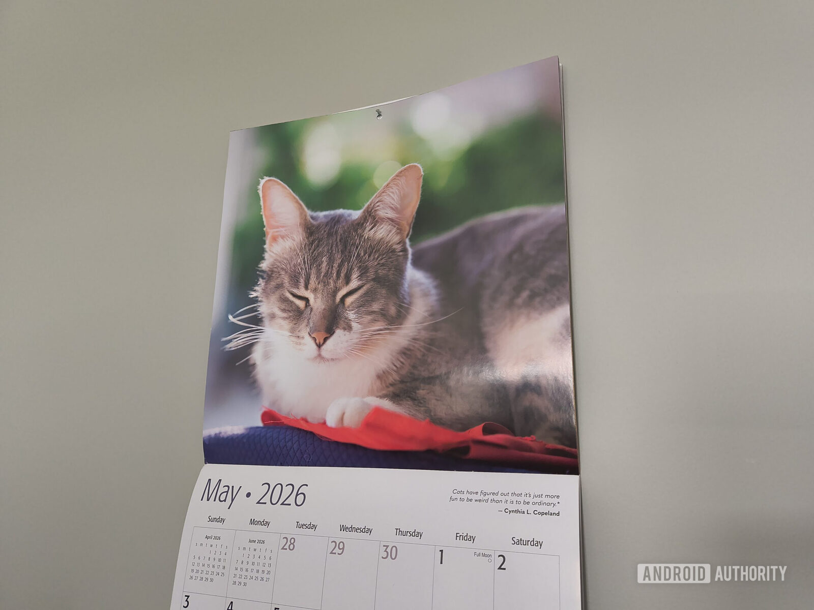
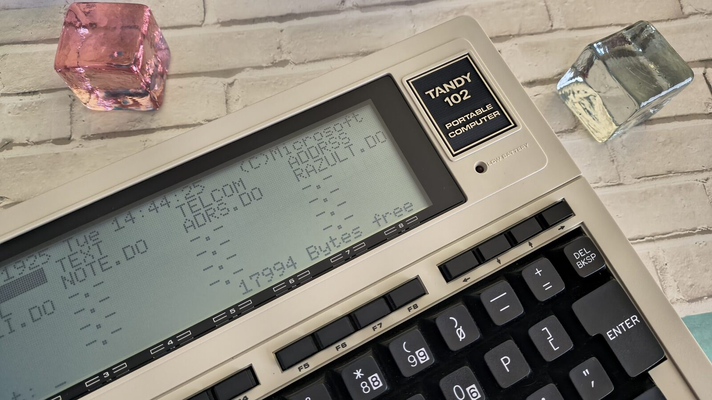

# Motorola Razr 2026: price rises to $799.99 and it remains the reference foldable

The Motorola Razr 2026 already has a verdict: 8 out of 10 in Android Authority's analysis. The clamshell foldable goes up this year to $799.99 in its base version — more expensive than its predecessor and without background changes in the technical sheet — but the review still points it out as the foldable that should end up in more pockets. The improvement is in the battery and cameras; the pending subject, software support.

## Design and displays: a formula that Motorola does not touch

The Razr 2026 is not a revolution compared to the previous generation. It keeps the 3.6-inch external screen, the aluminum frame matching the color, and the textured back; the new tones are almost the only thing that allows distinguishing it at first glance. The hinge, however, is the best one the review has tested on a Razr, and the assembly boasts dust and water resistance IP48, a reasonable relief for a format that still requires some care.

The external screen is one of the phone's arguments: it works from the first boot, allows editing shortcuts without installing extra software, and offers simple games to kill time. It only stumbles with some applications whose format does not fit well in those 3.6 inches. The top model, the Razr Ultra, has a 4-inch external screen, but here the size cut is not annoying.

When unfolded, the main panel appears: a 6.9-inch AMOLED at 120 Hz, 1080p resolution and HDR10+ compatibility. The review describes it as a bright panel sufficient for indoors and outdoors, and points out that Full HD resolution has not become a problem in daily use.

## Performance and battery: mid-range with two days of autonomy

The Razr 2026 relies on a MediaTek Dimensity 7450X accompanied by 8 GB of RAM. The analysis is clear: it is a mid-range performance that handles daily tasks well, but falls short if more is demanded from it, for example when running an demanding game at maximum. For usual use, however, it does not pose a problem.

Where the phone surprises is in autonomy. Its silicon-carbon battery of 4,800 mAh holds two days of moderate use with a single charge, a result that the review considers more typical of a high-end device. Fast charging, on the other hand, stays at 30 W via cable and 15 W wirelessly, below the Razr Ultra.

The weak point is software. Motorola promises three years of Android updates and five years of security patches, half of what Google and Samsung offer in phones that cost less. Android 16 works well on the device, but the review doubts whether Android 17 will arrive soon, and reminds that patches can be delayed. The Hello UI layer, clean, and Moto gestures remain as always.

## The cameras of the Motorola Razr 2026: two 50 MP sensors and photos ready for social networks

Motorola sells the Razr 2026's cameras as "AI-powered," although the review admits it could not say what that translates to after capture. The result, however, convinces it: two 50-megapixel sensors (main and ultra wide-angle) that avoid the typical quality drop when switching to ultra wide-angle. The review would have preferred a telephoto lens, but values that both share resolution.

With good light, images are detailed, with deep contrast and saturated colors; the review considers them more ready for social networks than those of a Pixel, although at night they remain somewhat soft and a Pixel 11 would still be better for night photography. The front camera is 32 MP and fulfills, especially in portrait mode, while Flex View mode allows recording video as if it were a classic camcorder.

## What changes for the buyer

The base Razr 2026 costs $799.99, below the Galaxy Z Flip 8 ($1,199.99), the Razr Plus ($1,099.99) and the Razr Ultra ($1,499.99). Compared to the [Galaxy Z Flip 8 analysis we published last month](/noticias/samsung-galaxy-z-flip8-review/), the review acknowledges that Samsung's phone is more solid in software and update frequency, but reproaches it for having lost the style hook that the Razr still retains.

The warning of this generation is that Motorola has raised the price without improving the technical sheet much. The phone remains the sensible purchase for anyone who wants a clamshell foldable that works well, but if long-term support is a priority, Samsung's alternative — or waiting for the next batch of Android — weighs more. It is a context worth reading alongside the manufacturer's update policy, as we already reported when covering the arrival of [Android 17 to several Motorola phones in the United States](/noticias/moviles/motorola-android-17/).

At this price, yes: the Razr 2026 compensates with design, external screen and two days of autonomy difficult to find in a foldable. At this price, no: anyone who wants five or more years of updated Android should look elsewhere or wait for the next generation.
