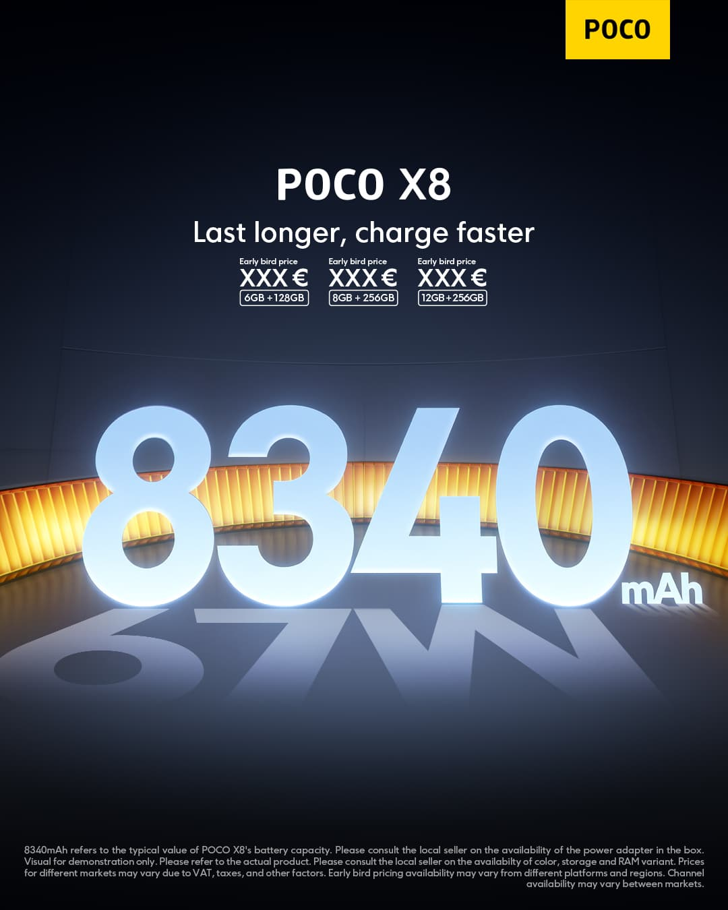
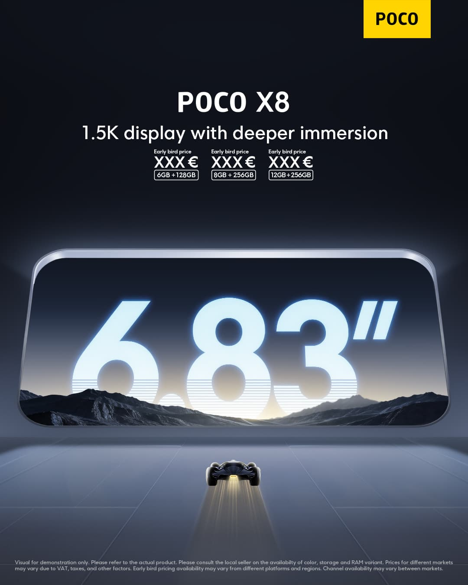
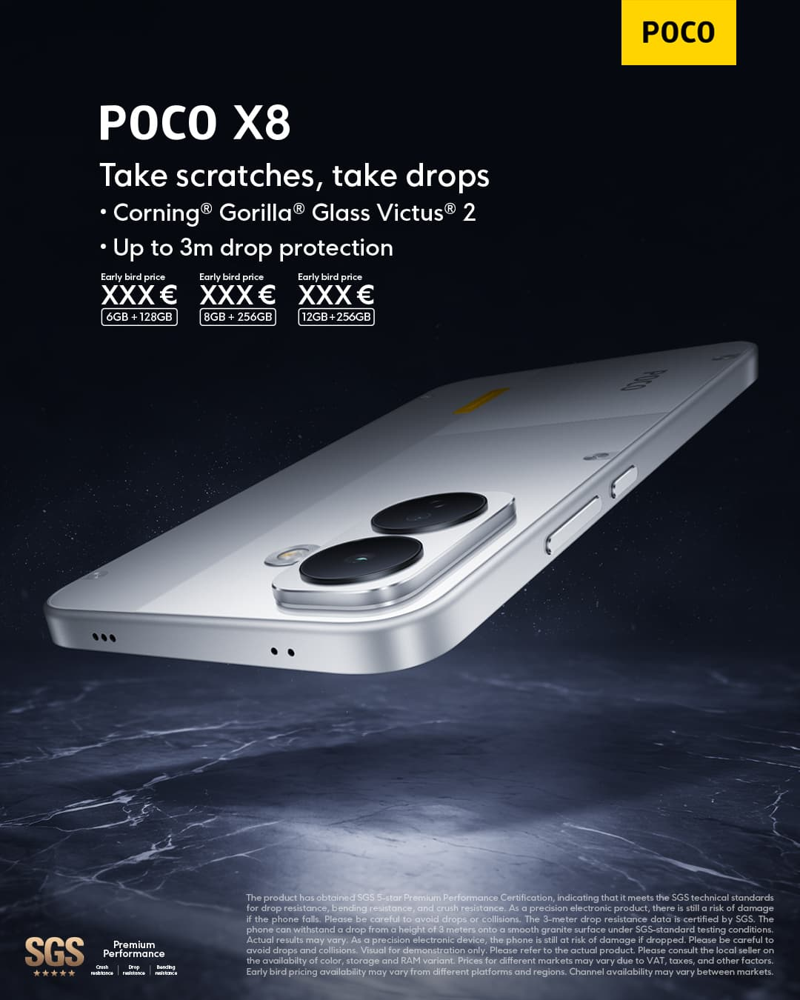

# POCO X8 Now Available from €319 with 8,340 mAh Battery and Snapdragon 6s Gen 4

The POCO X8 is now on sale starting at €319, featuring one of the most generous batteries in the mid-range: 8,340 mAh. Xiaomi has thus renewed its most popular series after updating its flagship offerings, this time with autonomy as the main selling point and a Snapdragon processor designed to keep costs down.

## An 8,340 mAh Silicon-Carbon Battery in the POCO X8

The jump compared to the POCO X7 is 3,230 mAh: the previous model capped at 5,110 mAh, which represents a 63% increase in capacity according to the brand's data. The cell uses silicon-carbon technology and, according to POCO, withstands more than 1,600 charge cycles — a figure that matters for anyone keeping the phone for several years.

In charging, the POCO X8 supports HyperCharge at 67 W: the manufacturer claims it recovers 45% of that capacity in 30 minutes. It also includes wired reverse charging at 22.5 W to power other devices, such as headphones.

## Flat 6.83-Inch Display and Snapdragon 6s Gen 4

In the multimedia department, the POCO X8 abandons the curves of the previous model and mounts a flat panel measuring 6.83 inches with 1.5K resolution and 120 Hz refresh rate. Maximum brightness reaches 3,500 nits, supported by M10 emitter material for readability under direct sunlight, and includes Xiaomi Vision Care's blue light protection system.

The camera setup is backed by a main 50 MP sensor with optical image stabilization (OIS), accompanied by two stereo speakers. As the brain, Qualcomm provides the Snapdragon 6s Gen 4, manufactured on a 4 nm process and compatible with LPDDR4X memory and UFS 4.1 storage. According to POCO's tests, the chip scores around 940,000 points in AnTuTu V11 — a performance that the company considers sufficient for gaming, entertainment, and multitasking within its range.

## IP69K Durability and Available from €319

The body debuts a back divided into two geometric finishes, with options in black, white, and orange, and reinforces durability with one of the most complete certification sets in its segment: IP66, IP68, IP69, and IP69K against fine dust, immersion, and high-pressure water jets.

The POCO X8 starts at €319 and can already be found in retailers such as AliExpress or eBay. If you are looking for autonomy and price above all else, it is a purchase that makes sense at this price; if what you prioritize is the camera or premium finishes, it is advisable to compare first with other brands' mid-range offerings. You can follow the rest of the news in the [Mobile Phones](/noticias/moviles/) section.

