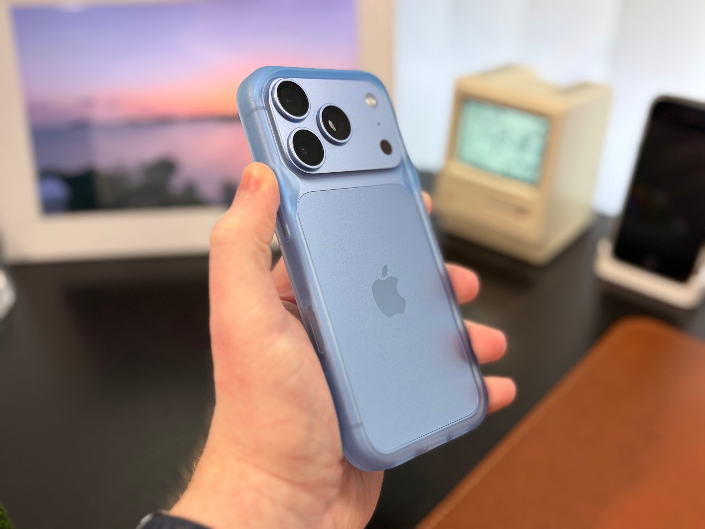
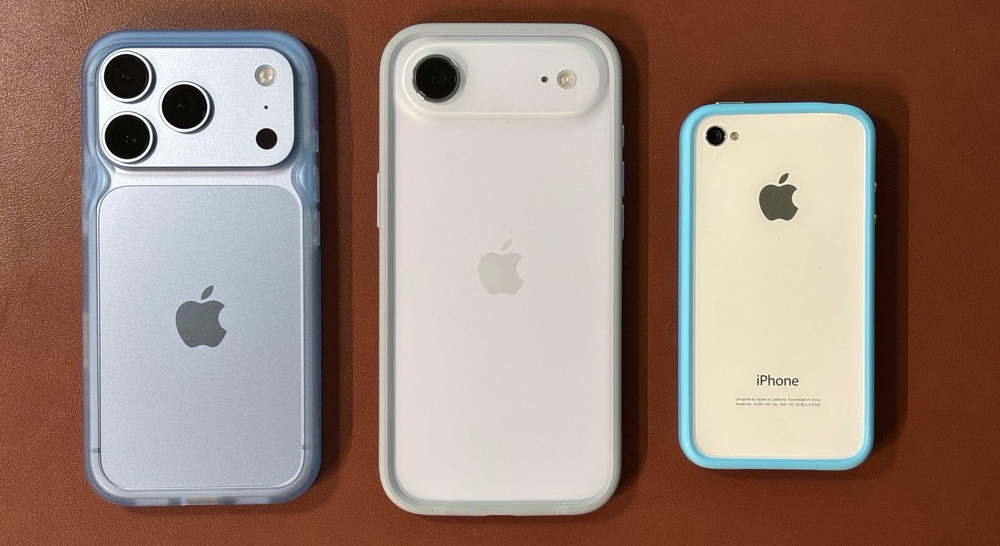
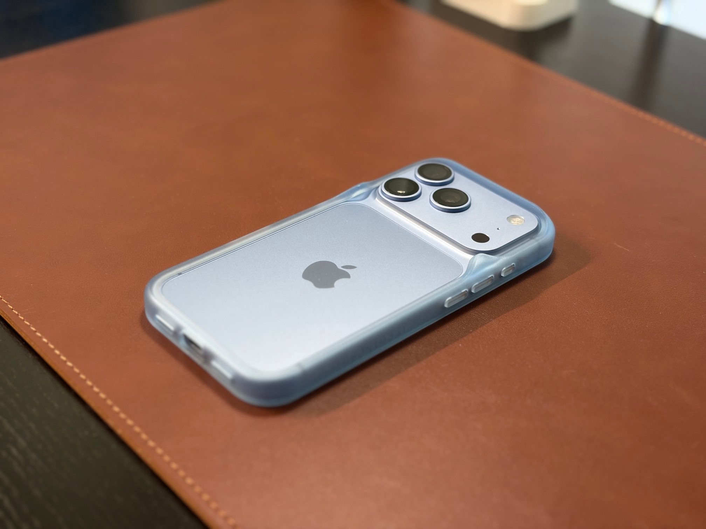
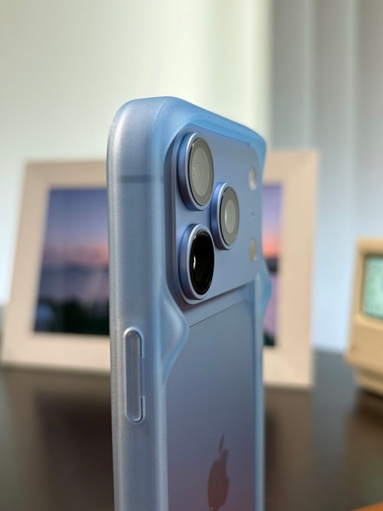
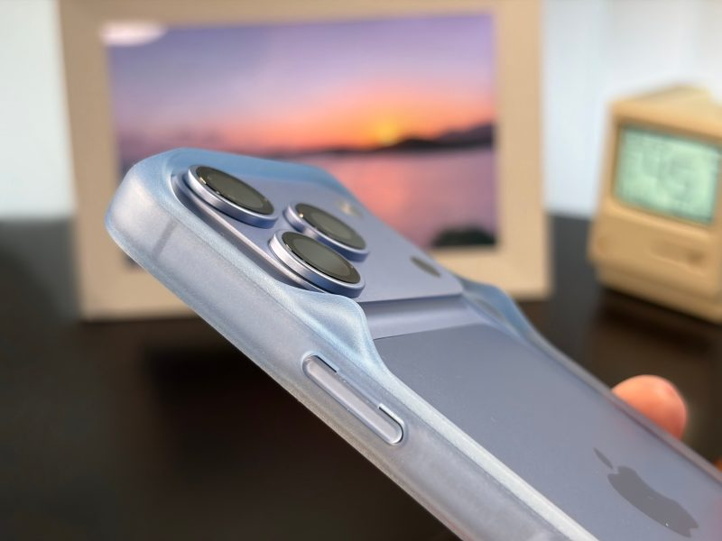
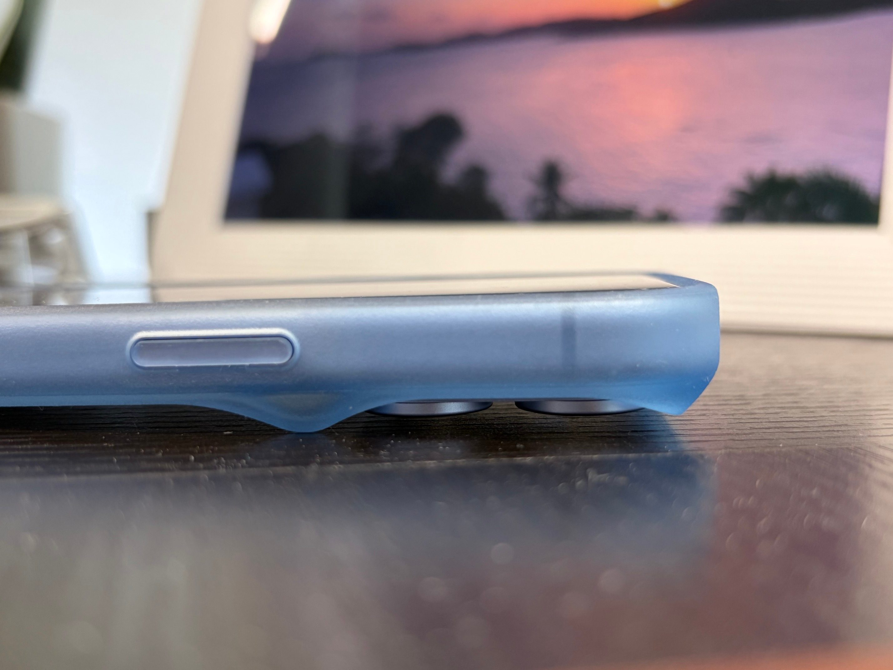

# Rhinoshield Bumper Analysis for the iPhone 18 Pro: Minimalist, But More Protective Than It Looks

Bumpers —cases that only wrap around the phone's edges without covering the back— are a minority format, and the iPhone 18 Pro has not escaped that scarcity. Faced with proposals that add features, such as [the Ugreen E Ink screen case](/noticias/ugreen-e-ink-iphone-case/), Rhinoshield maintains the opposite bet with its **Minimalist Impact Bumper**, which costs around $30 and is sold primarily through the firm's website, with occasional appearances on Amazon.

The analysis signed by Dylan McDonald at 9to5Mac arrives with a nuance: it isn't the bumper Apple would have hoped for this model, but it delivers. And it does so with an argument uncommon in this format: real protection of the camera module.

## A bumper that keeps the camera safe

The Minimalist Impact Bumper replicates the classic fit of this type of case: a subtle lip on the display and another somewhat more generous one on the back. What distinguishes it are supports that keep the camera module and lenses separated from the surface where the phone rests. On an aluminum iPhone 18 Pro, that avoids scratches and the uncomfortable wobble when writing on a table.

9to5Mac points out that thanks to that detail, the assembly protects more than an ordinary bumper. The case is made of hard plastic and of a single material, which makes it 100% recyclable according to the manufacturer, and it is offered in three colors aligned with those of the iPhone 18 Pro: white, blue, and black.

The firm does not offer the burgundy variant, precisely the color that has generated discussion due to [reports of discoloration around the cameras](/noticias/moviles/iphone-18-pro-decoloracion/). The blue of the bumper, according to the review, approaches the phone's Glacier tone, though it doesn't nail it exactly.

## Loose fit and buttons that cost effort to press

The less bright side is in the tactile experience. The fit results in being somewhat loose: the edges fold outward easily and the critic suspects they could stretch over time. Nevertheless, after an accidental drop, the phone did not slip out of the case, so he does not consider it a serious risk.

The buttons also receive criticism: they are almost flush and feel soft, which complicates pressing them firmly. To that is added a material that, compared to Apple's Air bumper, conveys a cheaper sensation —though the author prefers it over the soft plastic of typical transparent cases— and that traps dust from the pocket. There are also no attachment points for Apple's Wrist Strap or Crossbody Strap.

## What changes for the buyer

Despite the drawbacks, the critic has decided to keep the case for a concrete reason: it allows carrying the iPhone almost without a case without exposing the aluminum to blows and marks. Whoever seeks that "bare" but protected sensation has an option here; whoever prioritizes firm buttons and a rigid fit does not.

In price, Rhinoshield's $30 bumper lines up with Apple's model at $39 once shipping is added, and availability concentrates on the manufacturer's website, with sporadic listings on Amazon. For a reader in Spain it is advisable to check shipping costs and possible customs before making the purchase: the difference versus Apple's alternative is not decisive. At this price, yes for whoever wants the almost case-free experience; no for whoever cannot tolerate soft button pressing.
