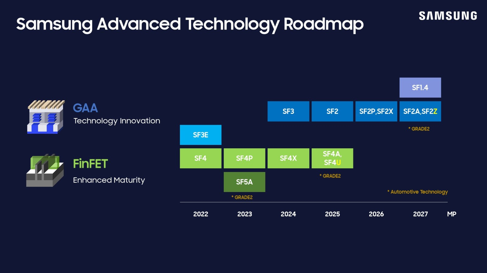

Samsung has begun mass production of its Exynos 2700 chip, according to Korean publication *The Elec*. The timing lines up with a Galaxy S27 family launch in February or March: it usually takes between three and four months from the start of manufacturing to a final product being ready.

## Which models will use it and in which regions

The Exynos 2700 will go into the Galaxy S27, S27+ and S27 Pro in Korea and Europe. In the United States and China, those same models will use Qualcomm's Snapdragon 8 Elite Gen 6. According to the Korean outlet, the production target is "more than 10% higher" than the Exynos 2600's, an adjustment driven by the addition of the Galaxy S27 Pro to the S family.

## The Galaxy S27 Ultra is still up in the air

The big unknown is the [Galaxy S27 Ultra](/noticias/galaxy-s27-ultra-funda/). Samsung System LSI, the division that designs the Exynos chips, is confident in the 2700 and is pushing for it to be adopted in the top-tier model as well: besides improving its own numbers, it would signal that the chip is good enough for an Ultra-class device. The final say belongs to Samsung MX, the division that builds the phones, which is weighing benchmark and thermal performance, the price of Qualcomm's chips and the production capacity for the Exynos 2700.

## A second-generation 2 nm node for the Exynos 2700

The Exynos 2700 will be fabbed on Samsung's SF2P, a second-generation 2nm Gate-All-Around (GAA) node. Compared with the first-generation SF2 node used by the Exynos 2600, Samsung promises 12% more performance, 25% lower power use and 8% less silicon area. The chip is also expected to use Arm C2 cores, versus the C1 cores in the 2600.

In internal testing, according to figures that have circulated, the Exynos 2700 beat the Snapdragon 8 Elite Extreme Gen 6 by 9.5% in the Geekbench multi-core test, though Qualcomm keeps the edge in the single-core test. Those numbers should be treated with caution: they come from leaks rather than from testing on a final product.

## What changes for buyers

For buyers in Spain, the relevant question is not which chip wins a benchmark, but how many years of updates the phone will receive and at what price. The regional split points to Spain getting the Exynos 2700 in the base, Plus and Pro models, while the Ultra remains unconfirmed. At this price level, uncertainty comes at a cost: the prudent move is to wait for official confirmation and for the first tests of the chip in a finished phone. That said, the start of mass production is the firmest signal so far that the Galaxy S27 family will arrive in the expected window.
