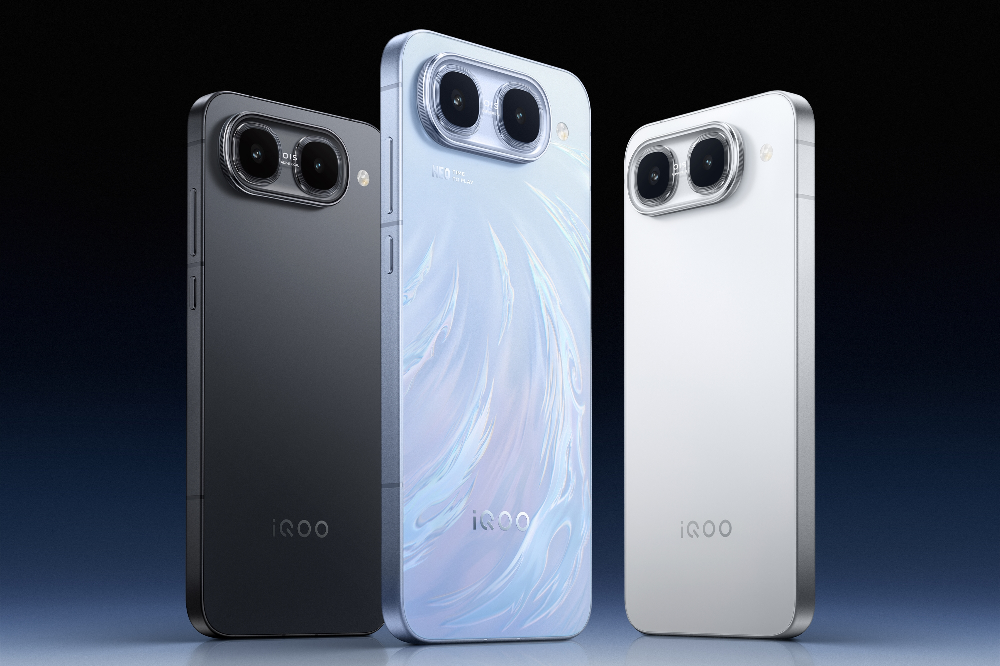

# The iQOO Neo12 Would Be One of the First Phones to Debut a 2K Display with a 185 Hz Refresh Rate

The iQOO Neo12 would be one of the first phones to debut a 2K display with a 185 Hz refresh rate. Visionox would supply the panel, and the launch is expected this October in China, according to leaker Digital Chat Station. There is no official confirmation from iQOO, so it's best to read the information as what it is: a leak, not an announcement.

## The iQOO Neo12: A Fourth-Generation pTSF Display

The panel's interest isn't just in resolution or refresh rate, but in the technology that underpins it. Visionox would have built it on pTSF, its fourth-generation emission technology, developed together with Tsinghua University. The acronym stands for phosphorescence-assisted thermally sensitized fluorescence.

According to the data collected by the leak, high-efficiency pTSF displays reduce power consumption by more than 12% and extend lifespan by 15%. There is also a mid-range variant that would shift color from the DCI-P3 standard toward Adobe and BT.2020 spaces, with precision suited to professional design; in that case, power consumption would drop by more than 6% and lifespan would increase by 20%. Overall, the promise is more brightness and better color without the battery paying for it.

## Fifth Generation of Snapdragon 8 Elite and Proprietary Graphics Chip

In terms of performance, the Neo12 would mount Qualcomm's fifth-generation Snapdragon 8 Elite, fabricated in 3 nm with a third-generation Oryon CPU, an Adreno GPU with new architecture, and an improved Hexagon NPU. The leak mentions a maximum frequency of 4.6 GHz, a 20% increase in single-core performance, 17% in multi-core, 32% more responsiveness, and up to 35% more efficiency.

Added to that is a dedicated graphics chip with frame rescaling and generation, designed to double the refresh rate in games and bring the image closer to that of a PC. An ultrasonic under-display fingerprint sensor also appears.

## What Changes for the Buyer

For now, there is no price, no confirmed sales date, and no confirmation from iQOO. That's the first thing to keep in mind: everything above are specifications from a leak. 185 Hz displays already exist on the market, with the [Poco F9 Ultra](/noticias/poco-f9-ultra-analisis/) as a recent example, and iQOO itself has already played around with high-refresh panels on its tablets, such as the [Pad Ultra with 165 Hz OLED](/noticias/iqoo-pad-ultra-8-8-oled/).

The reasonable doubt isn't whether the display sounds good on paper, but whether the jump to 185 Hz is perceptible outside of the few games that take advantage of it and at what price point. Without that data, there's no purchase verdict: in a display that claims efficiency, price is exactly what decides whether the improvement translates into a sensible purchase or just another brochure figure.
