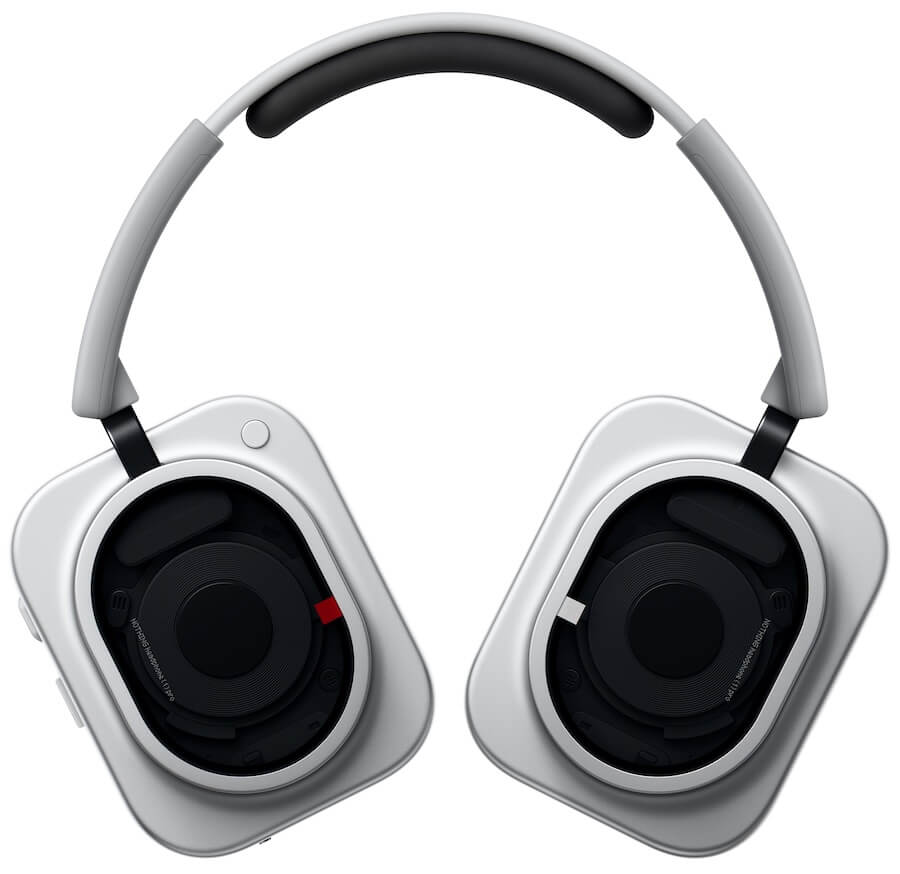
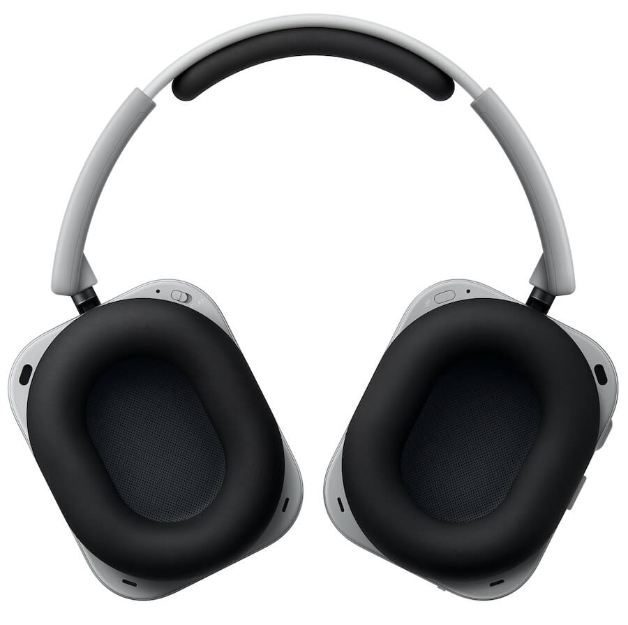
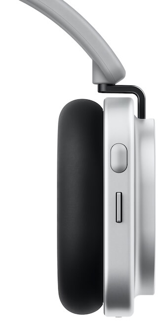
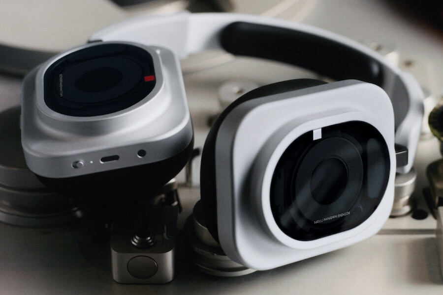

Nothing has announced the **Headphone (1) Pro**, its new flagship active noise-cancelling over-ear model, priced at $399. It sits above the $299 Headphone (1) and the $199 Headphone (a), but what is genuinely different is not the finish or the battery life: it is what happens inside each earcup, where the company has fitted three transducers per side.

## Three drivers per earcup, an unusual setup

Each earcup combines three drivers. For bass there is a 40mm dynamic driver with a PET dome, an electroplated metal-ceramic coating and a dual-magnet motor. It is joined by a second, 13 x 8mm dynamic driver for the midrange with a PEN diaphragm, and a far less conventional third element: a 3.2 x 6.0 x 1.15mm xMEMS solid-state driver for treble, with a silicon diaphragm. Nothing says the latter is considerably stiffer than conventional plastics, which translates into a faster transient response at high frequencies.

The brand claims 15% more bass impact and 26% higher sensitivity compared with the Headphone (1). Those are the company's own laboratory figures, but they point to the bass driver having been substantially reworked rather than simply carried over.

While most ANC headphones at this price rely on a single dynamic driver per side and leave the final shaping to DSP, Nothing splits the job across three transducers. It is worth remembering that three mediocre drivers can lose to one excellent one: the architecture opens up possibilities, it does not guarantee the result.

## Metropolis Studios replaces KEF

The original Headphone (1) leaned on the *Sound by KEF* name to build credibility with listeners who knew the British loudspeaker company. The Pro changes partners: Nothing now highlights the tuning work carried out with Metropolis Studios, the London facility that has hosted generations of recording and mastering engineers. That collaboration produced several EQ profiles inside the Nothing X app and a **Flat EQ** intended for reviewing, producing and mixing music.

The interesting part is that this Flat EQ has its own physical switch on the headphones. In one position the usual Nothing tuning is kept; in the other, the headphones switch to the flatter Metropolis profile without opening the app, digging through menus or remembering which preset was saved three firmware updates ago. It is a mechanical answer to an everyday problem, though whether anyone should mix a record on Bluetooth ANC headphones is another discussion.

## Connectivity, battery and what is left out

Wirelessly, the Pro handles Bluetooth 6.1 with the SBC, AAC and LDAC codecs, plus multipoint connection and Auracast broadcast reception over LC3. It also supports wired use: USB Type-C with lossless playback up to 24-bit/192kHz and an analog 3.5mm input up to 24-bit/96kHz. It is Hi-Res Audio certified both wired and wirelessly.

The omission worth flagging is the lack of aptX Adaptive and aptX Lossless support, which leaves out those who have invested their gear in Qualcomm's ecosystem, even as that platform keeps moving forward, as shown by [the new generation of Snapdragon Sound](/noticias/qualcomm-snapdragon-sound-elite-gen-2/).

The 1,060mAh battery delivers up to 68 hours with noise cancellation off using AAC and up to 30 hours with it on. With LDAC, those figures drop to 53 and 28 hours respectively. Five minutes of charging gives up to four hours of playback without ANC or two hours with ANC. A full charge takes around two hours. The striking detail is that the original Headphone (1) reached 80 hours without ANC, so the Pro moves backward in maximum battery endurance.

Adaptive noise cancellation rises to 46 dB, up from 42 dB on the previous model. The system relies on 10 microphones — three feed-forward and two feedback per side — and adds a new 8mm silicone baffle wall along with dual-layer cushions to improve passive sealing. It includes a transparency mode and Clear Voice processing with four microphones for calls and voice messages. The rated frequency response is 20Hz to 40kHz.

Physically it keeps the transparent industrial design that made the Headphone (1) recognisable, but with more premium materials: machined aluminium earcups, titanium-alloy arms — 45% lighter — and 9H Panda Glass. The cushions are 50% softer and the headband is 10% wider with 12% thicker padding. Weight comes in at 327 grams, essentially the same as the 329 grams of the Headphone (1). The controls remain one of its strong points: a roller for volume and playback, a paddle for track navigation, a customizable button, the Flat EQ switch and a separate button for Bluetooth pairing. It has an IP52 rating, ships in black and white and does not fold inward.

## Price and availability

The **Nothing Headphone (1) Pro** costs $399 in the United States and is available from September 29, 2026 through Nothing, Amazon and Best Buy in North America. That places it above the $299 Headphone (1) and the $199 Headphone (a), but below the $449 sticker of Sony's and Bose's current flagships.

The direct competition is demanding: the Sony WH-1000XM6 and the second-generation Bose QuietComfort Ultra are the reference points for noise cancellation, comfort and mature processing. Nothing counters with its three-driver architecture, USB-C lossless audio, Auracast and more extensive physical controls, though the real test of its ANC will have to come with the first reviews and extended use.

