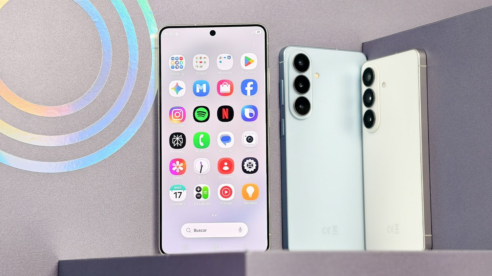
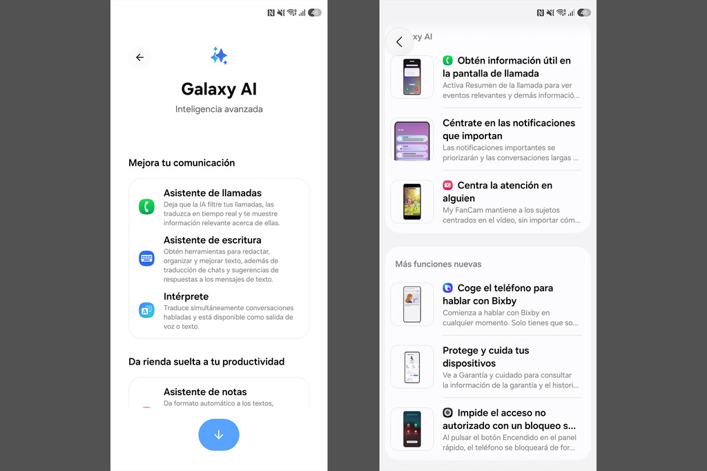
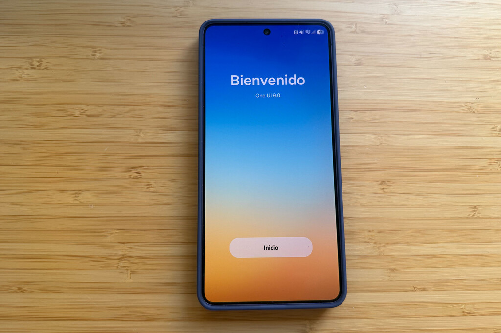

One UI 9, Samsung's skin on top of Android 17, is no longer reserved for South Korea and the United States: on 29 September the stable build started rolling out in Europe, with the Galaxy S26, Galaxy S26+ and Galaxy S26 Ultra as the first devices on the continent to receive it. The deployment is no isolated experiment, but the continuation of the official rollout Samsung announced on 16 September, after opening the stable version in its two priority markets and postponing the date it had originally scheduled.

## One UI 9 reaches Europe with Android 17

The package circulating in Europe (and also in India) arrives as build **S94xBXXU4BZI6** and includes the September 2026 security patch. As is usual with Samsung's major updates, the first wave is reserved for users enrolled in the beta programme: those devices are used to validate the servers before the download is opened up to everyone.

This is a genuine version jump rather than an incremental update: One UI 9 runs on **Android 17**, whereas One UI 8.5 and One UI 8 stayed on Android 16. One UI 9 made its stable debut on the foldable Galaxy Z Fold8 Ultra, Z Fold8 and Z Flip8, and on that basis Samsung extended the rollout to the Galaxy S26 line-up.

The schedule for the coming days looks like this: the download will keep rolling out over the first weeks of October, on both unlocked handsets and carrier-branded versions, and once the S26 family has settled the focus will move to the Galaxy S25 series, the foldables and the intermediate steps of the Galaxy A family. In other words, if your Galaxy is not an S26, you still have to wait — but the queue is already moving.

## What One UI 9 includes: AI, security and utilities

Samsung presents One UI 9 as a release focused on doing less work for the user. On the artificial intelligence side, the highlights are **Now Nudge**, which offers context-aware suggestions — for example, saving a location or a booking while you chat over messages — and **Creative Studio**, which proposes images tied to upcoming events such as a birthday. **Interpreter** adds a thread view so you can follow translated conversations without losing track, and it behaves better with Galaxy Buds earphones.

More everyday tools improve as well: the **document scanner** digitises curved or folded pages and removes fingers that end up in the shot; the **voice recorder** summarises what you recorded using headings and tables; **My FanCam** keeps the person you choose in frame while you record; and the **call summary** presents details of the ongoing conversation as cards, without leaving the call screen. On top of that comes AI-driven notification prioritisation, which puts important alerts ahead of the rest.

On the security front, One UI 9 introduces the **Security Brief** inside Now Brief, with alerts about malware, apps from unknown sources and unnecessary permissions; **Privacy Alerts**, which use the phone's own AI to spot suspicious access attempts; and **scam detection** reaching more countries and languages. Among the general features are **secure lock** (which requires a PIN, password or pattern once triggered from the quick panel), activating Bixby by speaking with the phone at your ear, and **Warranty and Care**, which brings together warranty details, device diagnostics, a repair cost and time estimate and Samsung Care+ management.

One detail worth keeping in mind: not every AI feature will reach every Galaxy. At a minimum, the fullest set of features is aimed at the most recent S and Z series, so a mid-range device will receive One UI 9 without the same package of additions.

## How to update your Galaxy to One UI 9

If you have one of the Galaxy S26 models, checking whether the package is already available for your handset takes only a few seconds:

1. Open **Settings** on your phone.
2. Scroll down to **Software update**.
3. Tap **Download and install** (or "Check for updates").

Before you tap "start", three boxes are worth ticking, because this is a big operating system jump: the file exceeds 4 GB, so the download must be done over a stable Wi-Fi network; you need at least 30% battery, ideally with the phone charging; and it pays to back up your photos and conversations in case the installation is interrupted.

When the update finishes, the One UI 9.0 welcome screen gives way to the home screen with the new features already installed.

And if your device has not appeared in the list yet, bear in mind that the rollout is staggered: so far One UI 9 had only been tested in specific trial programmes, such as the [One UI 9 beta for the Galaxy A16](/noticias/galaxy-a16-one-ui-9/) or the [One UI 9 beta for the Galaxy A54](/noticias/galaxy-a54-one-ui-9/), and that same queue is now moving on to the rest of the range.

