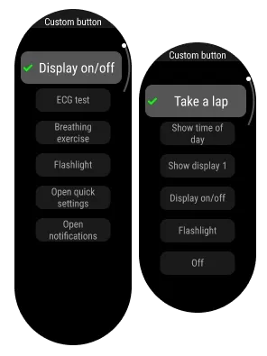
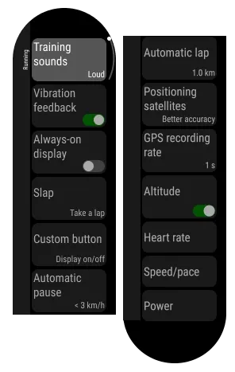
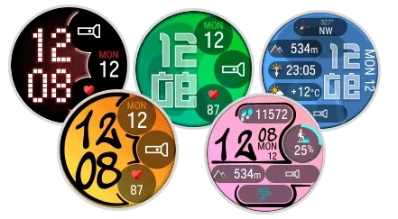
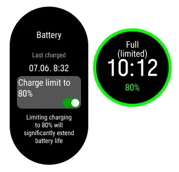

Polar has started rolling out **Polar OS 6**, the new software version for its sports watches, carrying firmware number **6.0.18**. The update lands on **30 September 2026** as a free release for six models and centres on two goals: bringing data that used to require opening the Polar Flow mobile app onto the watch screen, and protecting battery life over the long term.

## Polar OS 6 brings trend graphs to the wrist

The most visible change is a set of new **seven-day graphs** for recovery and activity metrics. Specifically, the watch now shows the trend for *Nightly Recharge*, autonomic nervous system charge (ANS charge), sleep charge, nightly heart rate, heart rate variability, nightly breathing rate and sleep duration.

That list is joined by a graph of the seven most recent **Running Index** results in the weekly summary, another for the seven most recent weight entries in the daily activity view, and a history of the seven most recent **ECG** tests, the latter only on models that support the feature. The practical upshot is simple: you can check trends that previously only appeared in the app without pulling out your phone, which is handy both during training and in everyday use. It is a direction similar to that of other platforms that have long been [scoring a user's readiness](/noticias/wearable-readiness-scores-evidence-gap/).

## A custom button, on-wrist settings and refreshed menus

The **LIGHT** button is now the **Custom button** and accepts one assigned function for time mode and a different one for each sport during training; out of the box it still turns the backlight on and off. The exception is the **Polar Ignite 3**, which does not get this feature. On top of that, the key settings for each sport profile can now be changed directly on the watch, without going through the app.

The menu is refreshed too, with updated colours and smoother transitions, and it reorganises some options: settings that used to sit in pre-training mode move into **Sport settings**, and timers are now reachable from that same place. There are also new digital watch face backgrounds and the ability to enter your weight from the quick settings menu, by swiping down from the main screen.

## An 80% charge limit and availability

Among the maintenance features, an optional **80% charge limit** stands out: when enabled, the watch stops charging before reaching full capacity to extend the battery's lifespan. It is off by default and is switched on in **Settings > General settings > Battery**, an approach phones and other rechargeable devices already use.

Polar OS 6 is available from 30 September 2026 as a free update for the **Polar Vantage V3, Vantage M3, Grit X2 Pro, Grit X2, Ignite 3 and Street X**. It is installed by syncing a compatible watch with the Polar Flow app or with FlowSync on a computer. The company also says it has improved the optical heart rate algorithm to reduce occasional reading dropouts and fixed erroneous alerts related to cadence and speed sensors.

The move reinforces the ground where Polar defends its place against Garmin and other rivals: an ecosystem of training and recovery metrics that has already reached third-party watches, such as the [Polar metrics built into the Moto Watch Ultra](/noticias/moto-watch-ultra-lte/). For anyone who owns one of the six compatible models, the update requires no purchase at all: just sync the watch.
