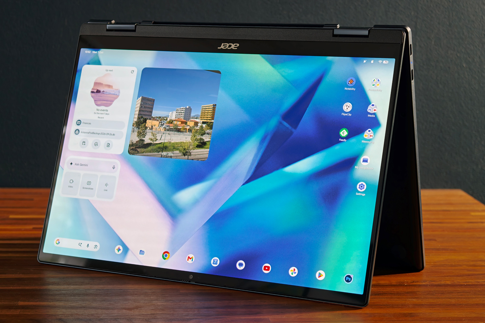
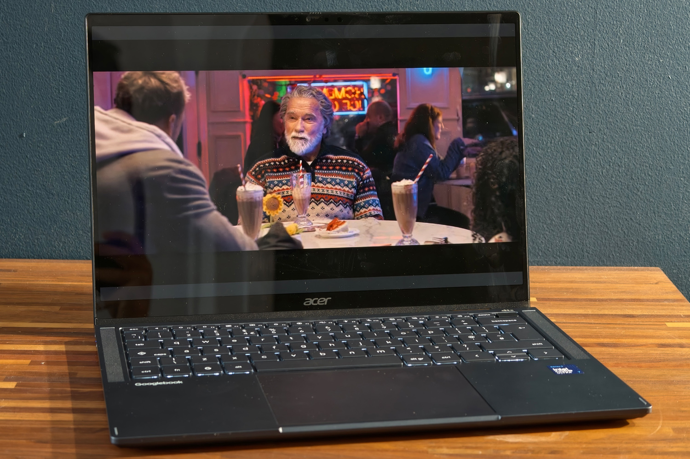
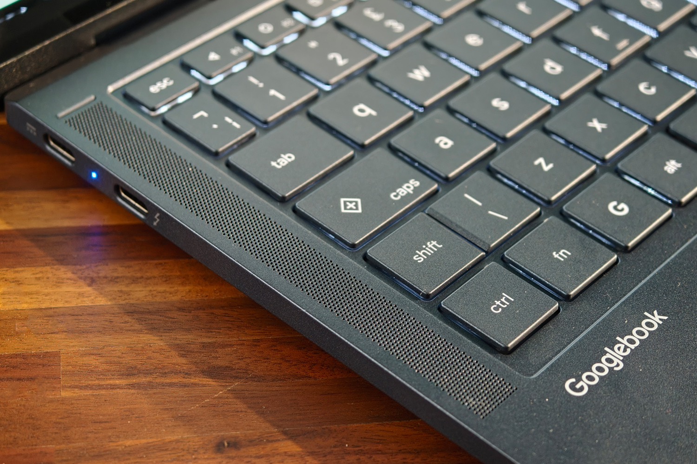
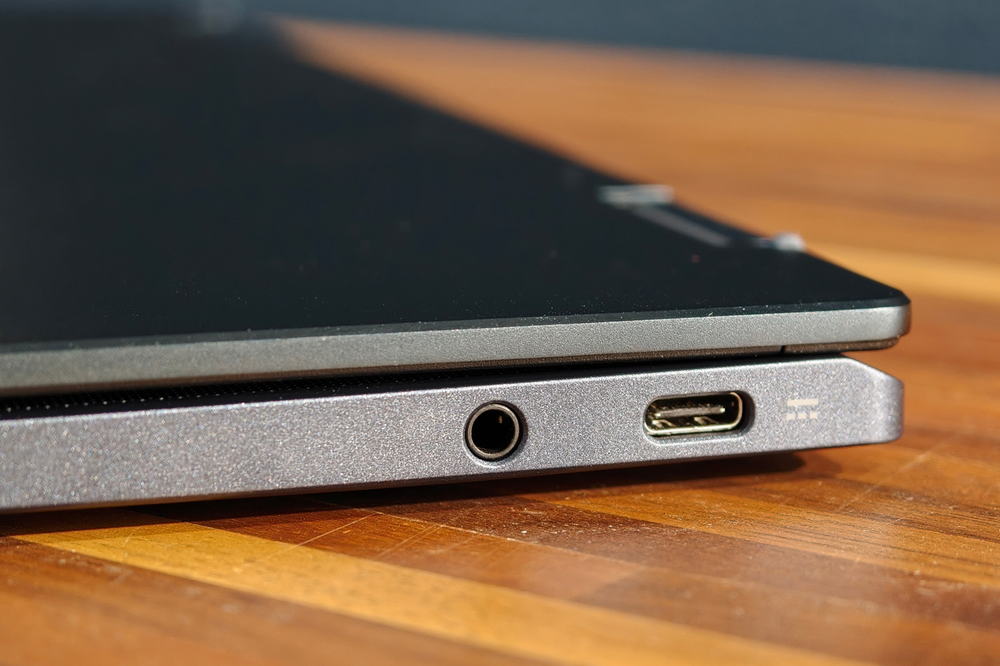
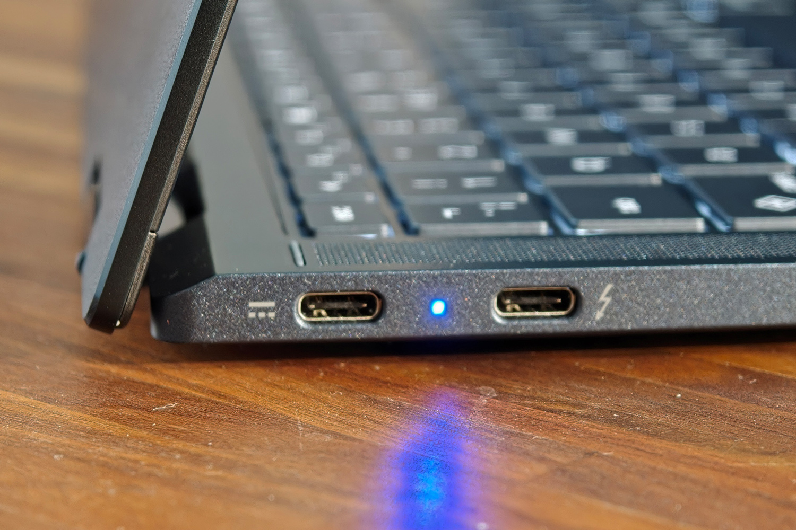
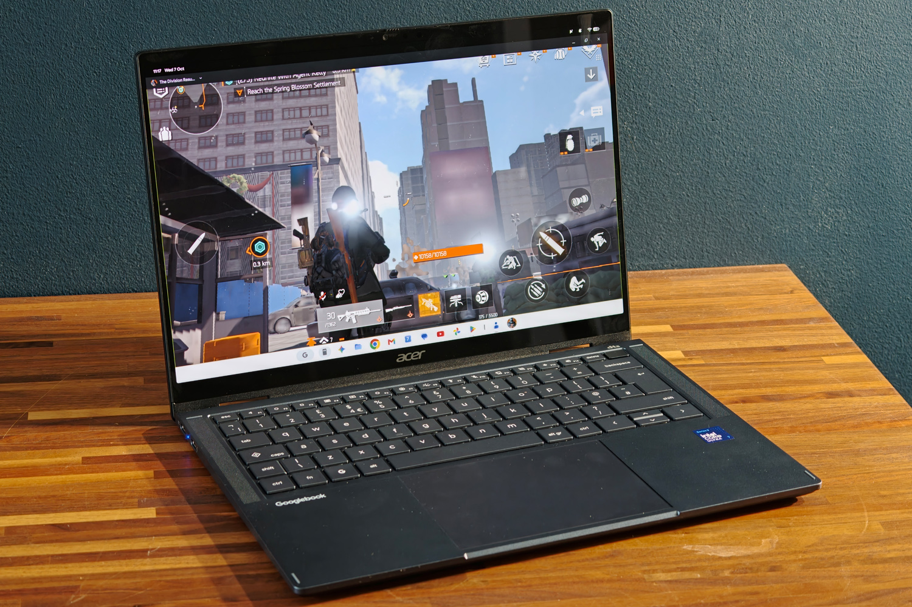

# The Acer Googlebook 14 convinces as a convertible, but its software lags behind

The Acer Googlebook 14 is the only convertible among the five devices launching with the Googlebook platform. The company shares the launch with Asus, Dell, HP and Lenovo, but it is the only one to have bet on 180-degree hinges to switch from laptop to tablet. British media outlet Stuff tested it for several days and gave it a rating of 4 out of 5: it praises the hardware and battery life, and criticizes that the system is still not up to the level of Windows or macOS in tools.

The starting price is $899 or £999, more expensive than what the public associated with a Chromebook, though below a MacBook Air or a Dell XPS 14. Acer adds for first-time buyers in the UK a 100 W GaN charger, a five-port USB-C hub, a mouse, extended warranty and planting of ten trees through Ecologi.

## The Acer Googlebook 14, a convertible that does not give up mobility

The Googlebook 14 weighs 1.14 kg and measures 13.9 mm in thickness, with a dark blue aluminum finish that departs from the usual black and silver. The hinges support the tent mode and tablet mode, and an orientation sensor rotates the screen and automatically opens the on-screen keyboard. Googlebook OS mandates a metal chassis and the Glow Bar light strip on the lid; Acer places it off-center, responds to Gemini with blue and purple tones, shows remaining battery when unplugged or illuminates with Google’s four colors when closing the lid. There is even a hidden disc mode that reacts to speaker sound.

The keyboard is island-style, backlit and with full-size keys except for the function row and arrows, which are half-height. Google imposes an Insert key and a G key instead of Caps Lock and Windows or Command keys, but the rest of the design is left to the manufacturer. Stuff notes that the typing feel is easy to adapt to, though it’s advisable to write with a light touch: the keys have almost no travel and lose rebound if pressed hard. The glass touchpad is wide, has mechanical pressure (not haptic) and good precision.

The screen is one of the strong points: 14-inch OLED at 2880×1800, with a 120 Hz refresh rate and HDR support. The touch panel responds quickly and brightness allows working next to a window, though the glossy finish reflects light and direct sunlight remains an issue. In sound, the two front speakers rise easily and sound clear, but they lack body in the bass, something expected in such a thin device.

In connectivity there is one Thunderbolt 4, two USB 3.2 Gen 2 Type-C and a 3.5 mm mini-jack. There is no card reader, something to keep in mind for someone who works with camera, and the 5 MP webcam includes a privacy shutter. The fingerprint sensor is integrated into the power button.

## A system that gains ground in the desktop and stumbles outside it

Googlebook OS is, in Stuff’s words, a stable evolution of ChromeOS that brings Android to the desktop, the leap the sector has been following since the [Googlebook vs Chromebook](/noticias/googlebook-vs-chromebook/) comparison. In the test there were no forced crashes and the system responded smoothly even with many tabs and applications open. The interface resembles ChromeOS, with the app tray and status bar in slightly different positions and quick settings at top right, and adopts Android’s Material 3 Expressive visual language.

Integration with mobile is the differentiating asset. When setting up the device, an Android phone shares accounts and desktop versions of installed applications; the file browser detects the phone on the same Wi-Fi network and notifications appear on screen without duplication. The «Continue On» feature pins apps open on the mobile to the taskbar for resuming them on the large screen. The problem is that it requires Android 17 —a burden for slow-updating manufacturers— and Samsung, with a huge user share, is not supported at launch, one of the limitations already known alongside [Android app compatibility issues on Intel models](/noticias/moviles/googlebook-apps-intel-samsung/). Additionally, «Continue On» works with very few applications right now.

The ceiling appears in productivity: for Stuff, a full workday using only this device is not possible. Android and browser apps do not match Windows or macOS in creative tools like Photoshop, and here Linux programs such as GIMP cannot be installed within the desktop: access is limited to the command line and those applications do not coexist with Googlebook OS apps in the tray. There are also no Steam versions for Linux, some progressive web apps conflict with their Android counterparts —Slack being an example— and many Play Store games do not recognize mouse and keyboard or do not run full screen.

## Performance and battery life: good for work, with nuances for creation

The unit tested mounts an Intel Core Ultra 7 355 with eight cores up to 4.7 GHz, 16 GB of RAM and 512 GB storage. The catalog allows choosing between the Ultra 5 325 or the Ultra 7 355 and up to 32 GB of memory and 512 GB disk. On x86, Google admits that a small number of Android applications still have compatibility issues, though Stuff did not find any during the test. The data published by the outlet places the device on par with Windows laptops with similar hardware: 2,536 points in Geekbench 6 single-core, 11,531 in multi-core, 38.9 in Speedometer 3.1 and 16,662 in PCMark Work 3.1. Active cooling keeps temperatures in check without the device overheating or making noise.

The 71 Wh battery is generous for a 14-inch laptop. Acer announces up to 14 hours of video streaming playback at 50 % brightness and up to 16 hours of browsing, but in Stuff’s general usage test the recording dropped to around 12 hours, still enough for a full day away from the plug. In idle, consumption is very low: just a few percentage points during the night.

For Stuff, the verdict is clear: the Googlebook 14 delivers on hardware, with a light convertible, an excellent screen and battery life that lasts through the day, but its system is still behind Windows and macOS in creative software and carries functions that ChromeOS already offered. It is a device for someone who works mainly in the browser and lives within the Android ecosystem, not for someone dependent on professional tools. Nevertheless, the outlet recommends waiting to see how quickly Google resolves the shortcomings detected in early reviews before deciding.
