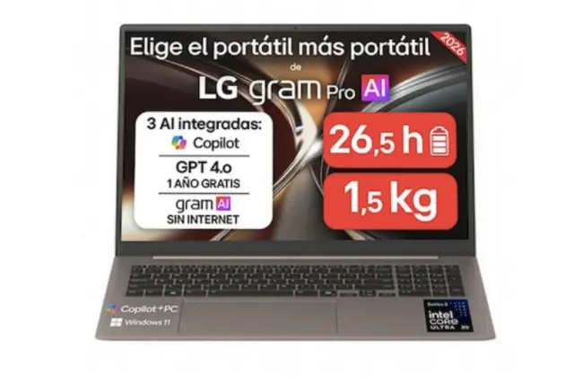
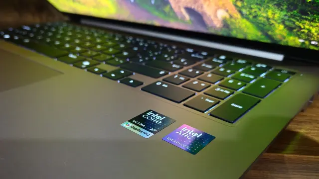
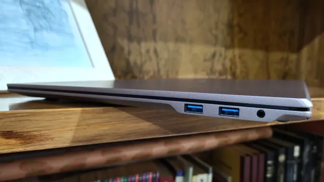
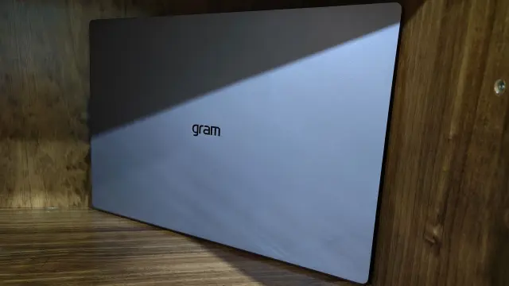
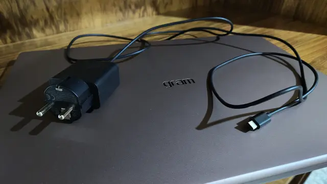

LG keeps in the gram Pro 17 the recipe that has turned the gram family into a reference for anyone who works away from a power outlet, but it takes it to a size that until recently forced users to give up mobility. In its review after a month of use, ComputerHoy highlights exactly that: a 17-inch display mounted on a body that comes close to the dimensions of a 16-inch machine, and a battery life that exceeds a full working day. The price, on the other hand, starts at 2,249 euros.

## The LG gram Pro 17 configuration

The unit reviewed is the 17-inch variant in a bronze finish, with these specifications:

- Intel Core Ultra X9 388H processor: 16 cores, 16 threads, up to 5.1 GHz and a 50 TOPS NPU.
- Integrated Intel Arc B390 graphics.
- 32 GB of dual-channel LPDDR5X memory.
- 512 GB of Gen 4 M.2 NVMe storage.
- Windows 11 Home, Wi-Fi 7 and Bluetooth 6.0.
- Ports: 2x USB-C 4 (fast charging, Thunderbolt 4 and DisplayPort), 2x USB-A 3.2 Gen 2x1, 1x HDMI 2.1 and 1x 3.5 mm jack. Wired network connectivity is handled with an RJ45 adapter.
- Dual microphone, facial recognition and stereo speakers with Dolby Atmos.

The chip is one of the most advanced Intel introduced in early 2026: it surpasses the Core Ultra X7 358H that powered this same year's gram Pro and that also appears in machines such as the Samsung Galaxy Book 6 Pro. That power relies on a 50 TOPS NPU, designed for artificial intelligence tasks run locally, such as the smart file search LG integrates into its software.

## A 17-inch laptop you can carry like a 16-inch one

The figure that sustains the whole proposition is in the dimensions: 379.4 × 265.4 × 13.3 mm and 1,539 grams. With that thickness, LG has managed to fit a 17-inch panel —touchscreen and in 16:10 format, with WQXGA resolution (2,560 × 1,600 px), 60 Hz and 350 nits— without giving up the numeric keypad and without the whole thing feeling bulky in a backpack. The bronze finish, moreover, does not pick up fingerprints the way black does and withstands the scratches of daily transport well.

The reservation lies in the brightness. The outlet notes that 350 nits may be enough for office use, but that the panel would benefit from an anti-glare finish: with the keyboard backlight at maximum, or in very bright rooms with brightness at 75 %, the keyboard's own light reflects on the screen. The most sensible solution, it points out, would be to raise the maximum brightness or opt for a matte panel.

## Battery life and sustained performance

Here it is worth separating what the manufacturer advertises from what was measured. LG claims up to 26.5 hours with the 77 Wh battery, a laboratory figure; in ComputerHoy's tests, with brightness at 75 % and office tasks and video playback, the machine exceeded 8 hours of continuous use. It charges with a 65 W adapter the size of a phone charger, in around an hour and a half.

The review also touches on thermals: under demanding tasks the laptop does not overheat, something the processor owes in part to its energy efficiency. It is the kind of behaviour that holds up after half an hour of load, and not only during the first minute of a benchmark. On the software side, LG adds its own applications on top of Windows 11 to configure the machine without leaving its ecosystem.

## Who is it for and who is it not for?

The gram Pro 17 is aimed at anyone who needs productivity without ties: a 17-inch laptop that weighs little, with a full keyboard, plenty of connections and battery for a long day. It fits office, light creation or study profiles that also want to move the machine daily, and —like almost everything in this range— it requires accepting a price above 2,000 euros. Those looking for a different high-end approach can compare it with the [Lenovo Yoga 9i 2026](/noticias/lenovo-yoga-9i-2026-review/), another latest-generation Intel machine with an OLED panel.

That said, it is not a laptop for everyone. Gamers should look elsewhere: here the graphics are integrated Intel Arc B390, with no dedicated GPU. Those who work outdoors in direct sunlight will miss more nits and an anti-glare panel. And those on a tight budget will find cheaper alternatives, at the cost of giving up the 17-inch format and part of the battery life. For everyone else, the gram Pro 17 does well what it promises: lasting the day without the size being noticeable.
