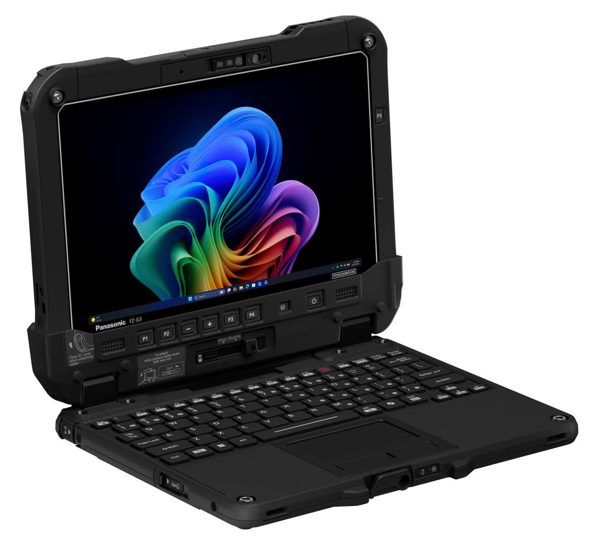
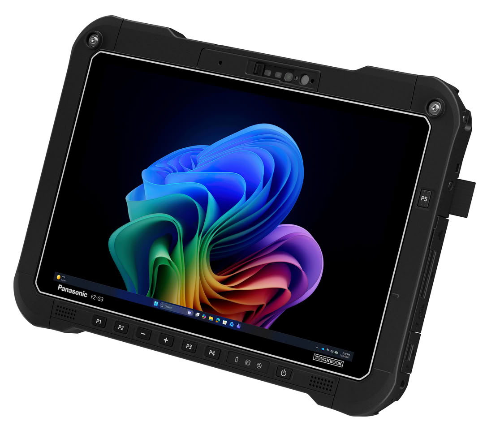
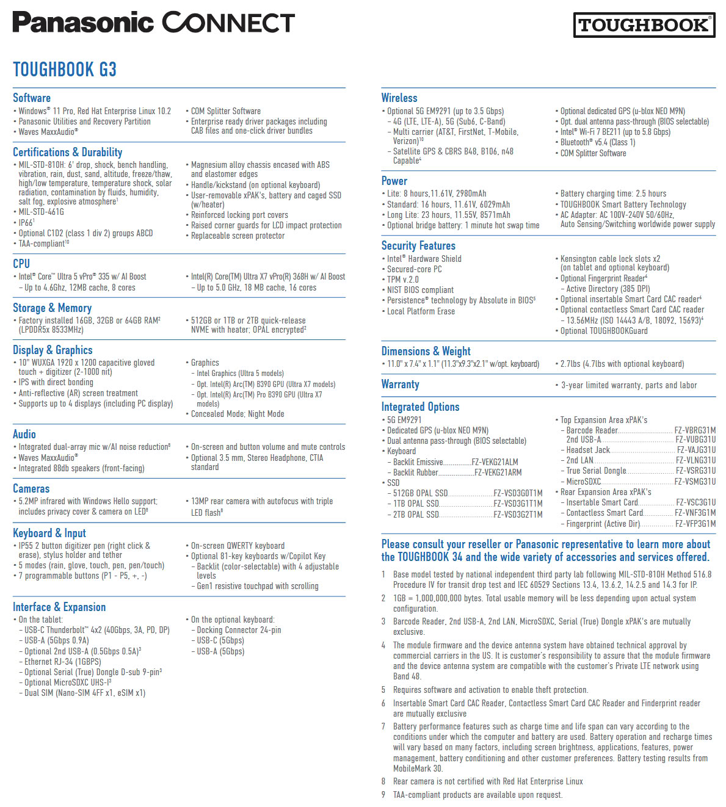

Panasonic Connect North America has expanded its line of rugged devices with two 2-in-1 models built for full shifts away from a power outlet: the Toughbook 34 and the Toughbook G3. Both share Intel Core Ultra processors, 5G and Wi-Fi 7 connectivity, and hot-swappable batteries, but they arrive in two very different formats: a 12.4-inch one for working inside and outside vehicles or in command centers, and a 10.1-inch one, lighter and more compact, for those who spend the day on the move.

## Toughbook 34 and Toughbook G3: two formats, two ways of working

The Toughbook 34 is the larger of the two. Its display grows to 12.4 inches in FHD+ (1920 × 1200), with 1,000 nits of brightness and Corning Gorilla Glass 3. Panasonic keeps four modular expansion areas, two of them xPAK that users can replace themselves, and offers an optional dual hot-swappable battery configuration. The company positions it both inside and outside vehicles and in command centers, and its touchscreen automatically detects whether a finger or a glove is being used.

The Toughbook G3 takes the opposite approach: a 10.1-inch WUXGA (1920 × 1200) chassis, also with 1,000 nits, lighter and thinner than previous generations. It keeps two expansion areas with configurable I/O and three battery capacity options. It is aimed at those who work in tight spaces, such as public safety personnel in smaller vehicles, federal staff carrying equipment into the field, or warehouse and logistics workers managing inventory and shipments.

Both share the same foundation: Intel Core Ultra 5 335H or Core Ultra X7 368H processors, up to 64 GB of LPDDR5x memory, up to 2 TB OPAL NVMe SSDs with quick release, and Windows 11 Pro or Windows IoT. It is not the first rugged device to appear this month: a few days ago we looked at the [Durabook Z14I-DX3](/noticias/durabook-z14i-dx3-triple-screen-workstation/), a three-screen model for the same kind of user.

## Battery life and display: what lasts the shift

This is where the fine print matters. Panasonic rates the Toughbook 34 at 9 hours with the 40 Wh battery, measured with MobileMark 30, and up to 18 hours when the optional second battery is added. The Toughbook G3 offers three batteries —35, 70 and 99 Wh— and reaches 23 hours with the largest one. These are manufacturer figures, taken with the test at 250 nits, with Wi-Fi off and in a professional scenario: in real use, with high brightness and continuous work, they will fall.

The strong point of both is the display. The 1,000 nits and the anti-reflective treatment are designed for reading in sunlight, something an office laptop rarely needs and that here makes the difference between being able to work or not in full light. Weight also shows: the Toughbook 34 starts at around 1.3 kg in tablet mode and rises to around 2.5 kg with the keyboard, while the G3 stays at 1.2 kg and 2.1 kg with keyboard, respectively.

## Ruggedness and security built for fleets

As expected in this range, both pass the MIL-STD-810H and MIL-STD-461G tests, survive drops of 1.5 metres with the keyboard and 1.8 metres in tablet mode, operate between −10 °C and 50 °C and carry an IP66 rating against dust and water. Security includes an OPAL SSD, TPM 2.0, optional smart card and fingerprint readers, TAA compliance, and a quick-release SSD to isolate data.

Panasonic Connect was the first rugged device manufacturer to achieve Red Hat Device Edge certification: the Toughbook 34 is now certified to run Red Hat Device Edge (RHEL) and the Toughbook G3 is undergoing certification. There are also barcode and RFID reader options, compatibility with many previous-generation accessories, and a standard three-year factory warranty.

Dominick Passanante, senior vice president and general manager of the Mobility Business at Panasonic Connect North America, sums up the approach: "The people that keep critical services and industries running need technology they can trust in every environment. The TOUGHBOOK 34 and TOUGHBOOK G3 are engineered to meet those demands by delivering the performance, connectivity and reliability that frontline workers depend on every day. The result is a device that keeps individuals and teams connected, productive and focused on the task at hand, whether they're in a vehicle, on a job site or responding to an emergency, all without compromising long-term reliability and security."

## Who it is for (and who it is not)

These are not consumer laptops and are not sold as such. They are deployment tools for fleets: they fit public services, field services, public safety, logistics and automotive, or any team that needs a computer able to withstand knocks, dust and water and that IT can manage and repair without complications. Backward compatibility with previous-generation accessories points in the same direction: making the most of the investment already made.

Anyone looking for a light office laptop, with the best screen for watching series or the most pleasant keyboard, should look elsewhere: here the trade-off is weight and thickness in exchange for toughness. And anyone who needs to know prices and availability will have to wait, because the published information details neither price nor release date, beyond the manufacturer's product pages.
