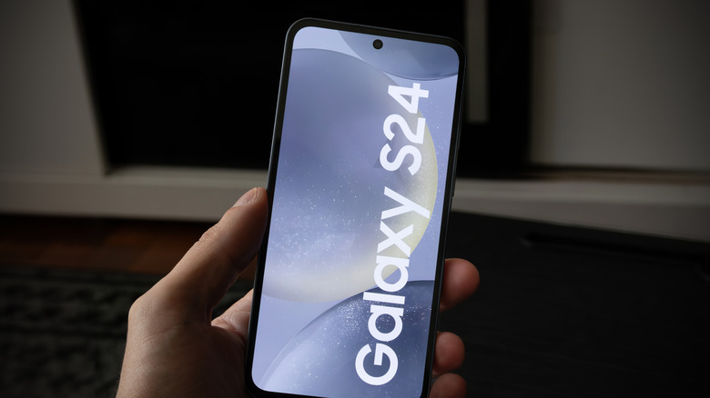

One UI 9, Samsung's layer on top of Android 17, began rolling out on September 16 and has been reaching more and more devices. If your Galaxy is on the compatibility list, the update may be available right now; if not, it is probably just around the corner. This guide gathers the steps to install One UI 9 without surprises: check compatibility, verify whether the package is available, free up storage, secure battery and connection, and back up before taking the plunge.

One UI 9 puts a strong emphasis on artificial intelligence features, such as **My Fancam** tracking or the suggestions from **Now Nudge**, plus greater scam detection and AI-enhanced privacy alerts that watch for possible security breaches in the background. If you are keen to try them, it pays to prepare the phone in advance.

## Prerequisites

- A Galaxy compatible with One UI 9: at least the S23 series, or a Z Flip or Z Fold no older than the 5 models.
- A stable Wi-Fi connection to download the package.
- Around 4 GB of free storage, with extra headroom.
- Enough battery to handle the installation, ideally with the charger connected.
- A backup of important files, on physical media or in the cloud.

## Steps to prepare your Galaxy before One UI 9

### 1. Check whether your device is compatible

First of all, confirm that your phone is part of the rollout. If you have at least a Galaxy from the S23 series, or a Z Flip or Z Fold no older than the 5 models, you are covered for when the full update arrives. The stable version has only just started rolling out on the S26 series, so it may take a while to reach the rest of the ecosystem.

### 2. Verify whether the update is available

To find out whether the package is ready for your device, go to **Settings > Software Update > Check for updates** (if the device has not already told you about an available update on its own).

From **Software Update** you can also open **Download and install** to schedule the automatic download for later, for instance while the phone is charging.

### 3. Free up storage

The update takes up about 4 GB, so it is worth clearing that much space and leaving some extra headroom so the process can work comfortably.

### 4. Charge the battery and connect to Wi-Fi

Make sure the battery is well charged before updating. If you schedule the installation for later, check that the phone will have enough charge and an active Wi-Fi connection during that window.

### 5. Back up your files

If you are worried that something might go wrong during the update, back up important files on physical media or in the cloud before continuing.

## How to verify the update completed

When the process finishes, the phone restarts on its own and returns to the home screen with One UI 9 already installed. To confirm it, go back to **Settings > Software Update**: if no pending update appears, the installation completed successfully.

## Phones still in the beta stage

It is not only the stable version that is rolling out: further betas for older devices are advancing too. The second beta has just launched for the Galaxy A55 and A35, as well as the S24 series. The package for the A55 and A35 starts rolling out in South Korea, while the S24 Beta 2 begins in India.

Approximate package sizes are around 403.66 MB for the A55, about 500 MB for the A35 and around 600.90 MB for the S24. These betas are less stable, so it makes sense to apply the same precautions as above. Also, for the A55 and A35 you can only get them if your device is enrolled in Samsung's One UI 9 beta program.

## Warnings and limitations

- The rollout is staggered: if your device does not appear yet, you have to wait. It advances first on the S26 series and then across the rest.
- The stable update takes up about 4 GB; without enough space, the download or installation may not complete.
- Beta versions are less stable than the stable one and are limited to devices enrolled in the corresponding program.
- Not every AI feature reaches every Galaxy: the fullest features are reserved, at least, for the most recent models in the S and Z series.

To follow the status of the stable rollout, you can read about [One UI 9 arriving in Europe](/en/news/one-ui-9-available/).
