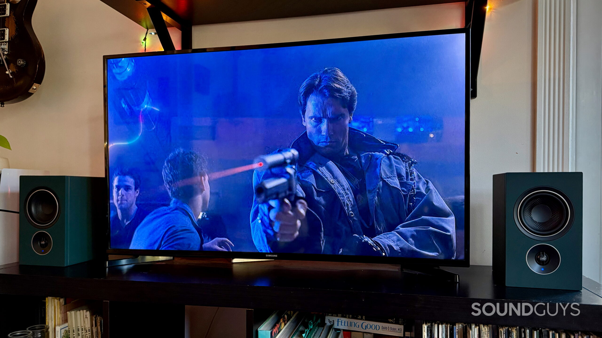

PSB is a Canadian company with more than half a century of history behind it, though the SoundGuys reviewer admits he had never heard of the brand before testing the **iQ2**, a $1,399 pair of powered speakers that sets out to pack amplification, streaming and connectivity into a single product. The review, published on September 29, 2026, concludes that these are versatile, well-rounded speakers, with the BluOS app as an almost unavoidable part of everyday use.

## An active system that needs no amplifier, DAC or streamer

Each iQ2 unit integrates a 4-inch woofer and a 0.75-inch aluminium-dome tweeter, each with its own Class-D amplification; PSB rates the system at **270 W**. At roughly 145 × 246 × 192 mm per speaker, they fit onto a desk without trouble, and the brand offers **seven finishes**, including the Boreal Green of the review unit, plus Ember Red, Sandstone Beige and Walnut. The included magnetic grilles allow for a more understated look when you prefer them covered.

One practical advantage is worth stressing: the two speakers communicate **wirelessly** with each other, so there is no need to run a cable between the left and right channels. Each one only needs a power outlet, which gives you freedom in placing them, though it does mean having two sockets within reach.

The top of the primary speaker carries touch controls for playback, switching source via presets and adjusting volume. The reviewer considers them well placed for desktop use, but admits he still reaches for the physical volume knob on his audio interface: touch controls look elegant on a system at this price, but sometimes a good old-fashioned knob is hard to beat.

## Connectivity: HDMI eARC, USB-C, phono and more

The connections are probably what most justifies the all-in-one label. Among the physical inputs there is a **stereo RCA that can work as either a line or a phono input**, so a compatible turntable can be connected directly without a separate phono preamp. It also offers **USB-C** to hook up a computer without an audio interface, **HDMI eARC** for a compatible TV, **optical** as a fallback, a **USB-A** port for external drives in FAT32 or NTFS, **Ethernet** for those who prefer a wired network, and a **dedicated subwoofer output** with crossover controls in BluOS to expand the system to 2.1.

On the wireless side there is **AirPlay 2**, which the reviewer uses daily to send music from his phone without touching the computer or swapping cables, and **Bluetooth with aptX Adaptive**, plus Wi-Fi or Ethernet as the network requirement for BluOS. The streaming ecosystem plays up to **24-bit/192 kHz** and adds Spotify Connect, TIDAL Connect and AirPlay 2, with the option to fold the speakers into a multi-room setup alongside other BluOS products.

## How the PSB iQ2 sound

For music, the review describes a **clear and detailed** sound with good width between the two speakers. Listening to "Home at Last" by Steely Dan over AirPlay, the reviewer could pick out details such as the reverb in the recording without losing the rest of the instruments across the stereo image. On "Sunset" by The Midnight, the kick drum landed with impact, and the system gets loud enough for a medium-to-large indoor gathering.

The point SoundGuys highlights most is how little he felt the need to adjust anything: the iQ2 delivers a full sound, with no obvious gaps in bass, midrange or treble, and BluOS's EQ tools went practically untouched for music listening. With movies, connected to the TV, it handled the punch of action scenes in *The Terminator* and *The Dark Knight*, and offered more left-to-right width than a soundbar thanks to having two separate speakers. Even so, in some passages of *The Dark Knight* he missed a little more treble to follow the dialogue, which he solved by raising the treble from the app.

In games, with *Star Wars Outlaws*, the reviewer praised the clarity and breadth, with environmental details easy to pick out while exploring Tatooine and the hum of the ship audible during the quieter stretches.

## Price, verdict and who it makes sense for

At $1,399, the iQ2 is a serious investment and makes little sense for anyone who just wants to play music from a laptop. To justify the price you have to take advantage of what sets it apart, and here SoundGuys finds plenty of room to do so: it sounds clear and full, gets loud without trouble, and slots into almost any home setup. It can live on a production desk connected to an audio interface, hook up to a computer over USB-C, anchor a turntable rig or replace a soundbar in front of the TV.

Its main drawback is that it is an **app-heavy** system: BluOS handles much of the functionality, so you will want to keep your phone handy to dig into the settings. Assigning your most-used sources to the touch presets cuts down on those visits, but it does not eliminate them. For anyone looking to improve their everyday wireless audio, the evolution of codecs and platforms such as Snapdragon Sound sets the context in which this kind of product operates.

SoundGuys notes that the unit was provided by the manufacturer and that the review was expedited as part of a paid collaboration with PSB, while retaining full editorial independence throughout: the brand did not preview or approve the article.
