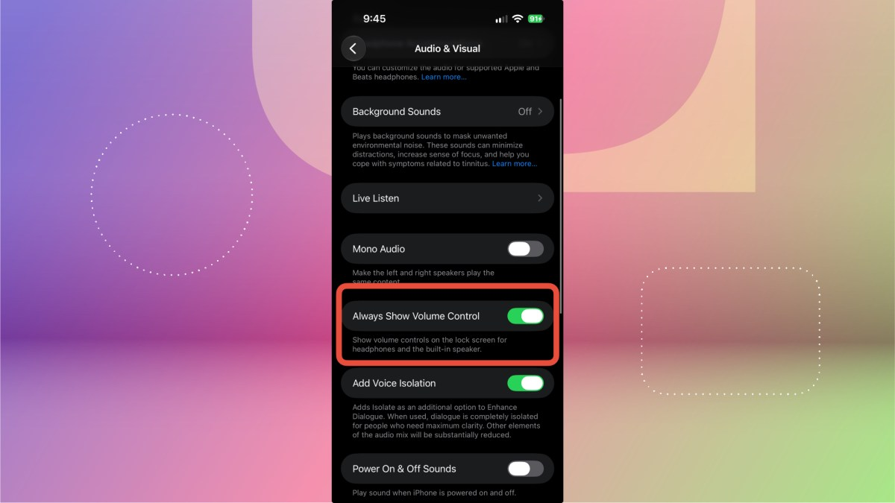

If you listen to music or a podcast on your iPhone, the physical side buttons let you raise or lower the volume without unlocking the phone, but they force you to pick between a level that is a bit too loud or slightly too quiet. The volume bar on the lock screen solves that problem because it allows a finer adjustment without opening the device.

The catch is that Apple removed that bar from the lock screen with iOS 16, back in 2022. It was not until 2024 that the company offered the option to bring it back, adding it with iOS 18.2. This guide explains how to restore it step by step on an up-to-date iPhone, including iOS 27.

## Prerequisites

- An iPhone running **iOS 18.2 or later**. The option to always show the volume control arrived with iOS 18.2, so the toggle does not appear on earlier versions.
- You do not need to unlock the phone or install anything extra: it is a system setting.

> **Note on the setting names:** the path is given with the English name as it appears in the source screenshots. The exact wording may vary slightly depending on the iOS version and the language configured on the iPhone.

## How to reach the volume setting in Accessibility

1. Open **Settings**.
2. Tap **Accessibility**.
3. Under **Hearing**, open **Audio & Visual**.

## How to turn on the volume bar

4. Turn on the **Always Show Volume Control** toggle.

With the toggle on, the bar is available on the lock screen. The next time you listen to music or a podcast, you can adjust the volume with the slider without unlocking the device.

## How to verify it worked

Lock the iPhone and play music or a podcast. If the slider appears over the playback controls on the lock screen, the setting was applied correctly.

## Warnings and limitations

- If the **Always Show Volume Control** toggle does not appear on your iPhone, first check the installed version under **Settings > General > About** and update to iOS 18.2 or later.
- The setting does not change how the physical buttons behave: they still work the same way, and the bar only adds a more precise control.
- The exact path and name of the setting may change between iOS versions and depending on the system language.
