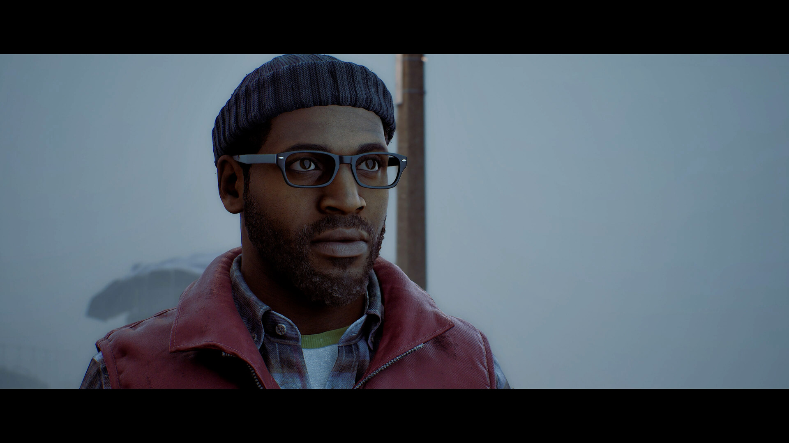
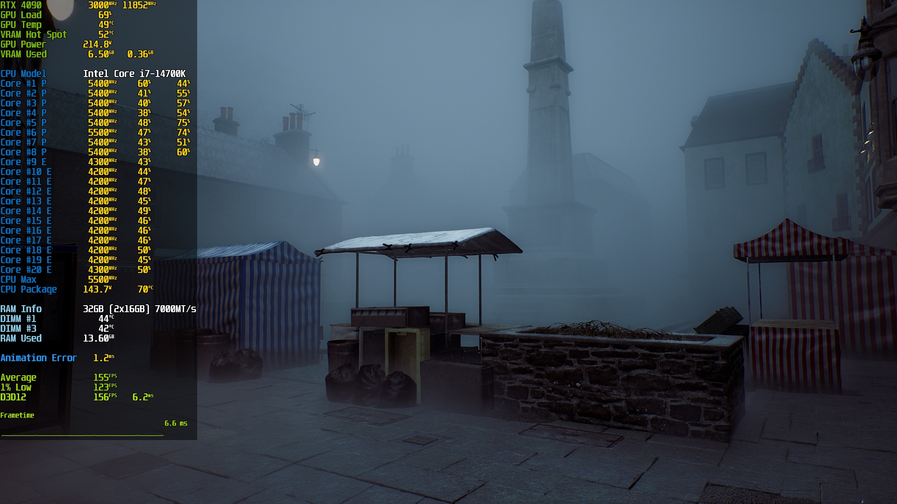
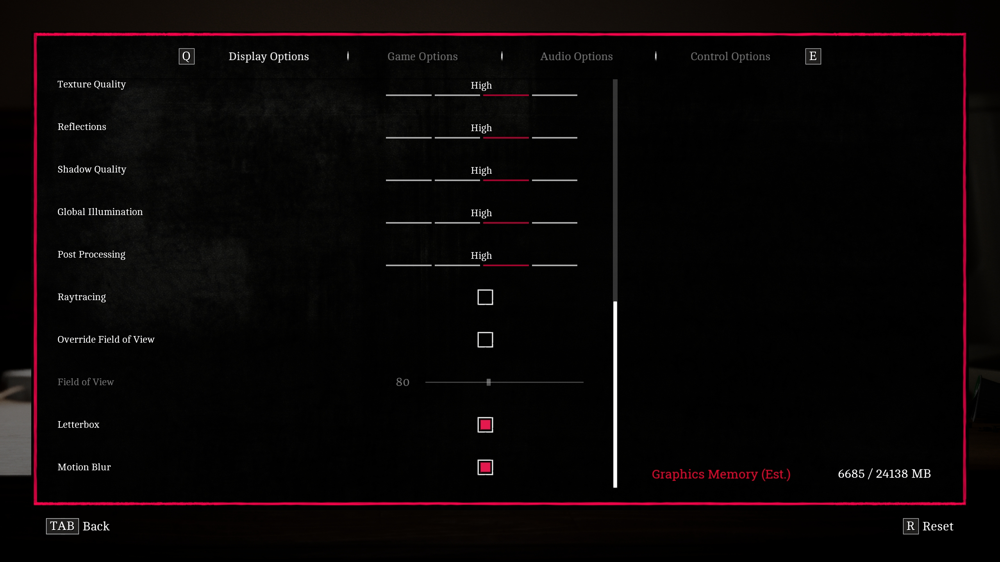
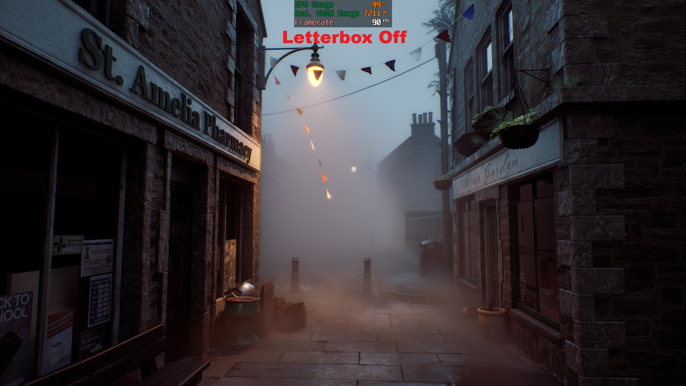
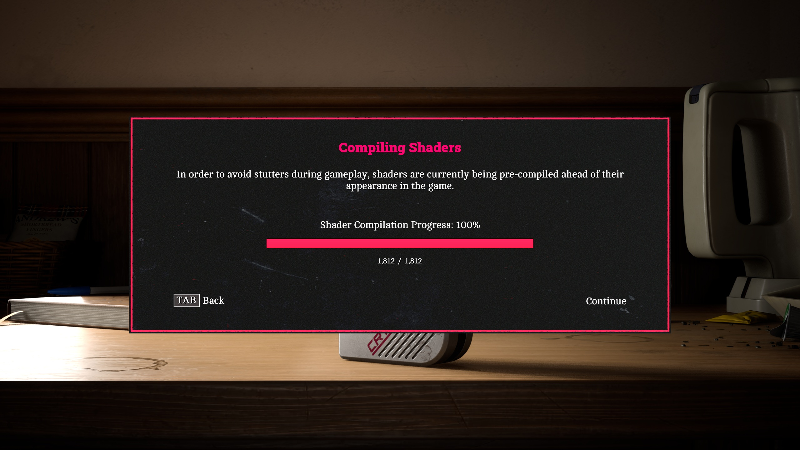

*SILENT HILL Townfall* arrives on PC as an entry built on Unreal Engine 5 with Nanite,
Lumen and Virtual Shadow Maps, and it makes good use of the fog and volumetric lighting
of its setting. It also arrives with some of the engine's typical problems: background
shader compilation, traversal stutters and a sparser graphics menu than expected. This
guide explains, step by step, how to tune *SILENT HILL Townfall* on PC for a smoother
experience without noticeably compromising the image.



## What this guide solves and who it is for

It is aimed at anyone who already has the game installed on Windows and is noticing
stutters, FPS drops, or simply wants to know which menu option actually matters. It
covers the official requirements, picks the right temporal upscaling, applies a graphics
profile optimized through real testing, and finishes with extra tweaks outside the menu.
Every value here comes from Wccftech's original analysis; there are no invented presets
and no untested shortcuts.

## Prerequisites

The official specifications published on the Steam store page call for Windows 11 and
DirectX 12 in both cases, with 75 GB of storage:

| Component | Minimum | Recommended |
| --- | --- | --- |
| CPU | AMD Ryzen 5 3600 / Intel Core i7-8700K | AMD Ryzen 7 5700X / Intel Core i7-9700K |
| GPU | NVIDIA GeForce RTX 2060 Super / AMD Radeon RX 6600 | NVIDIA GeForce RTX 3080 / AMD Radeon RX 7800 XT |
| RAM | 16 GB | 32 GB |
| OS | Windows 11 x64 | Windows 11 x64 |
| DirectX | DirectX 12 | DirectX 12 |
| Storage | 75 GB | 75 GB |
| Target | 1080p, Low, 30 FPS | 4K, High, 30 FPS with DLSS/FSR/TSR Balanced |

Keep in mind that those targets are conservative: the minimum specs aim at 1080p and
30 FPS on Low, and the recommended specs at 4K and 30 FPS on High with upscaling set to
Balanced. If you have an Intel Arc GPU, it is also worth checking the
[Intel Arc 101.9030 drivers with Game Ready support for this title](/noticias/intel-arc-drivers-101-9030/),
released ahead of launch.

## How the CPU behaves before you touch anything

It is worth knowing the starting point. In a geometry-heavy scene (the town square),
with everything maxed out, output at 1920x1080 and DLSS Super Resolution in Ultra
Performance mode, a Core i7-14700K averaged **158.7 FPS**, but the 1% lows sat at
**91.5 FPS** and the 0.1% lows at **57.2 FPS**. That large gap between the average and
the percentiles translates into uneven frame pacing.




CPU load was also unusually high for a game of this scope, and asynchronous shader
compilation pushes it even further during gameplay. If your processor has few cores,
expect the worst case: follow every step of this guide without skipping any.

## Steps

### 1. Pick the right temporal upscaling

*SILENT HILL Townfall* supports **NVIDIA DLSS Super Resolution**, **AMD FSR Upscaling**,
the native **TSR** of Unreal Engine 5 and an older-generation **TAAU** option that is
lighter but worse looking. **Intel XeSS Super Resolution and native frame generation are
absent.**

1. On a GeForce RTX GPU, select **DLSS Super Resolution**: it is the best reconstruction
   quality available in the game.
2. On an AMD Radeon, use **FSR Upscaling**. With an RX 7000 or RX 9000 you can also take
   advantage of **FSR 4.1** support, which the AMD Adrenalin layer recognizes in the
   game's FSR integration.
3. On other hardware, fall back to **TSR** as the universal option. Note: the game
   **does not expose TSR quality levels**, so it is less flexible than we would like.
4. Start in **Quality** mode and apply the graphics profile from step 2 first. Only
   lower the internal resolution if the GPU still cannot reach the target.

Temporal upscaling is managed separately from the rest of the tuning: do not compensate
for it by lowering graphics options that are already well adjusted.

### 2. Apply the optimized graphics profile

The menu is sparse: **there are only seven principal graphics quality settings**, with
no useful descriptions, no preview images, no indication of whether each option affects
the CPU, the GPU or VRAM, and no built-in performance metrics. There are no
Low/Medium/High/Ultra presets either: "maxed out" simply means every individual setting
at its highest value.




This is the profile recommended by the testing, always compared against a configuration
with everything maxed out:

| Setting | Optimized value |
| --- | --- |
| Fog Quality | Low |
| Texture Quality | Ultra (for GPUs with 8 GB of VRAM or more) |
| Reflections | High |
| Shadow Quality | Medium |
| Global Illumination | High |
| Post-processing | Low |
| Ray Tracing | On |

The reasoning behind each value:

- **Fog Quality → Low**: it is one of the few settings that actually returns a real GPU
  benefit while keeping the majority of the fog look that defines the game's atmosphere.
- **Texture Quality → Ultra**: at 1440p with native TSR and hardware Lumen, the top
  quality stayed within roughly 8 GB of VRAM. Lowering it changes very little visually
  and does not meaningfully reduce memory usage, unless you are suffering VRAM-related
  stuttering on a low-memory card.
- **Reflections → High**: going below High gains no meaningful performance while
  degrading the image; Ultra adds very little.
- **Shadow Quality → Medium**: the Virtual Shadow Maps already do a good job, and Medium
  keeps the quality you actually notice in gameplay while recovering GPU headroom.
- **Global Illumination → High**: lower levels produced no useful gains and Ultra only
  improves things subtly. Indirect lighting is key to the presentation, so do not drop
  below High.
- **Post-processing → Low**: it progressively disables effects, including the film grain
  and chromatic aberration many players would turn off manually, with a small performance
  gain and a cleaner image.
- **Ray Tracing → On**: hardware tracing moves Lumen off the software path and visibly
  improves reflections at a performance cost measured as unusually low. Turn it off only
  if you cannot hit your performance target, especially on GPUs with weaker tracing
  hardware.

The most important reductions are Fog Quality and Shadow Quality. If you still need more
performance, the correct order is **disable Ray Tracing first and then lower the
temporal upscaling**, rather than strangling every other option.

### 3. Consider letterbox mode (optional)

The game offers a cinematic letterbox mode that adds black bars above and below the
image. Beyond the aesthetic effect, it **reduces the effectively rendered area** and can
moderately improve GPU performance. In the 2560x1440 test, the game ran at **90 FPS**
without letterbox and **105 FPS** with it enabled, with the GPU at 99% in both cases.




### 4. Disable NVIDIA Reflex if you notice stuttering

Reflex Low Latency reduces system latency and under normal circumstances is worth
enabling, but in *SILENT HILL Townfall* its implementation behaved badly: on the test
system, turning it on **introduced constant frame time instability**. If the game feels
uneven despite a healthy FPS count, Reflex is one of the first options you should try
switching off. Leave it disabled until the problem is fixed by a patch.

### 5. Remove film grain and chromatic aberration with Engine.ini

Setting Post-processing to Low already disables several effects, but anyone wanting
finer control can edit Unreal Engine's configuration. Navigate to:

```
%LOCALAPPDATA%\Townfall\Saved\Config\Windows
```

Create an `Engine.ini` file (or edit the existing one) and add these lines:

```ini
[SystemSettings]
r.FilmGrain=0
r.SceneColorFringeQuality=0
```

Those UE5 variables disable film grain and chromatic aberration without having to lower
the overall Post-processing setting. Afterwards, **mark the `Engine.ini` file as
read-only** so the game cannot overwrite its contents.

Avoid filling `Engine.ini` with large collections of undocumented "optimizations":
launch-week mods promise to eliminate compilation and traversal stutters through
streaming, async compute and threading changes, but those claims are far harder to
verify than a simple image tweak. **There is no universal `Engine.ini` command that can
reliably cure an engine-level shader compilation problem.**

### 6. Do not clear the shader cache without reason

Since the game already runs an incomplete initial PSO compilation and keeps building
shaders during gameplay, **repeatedly clearing the game's or the driver's shader cache
can make matters worse**, forcing previously completed work to be done again.



Let the initial compilation finish, avoid clearing caches manually unless you are
troubleshooting a specific problem, and expect already visited areas to behave better
once their shaders are cached.

### 7. Use driver-level frame generation as an alternative

The game has **no native frame generation**, despite being exactly the kind of
GPU-heavy UE5 title that would benefit from it most. Testing with *OptiScaler* managed to
enable it, but with enough stability problems to make it inadvisable in its current
state. The cleanest route today is driver-level interpolation:

- **GeForce RTX 40 and RTX 50**: use **NVIDIA Smooth Motion**, which runs at the driver
  level and inserts an AI-generated frame between conventionally rendered ones; NVIDIA
  positions it specifically for games without native DLSS Frame Generation.
- **Radeon RX 6000 and newer**: use **AMD Fluid Motion Frames 2.1**, integrated into
  AMD Software: Adrenalin Edition and compatible with DirectX 11, DirectX 12, Vulkan and
  OpenGL titles.


Community frame generation mods, such as the *FSR FG Enabler* on Nexus Mods (built on
Unreal/FidelityFX configuration variables, with no DLL injection), should be treated as
experimental: user reports are inconsistent and some see no effect at all. They are the
last option, not the first.

## How to verify that the SILENT HILL Townfall tweak worked

Verification happens in-game with a frame counter. In the tests at 2560x1440, with TSR
at native resolution on a Core i7-14700K and GeForce RTX 4090 system, applying the
optimized profile against maxed-out settings produced the following:

| Configuration | Average FPS | 1% low | 0.1% low |
| --- | --- | --- | --- |
| Max graphics settings | 101 | 70 | 52 |
| Optimized graphics settings | 135 | 82 | 64 |
| Improvement | **+34%** | **+17%** | **+23%** |

The point is not only the average: the lower percentiles improved as well, which is
exactly what reads as smoothness. Signs that the tuning worked:

1. Average FPS rises steadily compared with your previous baseline.
2. Occasional stutters are less frequent in areas you have already visited.
3. VRAM usage stays around 8 GB with Texture Quality on Ultra at 1440p.
4. The image looks cleaner (no grain, no aberration) without the scene looking clearly
   worse.

If the game still feels uneven at a good FPS count, go back to step 4 and disable
Reflex.

## Warnings and limitations

- **Incomplete shader compilation**: the game runs an initial PSO pass with a progress
  screen, but it does not compile everything; the rest is compiled asynchronously during
  gameplay, with CPU spikes and stutters on top of Unreal Engine 5's usual traversal
  hitches. In a slow-paced game, this breaks immersion.
- **Limited scalability**: dropping everything to Low does not produce the dramatic
  improvement one might expect, nor does maxing everything out bring an equivalent visual
  transformation. Several options barely change the image or the performance.
- **No presets and no built-in metrics**: there are no predefined graphics profiles and
  no in-game FPS counter; use your driver's tool or an external one.
- **Automatic HDR**: there is no HDR toggle in game; if HDR is active in Windows, the
  game enables it on its own, with a standard result for a UE5 title.
- **No XeSS and no native frame generation**: Intel users will have to rely on TSR, and
  anyone looking for FG will have to go through the driver or mods.
- **Possible control bug**: a bug was found in which remapped keys sometimes fail to
  apply.

All in all, *SILENT HILL Townfall* is a visually attractive but technically uneven PC
release. With this settings profile, average performance improved by **34%**, with
**17%** and **23%** gains in the 1% and 0.1% lows and only minor visual compromises.
What the game needs from the studio is a patch addressing PSO compilation, frame time
consistency and native frame generation.
