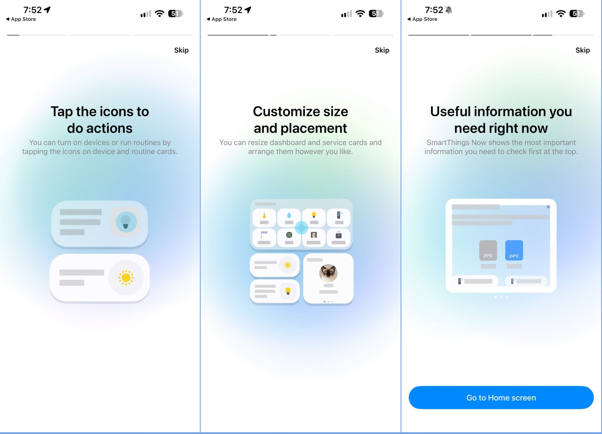
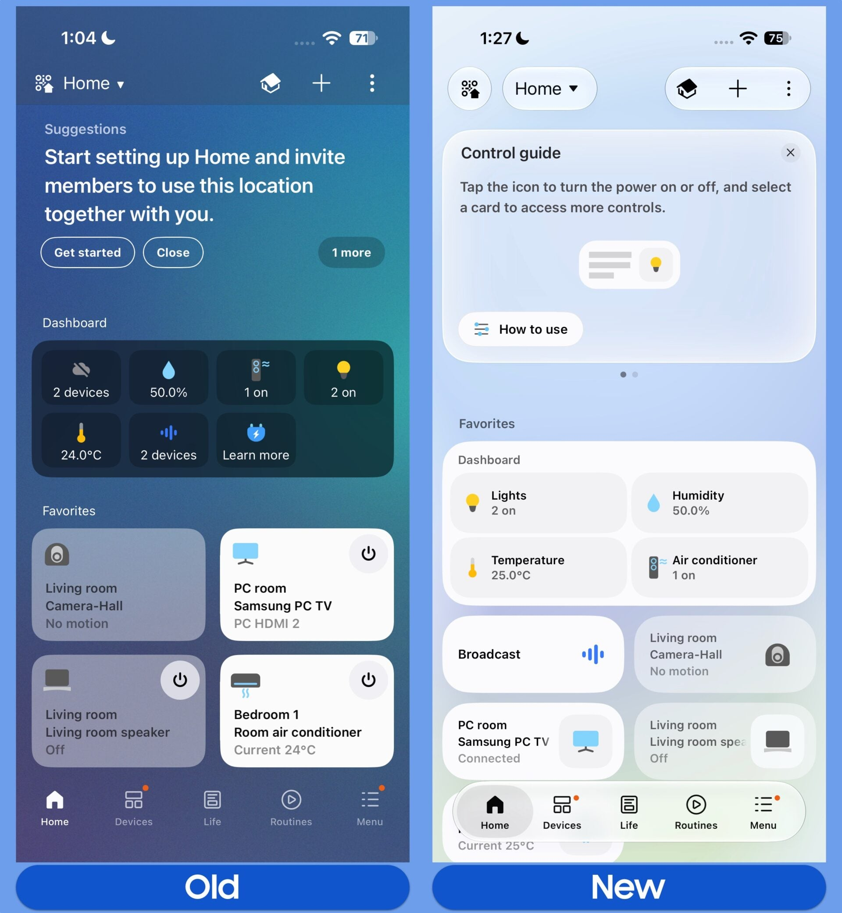
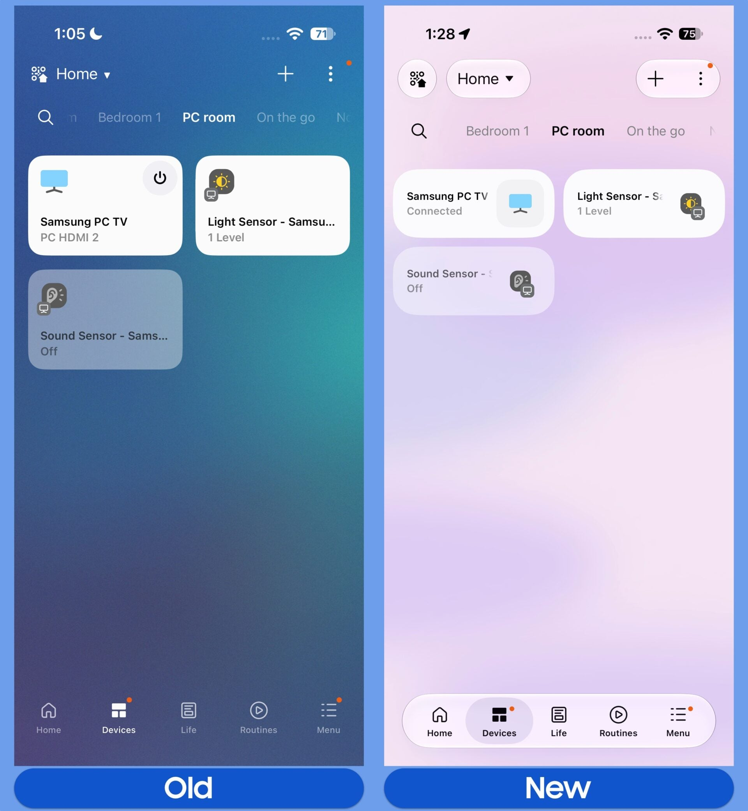
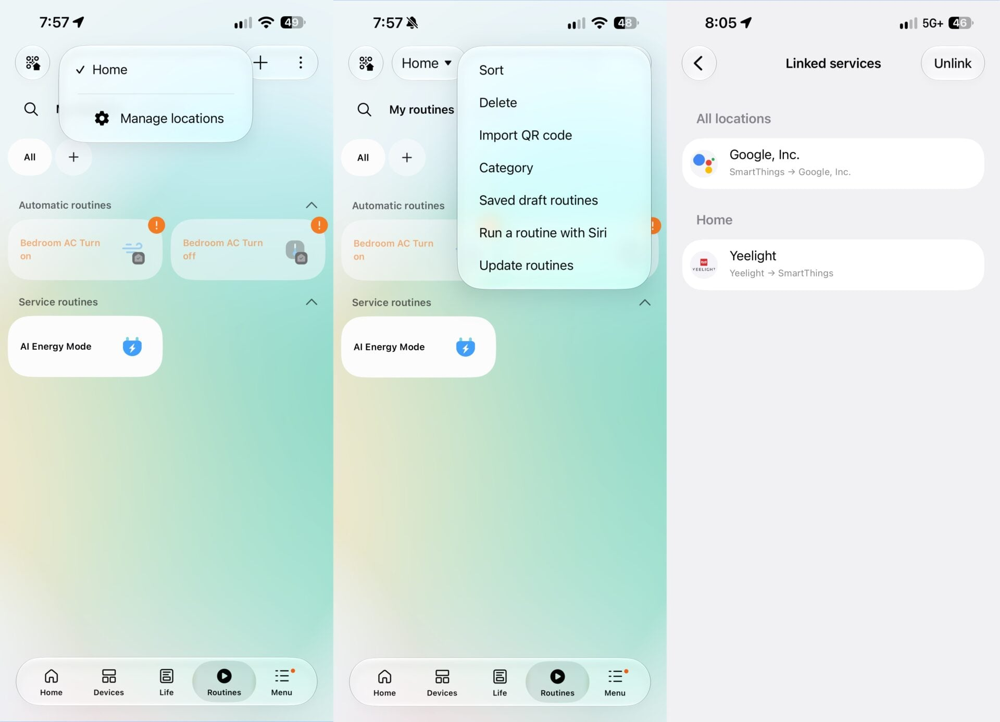

Samsung has released the redesigned version of its **SmartThings** app, and the
first platform to receive it is iOS: version 1.7.51 of the iPhone app is already
available ahead of the company's own Galaxy phones and the rest of the Android
ecosystem. The new release adopts Apple's Liquid Glass design language with an
overall lighter color scheme, and it arrives a few months after SamMobile
published an exclusive first look at the same interface.

## What changes in the SmartThings interface

The app keeps its five main tabs, but navigation moves to a compact, floating
bar with a Liquid Glass finish. Cards for each device or routine are smaller by
default, although they can still be resized if you prefer more detail: tapping a
device's icon turns it on or runs its assigned action, while the rest of the
card opens its full controls.

At the top of the Home tab there is now a dynamic summary card with insights
such as weekly or monthly energy usage, quick access to the TV remote, family
care alerts and suggested automations. It can be dismissed so that connected
devices show up right away. The Favorites section stays on the same tab, and the
home QR code, the location selector and the overflow menu are now enclosed in
pill-shaped outlines instead of being borderless.

## The TV remote gains a light mode and more freedom of movement

The built-in virtual remote for TVs and smart monitors gains a dedicated Light
Mode, can be resized for one-handed reach and moved to any of the four corners
of the screen. The dedicated TV page adopts the floating tab bar in turn and is
split into three sections: For You, Featured and Settings, with a persistent
Remote shortcut in the bottom-right corner.

Routines, the menu and settings share the same refreshed treatment, including
routine sorting and the linked services section.

## What has not changed yet

The deeper menus for each device, such as the specific plugin screens for air
conditioners, soundbars, wireless speakers or washers and dryers, still use the
old design. SamMobile notes that Samsung will very likely update those plugins
individually in future versions of the app.

For now, the rollout has stayed on iPhone: the redesign will reach Galaxy and
other Android devices later, with no specific date given in the published
coverage. Anyone running their home from a Galaxy will have to wait, while
Samsung keeps refreshing the software on its devices with the recent opening of
[the One UI 9.0 beta](/noticias/galaxy-a54-one-ui-9/) to several models in the
range.
