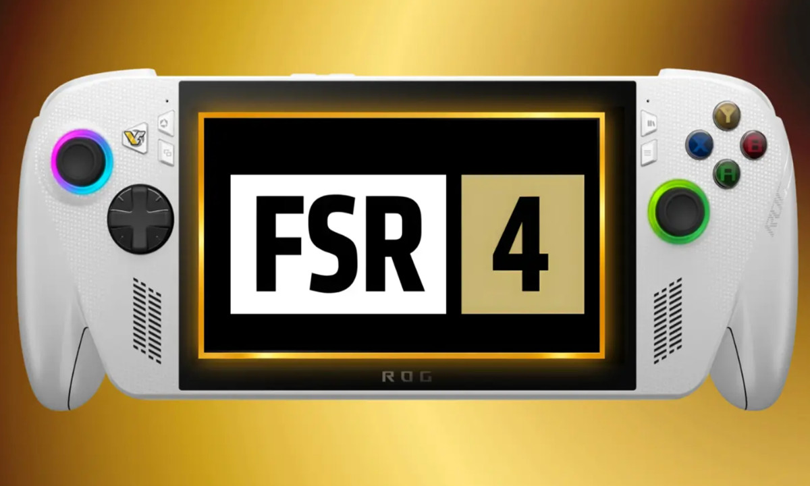

AMD has confirmed that FSR 4, its machine-learning upscaling technology, will no longer be reserved for graphics cards and will arrive on its APUs before the end of the year. The announcement covers both units already on the market and new product lines the company has planned.

## What AMD Has Confirmed

The confirmation comes from Jack Huin, Senior Vice President and General Manager of AMD’s Computing and Graphics Group, during a meeting with Korean media at the Seoul Dragon City event. The executive placed FSR 4 support on APUs for the end of this year and described it as an extension to "the entire product line, including APUs, gaming laptops, and portable devices." 

Context matters when measuring the scope of the announcement. FSR 4 debuted as exclusive to RDNA 4-based Radeon RX 9000 graphics cards, the AI upscaling approach the company [already demonstrated with neural rendering in that range](/noticias/amd-renderizado-neuronal-rx-9000/). This summer AMD extended compatibility to discrete Radeon RX 7000 graphics cards with RDNA 3 architecture. APUs, however, were left out: models with RDNA 3.5 integrated graphics like "Strix Halo" could not run FSR 4 because, according to the company, they did not offer the performance necessary for the AI calculations the technology requires.

## Why It Matters: An APU Install Base Without FSR 4

The relevance of the move lies in volume, not technological novelty. APUs integrate CPU and GPU on the same die, reducing power consumption, space, and cost, which is why they form the basis of much of the budget laptop market, mini-PCs, and portable gaming devices. AMD also uses them in semi-custom chips with which it dominates the console market.

That install base is enormous, and until now remained outside the house’s AI upscaling. Bringing FSR 4 to those APUs means that systems that currently cannot activate it will enter the same image-enhancement technology as dedicated GPUs.

## A Lighter Model and What Changes for Gamers

According to Huin, compatibility will work in two directions: for existing APUs and for new products. The key for units already sold is a specific model that lightens FSR 4 and adapts it to the APU environment. The executive pointed out that the goal is to achieve "excellent gaming quality and low latency," without detailing figures.

And there is the nuance worth keeping in mind: for now this is a calendar announcement, not measured data. AMD has not published how many frames are gained, in which games, at what resolution or with what settings, nor to what extent the lighter model retains the image quality of original FSR 4. Without that information, the open question is whether the trimmed version maintains sharpness at 1080p and 1440p, the two realistic goals for an integrated GPU.

The announcement leaves a double reading. In addition to compatibility for current APUs, the mention of new product lines points to the possibility that an APU with RDNA 4-based integrated graphics could appear this year. For those looking at price per frame, the useful comparison will not be against a dedicated card, but against the cost of making the jump within the integrated graphics segment itself.
