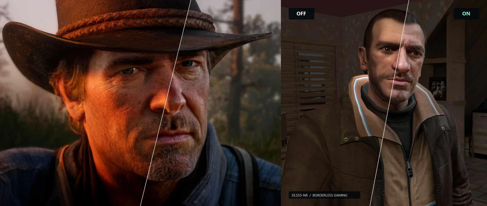

Borderless Gaming has added support for an **unofficial implementation of DLSS 5 Neural Rendering** that runs on top of the game's final image through its BGFX effects and scaling system. The pitch is straightforward: apply neural rendering without replacing NVIDIA's DLL, without modifying the game's files and without relying on a mod made specifically for each title. The entry price is **€6.89**, because Borderless Gaming is a commercial tool originally designed to play games full-screen without borders.

## What it does and how it is installed

The effect is installed from GitHub with the application's own editor and is enabled by selecting the **DLSS5-NR** preset. The program takes care of downloading and configuring the required files, and then lets the user adjust parameters such as intensity, lighting, structure, style or processing resolution.

The key is where it runs. Instead of sending the work through NVIDIA's conventional DLLs, the model runs **inside BGFX**. All the processing happens externally, on the image already produced by the game engine. According to the developer, the Neural Rendering model had to be adapted and quantised, its execution changed and several bottlenecks removed.

That external approach has a relevant consequence: because it does not depend on official support, it can also be enabled on **hardware that has no access to DLSS 5 Neural Rendering**. It follows a similar principle to other community efforts, such as the [open-source reimplementation of DLSS 5 on Vulkan that also reaches the RTX 40 cards](/noticias/dlss-5-reimplementacion-vulkan-open-source/).

## Performance: what to expect and on which GPU

The developer gives a concrete example: even a **GeForce RTX 3090** can enable the effect at roughly **30 FPS**. That figure deserves caution, because the source does not detail the game, resolution or settings it was measured with, so it is not comparable to a controlled benchmark. The material itself acknowledges that the result depends on the title, the resolution and the chosen parameters.

That is why its use is mainly recommended on **higher-end GeForce RTX 50 or RTX 40 cards**. It helps that the implementation allows Frame Generation to recover part of the performance lost when the effect is enabled. The technology is also optimised around the **Blackwell (RTX 50)** architecture, which leaves earlier generations in a compromise position: they can run it, but not under the same conditions.

## A port for BGFX, not a native DLSS 5

Here lies the nuance that separates this solution from the official one. When a developer integrates Neural Rendering into a game, NVIDIA's technology can read information provided by the graphics engine itself, including the rendered frame and data such as motion vectors. Borderless Gaming has no access to that internal information: it works on the final image with its own pipeline, so **the result is quite different** from what a native implementation would offer.

The official repository describes it as **a port of DLSS 5 Neural Rendering for BGFX**, not as a way to add full native support to any game. Its goal is to alter aspects of the image such as lighting, tone and structure, and it can be applied on older GPUs than the RTX 50. Anyone expecting the same fidelity —and the same scene information— that a studio-made integration provides will be disappointed.

## Price and how it relates to the alternative

Borderless Gaming's **€6.89** is the main point of friction. The feature lands, in a sense, where **LossLess Scaling** already points: a paid utility that adds capabilities to games that do not ship them. The difference is that no performance is gained here; on the contrary, the frame cost can be considerable, especially outside the higher-end RTX 40 and 50 cards.

The real alternative is twofold. Anyone with a compatible GPU does not need to pay anything: native DLSS 5 arrives with the game when the studio integrates it, with better quality and without depending on the final image. Anyone who lacks it will find in this proposal a simple way to experiment with neural rendering, but should judge it as an added effect rather than a substitute for the original.
