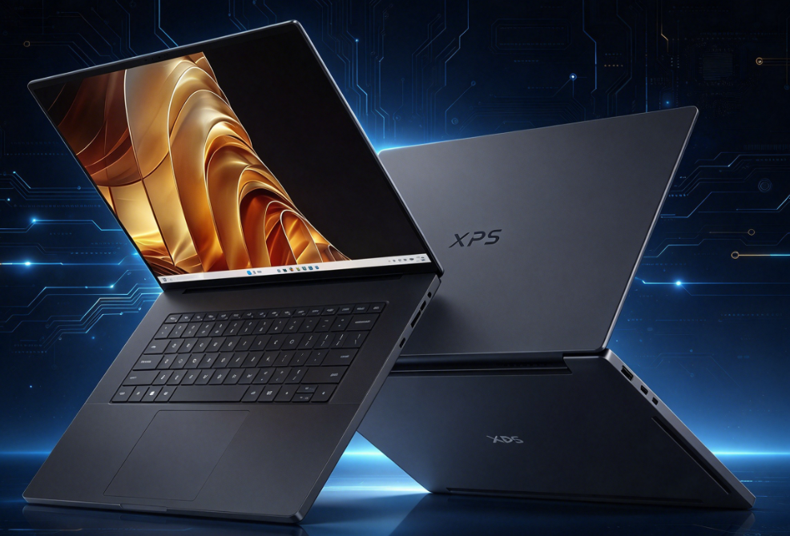

# Dell Unveils XPS 16 Creator Edition with RTX Spark and Up to 128 GB Unified Memory

Dell has unveiled the XPS 16 Creator Edition, the first laptop in the XPS family to incorporate NVIDIA's superchip RTX Spark. The lineup starts at $3799.99 — approximately 27,360 yuan — and is offered in two configurations of the N1X chip, with unified memory as the main argument against discrete GPU laptops. The company targets AI developers, content creators, and high-end gamers.

## Two Versions of the RTX Spark Superchip

The XPS 16 Creator Edition revolves around two variants of the RTX Spark N1X. The more powerful one combines a 20-core Grace CPU with a Blackwell GPU featuring 6144 cores; the second drops to 18 CPU cores and 5120 GPU cores.

According to the manufacturer, the superchip is fabricated on TSMC's 3 nm node and unites CPU and GPU via NVLink-C2C interconnect. Dell and NVIDIA estimate its AI compute capacity at up to 1 petaflop in FP4 precision, sufficient to run models with up to 120 billion parameters locally. These are manufacturer figures: there are no independent benchmarks yet placing them in context, so they should be treated as such.

This move is not isolated. Specifications for the [Surface Laptop with NVIDIA RTX Spark](/noticias/tarjetas-graficas/surface-rtx-spark-filtracion/) were already leaked, and MSI quietly launched the [mini PC EdgeMesa N AI+ with RTX Spark N1X and 128 GB unified memory](/noticias/msi-edgemesa-n-rtx-spark/). The chip is becoming the centerpiece of high-end ranges across several manufacturers simultaneously.

## Unified Memory and Tandem OLED Display

The second pillar is memory. The system supports up to 128 GB of LPDDR5X unified at 9400 MT/s, a single shared pool for CPU and GPU. Dell claims this architecture allows loading large 3D scenes and multi-layer 8K timelines that a discrete GPU laptop could not handle. Again, this is a manufacturer claim rather than a measured figure.

The display is a 16-inch Tandem OLED panel at 3.2K (3200×2000), with up to 1000 nits of brightness, 100% DCI-P3 coverage, and factory calibration with Delta E below 2. Refresh rate is variable between 20 and 120 Hz. Storage scales up to 4 TB in PCIe Gen 5 SSDs, and connectivity includes three USB4 Type-C ports at 40 Gbps, HDMI 2.1b, a full-size SDXC card reader, Wi-Fi 7, and Bluetooth 6.0.

The chassis is CNC-machined aluminum, measures 17.81 mm in thickness, and weighs from 2.02 kg, with a 99 Wh battery and a 130 W USB-C adapter. Dell describes it as its thinnest high-performance XPS and assures that the cooling system uses the largest and thinnest fan ever manufactured by the company, along with an 8 mm heat pipe.

## What Changes for the Reader

For now, the XPS 16 Creator Edition is only available on reserve at Best Buy, with Dell's website as the next step. The company has not opened a product page or listed a price on its China site, so availability outside the United States remains unconfirmed. Anyone wanting the RTX Spark superchip will have to wait for a local announcement or resort to importing.

At $3799.99, the XPS 16 Creator Edition does not compete on price/performance in gaming against a conventional discrete GPU laptop. It competes by loading into memory what those machines cannot reach, and that is the real argument of the proposal. Today it remains a manufacturer promise awaiting independent benchmarks to back it up.
