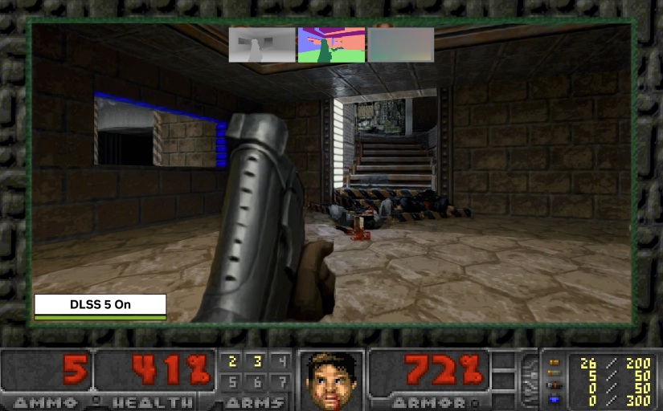

The original 1993 DOOM is once again serving as a test bench. Developer Nikolai Zhivotenko has released **DOOM + DLSS 5**, an experiment that brings NVIDIA's DLSS 5 neural rendering to id Software's classic through a Windows port that rebuilds the presentation path on **DirectX 12**. This is not DLSS 5 being injected into the original DOS executable; the renderer has been rewritten to supply the additional information that modern temporal and neural reconstruction techniques require. The information comes from Wccftech.

## The original DOOM engine, adapted to modern buffers

The project is based on **Linux DOOM 1.10**, the version id Software released as open source, and has been turned into a 64-bit Windows application. The game still renders internally at its original **320×200** resolution, but the final image is presented in a **1280×800** window. The change that enables everything else is that the modified engine now generates **depth, normal and motion data for every frame**: the G-buffer that far more recent reconstruction technologies expect and that the 1993 rasteriser never produced.

In that sense, the achievement is not image quality but integration: an engine designed three decades earlier starts speaking the data language of today's graphics pipelines.

## Which upscaling modes it supports

The port also works as an upscaling test bench. It offers separate modes for **DLSS Ray Reconstruction**, **DLSS 4 Super Resolution using Preset K**, **DLSS 4.5 using Preset L**, **AMD FSR 2.2**, **Anime4K** and a plain nearest-neighbour 4× scaling. The DLSS 5 mode first runs the DLSS 4.5 path and then applies DLSS 5 Neural Rendering, provided the necessary DLSS 5 Swapper setup is installed.

## What changes for readers

Expectations should be calibrated: no performance or frame-rate figures have been published, and the author himself does not present the result as an image-quality upgrade. Neural reconstruction is working here with geometry and imagery far removed from the material these models are normally fed, so some reconstructed details can look rather unusual. What matters about the experiment is that it works at all: that a 1993 architecture can deliver the G-buffer modern techniques ask for, just as other reimplementations have brought DLSS 5 to Vulkan and unsupported hardware.

There are compatibility limits too. Neither the DOOM sold on Steam nor DOOM 64 can enable DLSS this way: users must build the port from its GitHub repository, published under the GPLv2 licence, and supply a compatible IWAD. Anyone looking for a shortcut tool that applies DLSS 5 without touching the game can consider options such as [Borderless Gaming, which does it with no per-title mods](/en/news/tarjetas-graficas/borderless-gaming-dlss-5-universal-neural-rendering/), though the interest here lies elsewhere: showing that the original DOOM still has room to adopt new graphics technologies.
