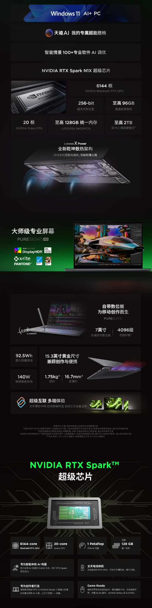

Lenovo is already accepting reservations for the YOGA Pro 15 RTX Spark and will open general sales on October 16, according to ITHome. The device is a 15.3-inch laptop built around NVIDIA's RTX Spark N1X chip, the platform that combines CPU, GPU, and memory in a single package and which had already appeared in MSI's EdgeMesa N mini PC.

## RTX Spark N1X: 6,144 Blackwell cores and unified memory

The data that defines the device is in the product sheet cited by the outlet: the graphics part is an RTX with Blackwell architecture featuring 6,144 cores, accompanied by a 20-core Grace CPU. The combination shares a 256-bit memory bus and can be configured —always according to the manufacturer's figures— with up to 96 GB of shared graphics memory and up to 128 GB of unified LPDDR5x memory at 9,400 MT/s.

That unified memory is what separates this family from a standard gaming laptop. Instead of splitting dedicated VRAM between the GPU and a separate reserve for the system, the chip exposes a single memory space shared by the CPU and GPU. In AI and creation workloads, the practical limit is usually not computing capacity but how much model fits in memory, so the 128 GB ceiling is the product's central argument. The other figure repeated in the manufacturer's documentation, around 1 PFLOP for AI workloads, is an estimate of part: it comes without any independent test that allows placing it against other solutions.

## What accompanies the chip

The YOGA Pro 15 RTX Spark distributes the rest of its specs between mobility and creative work. The screen is a PureSight Pro panel with VESA DisplayHDR 500 certification, cooling relies on the Lenovo X Power architecture and the battery is 92.5 Wh with 140 W fast charging. The device weighs around 1.75 kg and its minimum thickness is around 16.7 mm.

The least common piece is the integrated tablet: a 7-inch area intended for handwriting with a stylus, with 4,096 levels of pressure. Lenovo accompanies the set with device interconnection functions, such as instant file transfer and moving applications between devices. The configuration is completed with space for two M.2 SSDs up to 2 TB each.

## What changes for the reader

For now, the only confirmed thing is the commercial calendar: reservations are open and sales start on October 16. The published information does not detail price, tiered configurations, or availability outside the home market, so there is still nothing with which to calculate a price/performance ratio.

The interest in this platform is not in its frames per second in a specific game —there are no independent measurements at 1080p, 1440p or 4K with which to compare it— but in its unified memory approach and how it is expanding. The same chip already appears in the mini PC [EdgeMesa N by MSI](/noticias/msi-edgemesa-n-rtx-spark/) and in the [leaked specifications of the Surface Laptop with RTX Spark](/noticias/tarjetas-graficas/surface-rtx-spark-filtracion/), which points to a wider family of devices than that of a single model.
