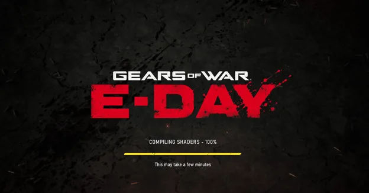

Microsoft has expanded Advanced Shader Delivery (ASD) on Windows 11 and made Gears of War: E-Day the first game to support the technology across a broad range of systems with AMD, NVIDIA, Intel and Qualcomm GPUs. The feature targets one of the most recurring problems in modern PC games: the compilation of shaders and pipeline state objects (PSOs).

## What Advanced Shader Delivery is

In a conventional start-up, the user's CPU compiles a large number of shaders during the game's first run, or compiles them on the fly during play (just-in-time). Advanced Shader Delivery changes that split: precompiled shaders arrive alongside the game download. According to Microsoft, this noticeably shortens first-launch compilation and reduces the stutter tied to shader compilation during gameplay.

## The numbers Microsoft gives

On a typical PC without ASD, first-launch shader compilation can take several minutes. With Advanced Shader Delivery enabled, Microsoft puts the process at just a few seconds, which works out to roughly a 95% reduction in compilation time.

The origin of that figure is worth spelling out: it is the manufacturer's own data, not an independent measurement, and it rests on a single title —Gears of War: E-Day— as its demonstration.

## What hardware and which version of Windows are required

The rollout is not universal and arrives platform by platform. These are the requirements Microsoft has detailed:

- **Operating system:** Windows 11 version 24H2 or later.
- **AMD:** GPUs based on RDNA 1, RDNA 2, RDNA 3, RDNA 3.5 and RDNA 4, with the Adrenalin 26.6.1 driver or newer.
- **Qualcomm:** devices with Snapdragon X2.

Over the course of this month, support will expand to all NVIDIA RTX GPUs, including RTX Spark, as well as Intel Arc B570 and B580 cards and Core Ultra Series 2 and Series 3 integrated graphics. With that move, ASD would cover a substantially larger share of the Windows 11 gaming ecosystem.

## What changes for the PC player

In Gears of War: E-Day, the XBOX PC app must be installed before downloading the game in order to take advantage of ASD. When the feature is working, the launch window shows the message "Precompiled shaders installed". The Coalition's game is only the beginning: Microsoft has already confirmed that Call of Duty: Modern Warfare 4 will also support Advanced Shader Delivery later on.

How much this matters depends on adoption. If the technology becomes widespread —and especially if it reaches other PC stores, such as Steam— Windows 11 would have a system-level solution to a problem many titles carry. Anyone who has endured the first shader compilation after buying a game like [Gears of War: E-Day](https://www.techspain24.com/noticias/gears-of-war-e-day-pc-requirements/) knows the pain point: minutes of waiting before playing and occasional stutters in-game, exactly what ASD promises to cut.

