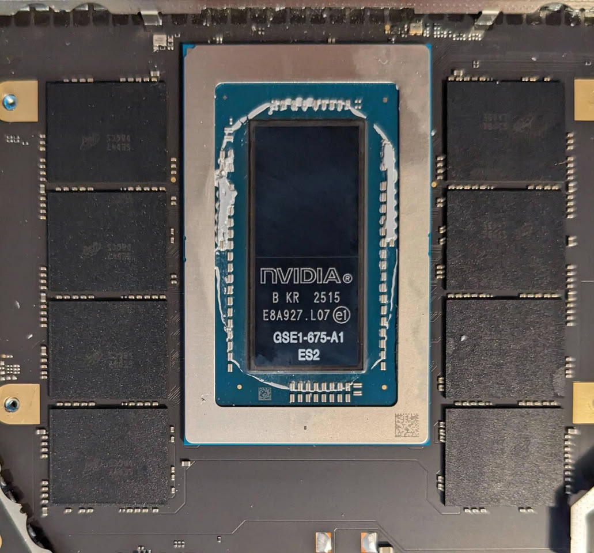

Microsoft is preparing a family of Surface Laptops built on NVIDIA's RTX Spark SoC, according to a leak that TechPowerUp picked up from a Windows Central report. The information, **not confirmed by the manufacturer**, points to an event on October 7 in San Francisco where the full line would be unveiled; Microsoft had already announced that date, focused on local AI, in its [earlier invitation](/noticias/microsoft-surface-event-2026/). One early claim stands out above the rest: the promise that the new Arm SoC will perform the same on battery as it does plugged in. Without measured figures, that claim cannot be verified yet.

## Three configurations on RTX Spark

The report claims Microsoft will launch a Surface Laptop with the 18-core RTX Spark, joining the 20-core variant already known from earlier leaks. Unified memory would start at 24 GB on the 18-core model, while the 24-core version would start at 32 GB. Unified memory is a single block shared between CPU and GPU, common in Arm-style SoCs, that avoids duplicating copies of data between the two. Another device already using this architecture is the [MSI EdgeMesa N AI+](/noticias/msi-edgemesa-n-rtx-spark/) mini PC, announced with 128 GB of unified memory.

## Display, keyboard and ports

Both 15-inch laptops would share the same PixelSense Ultra touchscreen, with 2,000 nits of peak HDR brightness and high color accuracy. The haptic touchpads would be 30% larger than those on the 15-inch Surface Laptop. On connectivity, three USB Type-C ports, one USB Type-A, one HDMI and a full-size SD card reader are quoted. The leak does not specify those ports' versions or speeds, a relevant detail if the machine aims to move data from fast external storage.

## Performance and efficiency: what is still unknown

The report mentions a performance demonstration in which the new SoC would hold the same level of performance on battery as when plugged in. It is, at once, the most compelling and the hardest claim to verify: there is no resolution, no games, no settings and no measured power draw. For a GPU, the relevant figure is not the peak frame rate but how many frames it sustains and at what energy cost, and that is exactly what a spec leak cannot provide.

That is why the comparison that truly matters remains pending. Without prices or independent testing, the RTX Spark cannot be placed against x86 alternatives with dedicated graphics on price per frame or performance per watt. Until those figures exist, the leak only previews the shape of the product and its ports, not its real-world efficiency.
