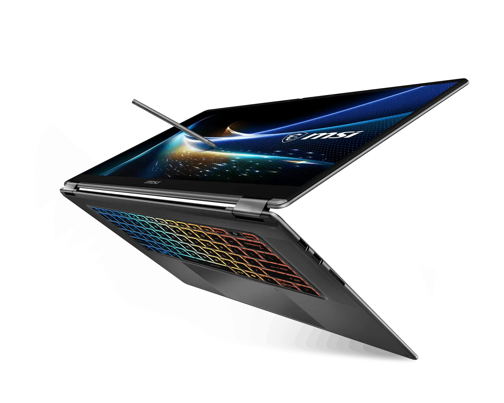

MSI has opened reservations for the Prestige N16 Flip AI+ in selected markets through its certified distributors. It is a 16-inch convertible that the manufacturer presents as the first 2-in-1 from the first batch of laptops with NVIDIA RTX Spark, the superchip that combines a Grace CPU and a Blackwell GPU under a single unified memory pool.

It is advisable to set the frame before diving into the figures: everything that follows comes from MSI's press release and product sheet, not an independent test. These are manufacturer data, and as such they must be read with caution.

## What MSI has presented

The Prestige N16 Flip AI+ arrives in two RTX Spark N1X configurations: one with a 6,144-core Blackwell GPU and a 20-core CPU, and another with a 5,120-core GPU and an 18-core CPU. Memory is soldered LPDDR5X, up to 128GB shared between the CPU and GPU. NVIDIA rates the superchip's performance at up to 1 petaflop in FP4, a metric geared towards reduced-precision AI workloads rather than gaming.

On screen there are two options: a 3,840 × 2,400 UHD+ Tandem OLED or a 2,880 × 1,800 OLED, both 16 inches, touch-enabled, with variable refresh rates from 30 to 120 Hz, 100% DCI-P3 coverage, and VESA DisplayHDR True Black 1000 certification. The package is completed by a 360-degree hinge for switching between laptop, tablet, store, and presentation modes; the included MSI Nano Pen —with a slot in the chassis that charges it—; a touchpad 53% larger than the previous generation's; an SD card reader; four speakers; and a 99.9 Wh battery with 140 W USB-C charging.

In connectivity it includes two Thunderbolt 4-compatible USB4 Type-C ports, two USB 3.2 Gen2 Type-A ports, HDMI 2.1, an SD card reader, and Wi-Fi 7 with Bluetooth 5.4. The declared weight is 1.9 kg and thickness ranges from 13.9 to 16.9 mm depending on the area.

## Why it matters: unified memory and local AI with RTX Spark

MSI's argument is not gaming speed, but where the AI model lives. With up to 128GB of unified memory, the system can keep loaded models and projects that don't fit in a dedicated GPU with fixed VRAM, as well as several demanding applications at once. The manufacturer cites 3D projects up to 90 GB. Keeping loads local, it adds, avoids reliance on the cloud: less recurring cost, more privacy, and responses without network latency.

That approach relies on CUDA and specific accelerations per application: DaVinci Resolve with fifth-generation Tensor Cores, Blender with DLSS 4.5 ray reconstruction in the CYCLES viewer, Adobe Premiere Pro with NVENC and NVDEC engines, and ComfyUI with NVFP4 acceleration. NVIDIA describes RTX Spark as its most efficient RTX chip to date; it is a manufacturer claim and, without independent measurements, remains so.

There is a nuance the buyer should keep in mind: being a Windows on Arm platform, native Arm software coexists with x86 software executed via emulation. Compatibility is broad, but performance is not identical in all cases.

## What changes for the reader

The Prestige N16 Flip AI+ can already be reserved, although availability varies by market. MSI has not published a price, so there is currently no way to calculate a per-frame price or compare it with concrete alternatives: the immediate incentive is the launch batch, valued at $299, including a 128GB MSI Dual Drive, one year of MSI Care Plus, and one year of accidental damage protection, available until December 31, 2026.

For those seeking local AI on the go, the appeal lies in the unified memory block rather than gaming figures. It is the same bet we already saw in the [Surface Laptop with RTX Spark leak](/noticias/tarjetas-graficas/surface-rtx-spark-filtracion/) and that MSI tried before in a mini PC format with the [EdgeMesa N AI+](/noticias/msi-edgemesa-n-rtx-spark/). Without independent tests of power consumption, sustained performance, or battery life, the sensible decision is to wait for the first reviews before turning manufacturer figures into a purchase.
