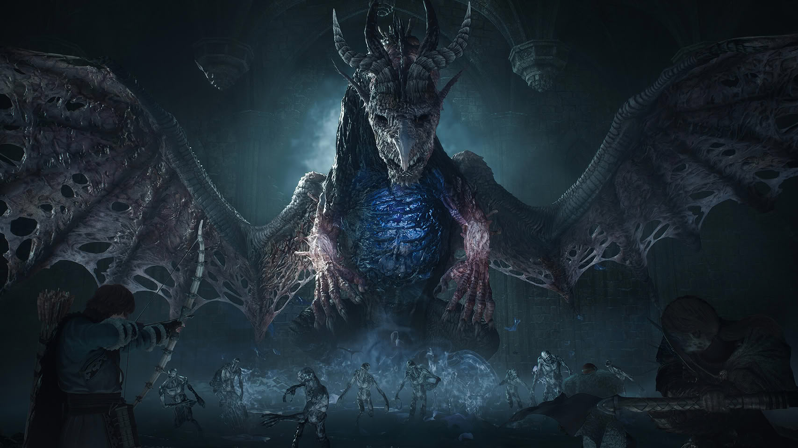

NVIDIA has released the GeForce 617.42 WHQL Game Ready driver, the first entry in the 617 branch and the successor to 617.14 from September 22. The package arrives fourteen days later and leans on the usual pillars: support for freshly released games, a handful of optimizations and a few fixes. What stands out, however, is not what it repairs but what it leaves open: the laptop power-consumption problem has returned to the list of known issues.

## What GeForce 617.42 adds

The driver covers two releases with Game Ready support: **Call of Duty: Modern Warfare 4** and **STAR WARS: Galactic Racer**. It also tunes performance in *Dragon's Dogma 2: Dark Arisen* and *Valor Mortis*, and accompanies the Sim Update 7 for *Microsoft Flight Simulator 2024*.

As far as performance goes, the only figures available are the manufacturer's. NVIDIA claims that 6X Multi Frame Generation in *Flight Simulator* scales linearly, with increases of up to 6.4X against the 4.2X average of the 4X mode at 4K, and that Dynamic Multi Frame Generation on the RTX 50 series switches between multipliers instead of holding one. These are figures with no independent measurement, so they should be read for what they are: NVIDIA's own reference, not a third-party result.

The 615 branch also adds support for CUDA 13.4 and updates the bundled modules (PhysX 9.26.0703, HD Audio 1.4.6.3 and DCH control panel 8.1.969.0). The desktop installer weighs 990.85 MB, up from 984.3 MB five weeks ago.

## One crash fixed, and the bug that comes back

The only gaming bug NVIDIA records as fixed is a crash to desktop in *Assassin's Creed Shadows* after extended gameplay, a problem it had carried since driver 616.56. The issue carries the id \[6685219\] and had been open since 616.92 on September 9; anyone who skipped the September release now gets that fix and the new game support in a single download.

Overall, the fixed-bugs section reads "N/A", and that is where the contrast lies: the only open issue NVIDIA lists is the return of id \[6007998\], according to the release-notes tracking published by MIXED Reality News. It concerns the "Prefer Maximum Performance" power management mode, which "may not be applied correctly" on laptops. NVIDIA has never marked it as fixed: it appeared in seven consecutive drivers — from 610.47 in May to 616.92 in September —, vanished without explanation from 617.14 and has now come back. The notes specify neither the affected GPU, nor a laptop model, nor a concrete symptom, so the entry describes a broad range of behaviour without pinning down any of it.

## What changes for the user

For anyone with a GeForce card, 617.42 is a routine update with two clear reasons: this fortnight's releases and the *Assassin's Creed Shadows* fix. The calendar accompanying the launch places *Modern Warfare 4* Campaign Early Access on October 16 for pre-orders, and the full opening — with multiplayer and DMZ — on October 23. *Dragon's Dogma 2: Dark Arisen* arrives as a free update to the base game on October 9, and the *Microsoft Flight Simulator 2024* Sim Update 7 on October 13.

The fine print is the usual one: NVIDIA's changelog is "a subset" of the total. On Windows 11's Advanced Shader Delivery feature, the driver says nothing — it appears neither in the notes nor in the announcement — and *Modern Warfare 4* asks for "616.56" for NVIDIA, with the promise of a compatible driver before launch. Against the previous release, the step is modest; for anyone who skipped September's, the package concentrates more value. The drivers are available through the NVIDIA app and GeForce.com, and the preceding release, [GeForce 616.92 WHQL](/noticias/geforce-616-92-game-ready-drivers/), is now one step behind.
