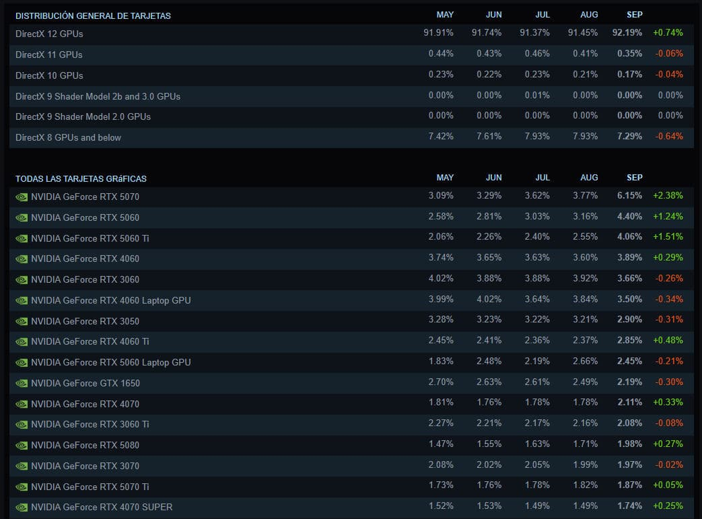

Steam's hardware survey for September 2026 has a new top spot. The GeForce RTX 5070 is the most used graphics card among players on the platform, with a 6.15% share and a month-on-month gain of 2.38 percentage points, as reported by Profesional Review from the report Valve publishes every month in the [Steam Hardware & Software Survey](https://store.steampowered.com/hwsurvey/). The figure confirms a changing of the guard at the top of the table, until now held by previous-generation models, and it arrives alongside two other shifts in memory and resolution.

## The RTX 5070 pulls Blackwell's mid-range up

The RTX 5070's rise does not come alone. Two other cards from the same architecture climb the ranking: the RTX 5060 Ti reaches a 4.06% share and the RTX 5060 sits at 4.40%, both up on the previous month. The mid-range of the RTX 50 series now holds several spots among the most used GPUs, while AMD's equivalent options do not appear in that upper part of the table. On AMD's side, the bet for a new build remains the [Radeon RX 9070 XT, flagged weeks ago as the best cost-per-frame option](/noticias/xda-one-gpu-worth-buying-right-now/) for 1440p and 4K.

The table should be read in context: Steam's survey is voluntary and anonymous, so it describes the hardware of those who answer it, not the PC market as a whole.

## 32 GB of RAM overtakes 16 GB for the first time

The report also records a shift in the system's main memory. For the first time, 32 GB configurations outnumber 16 GB ones: the former reach a 42.22% share, up 4.77 points, while 16 GB drops to 37.82%. The move responds to modern titles that demand ever more main memory headroom. For anyone deciding on a purchase, the data puts 32 GB as the most chosen configuration, even though the specific use case —games, resolution and settings— still calls the shots.

## 1080p falls below 50% and AMD closes the gap on CPU

On displays, 1080p remains the dominant resolution but slips below the 50% mark: it lands at 47.91%, down 2.61 points, while 1440p rises to 27.04%. The migration to higher-resolution panels is slow but steady. In Windows processors, AMD reaches a 47.41% share against Intel's 52.59%, a gap that has been narrowing month by month.

All told, September's snapshot leaves one clear idea for buyers: the RTX 5070 tops the list of most used GPUs on Steam, and 32 GB of RAM has become the most common configuration among its players.
