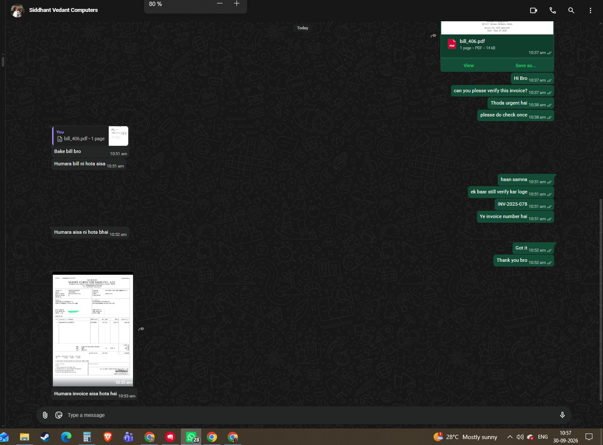

ZOTAC has denied the warranty on a GeForce RTX 3060 bought in 2025 after concluding that the invoice used to register the product was not issued by the seller named on it. The company laid out its version to Wccftech after the case stirred up debate on Reddit, and two ideas in its explanation are worth keeping: registering for the extended warranty does not authenticate any document, and without a valid invoice the coverage window is counted from the import date, not the purchase date.

## A one-year-old RTX 3060 whose warranty had already run out

It starts with the account of a user who bought an RTX 3060 last year and had his warranty request rejected by ZOTAC. According to the screenshots he posted, the brand argued that the product had already served its three years of coverage and had been sold two years after its original import. The reply raised fair questions: counting the warranty from import rather than from the sale to the customer leaves the buyer with far less headroom than the box advertises.

## ZOTAC's version: an invoice the seller does not recognise

ZOTAC reached out to Wccftech to qualify that account and said the refusal did not rest on the age of the product alone. According to its version, this RTX 3060 was already registered on its website under a different invoice, and the user had bought it from KVR Gaming System. When reviewing the claim, the brand found that the invoice the customer submitted did not match the one on the earlier registration:

> The product was imported in 2023. The customer later submitted a KVR Gaming System invoice showing a 2025 purchase date. However, our records show that a different invoice from Vedant Computers had previously been used to register the same product for the 3+2 year warranty, and Vedant Computers has confirmed that this invoice was not issued by them.

When ZOTAC asked Vedant Computers, the seller denied issuing that document. With no invoice that could be authenticated, the brand could not accept the 2025 purchase date and fell back on the import date it could verify: 2023.

## Registration and verification are separate processes

ZOTAC's explanation clears up one of the most confusing points of the case. The user had treated his registration for the 3+2-year extended warranty as settled, but the company argues that step is automatic and does not authenticate the document at the time it is made: the real check happens when a claim is opened. In other words, a product registering without errors does not prove the invoice is genuine.

ZOTAC also acknowledges that it did not inform the user about the discrepancy before denying the warranty, nor give him the chance to provide additional documentation proving his 2025 purchase. On the purchase date it treats as valid, the brand is clear: if a genuine, verifiable invoice exists, the date on it counts; if not, it uses the verified import date plus a reasonable buffer for the normal movement of the product through the channel. In this case, the six-month window ZOTAC considers normal for an NVIDIA GPU to leave the channel was not met: the product was sold nearly two years after entering the country.

## What changes for the buyer

The case comes from the Indian market and its channel rules, but the lesson travels well. First, the purchase invoice is the decisive piece of any claim: keep it in a legible format with the correct seller details, because an invoice the seller does not recognise invalidates the purchase date in the manufacturer's eyes. Second, registering a product for an extended warranty is not the same as having its documentation validated; that check comes with the claim, not with the registration.

It is also worth not confusing the manufacturer's commercial warranty with the legal guarantee of conformity, which in Spain covers the purchase before the seller regardless of the conditions the brand imposes. This is not the first striking warranty denial of the month: PNY refused one on an RTX 5090 that burned out at idle because the owner did not use its cable, a reason that was not in its terms either. In both cases the pattern is the same: the manufacturer's answer hinges on a document or an accessory the buyer does not always know is at stake until something fails.
