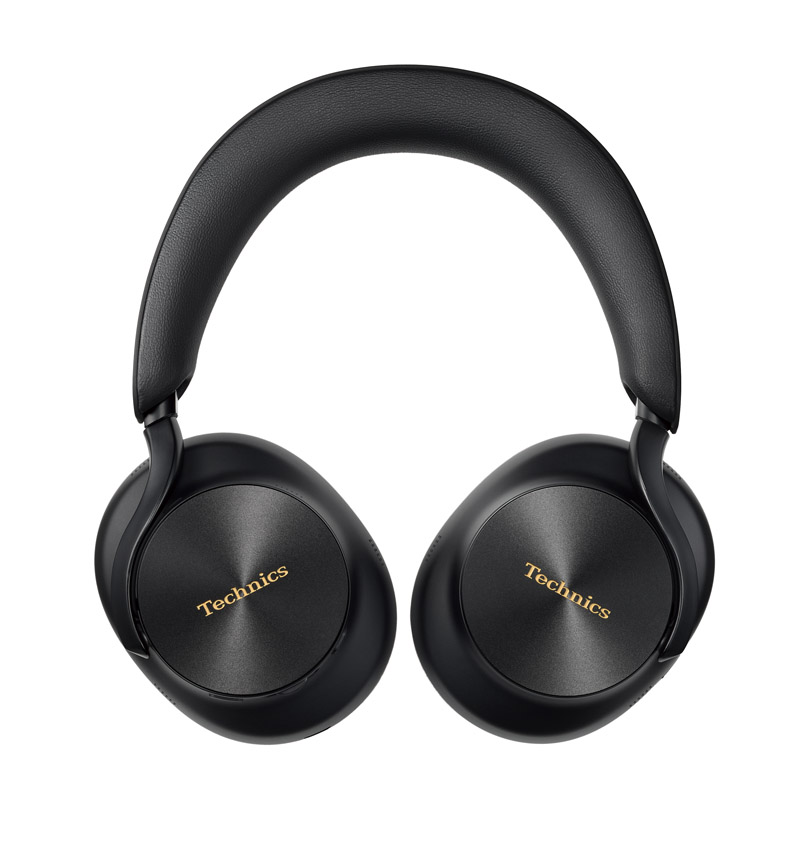
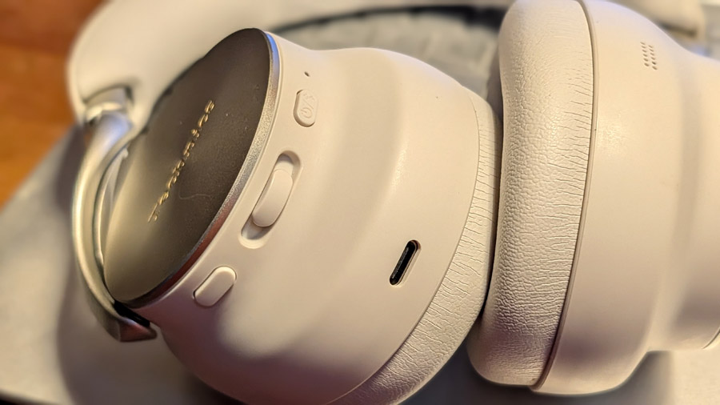
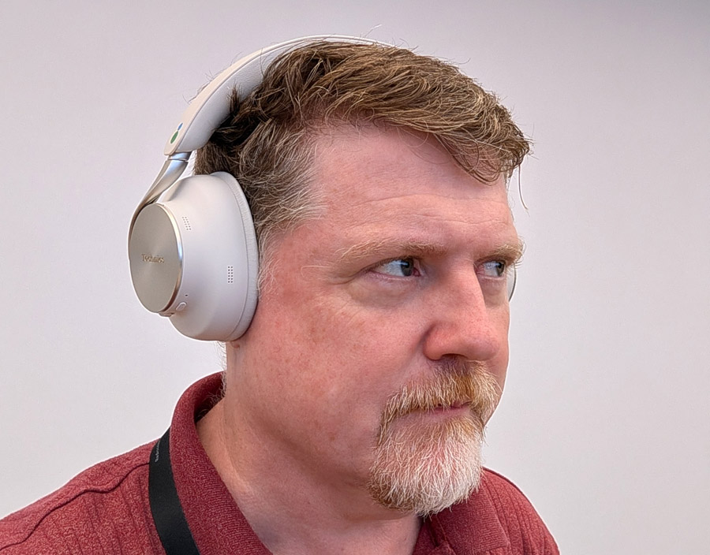

Technics is expanding its high-end audio lineup with the EAH-A1000, a pair of over-ear headphones with active noise cancellation (ANC) that carry the magnetic fluid technology the Japanese brand debuted in its recent earbuds into the over-ear format. The company will put them on sale on October 1, 2026 in two finishes —black and "platinum greige"— at a reference price of $449.

The specialist outlet eCoustics has already published its review of the model and places it as a firm contender in the premium segment, where it will compete head-to-head with the Bose QuietComfort Ultra and the Sony WH-1000XM6. The headphone keeps an aluminum and faux leather design, with foldable earcups and a rigid zippered case for transport.

## Technics brings magnetic fluid to over-ear headphones

The EAH-A1000 debuts a 40 mm carbon fiber driver, a material chosen for its high rigidity and low weight. The key lies in a new formulation of the brand's magnetic fluid, designed to ensure linear excursion of the diaphragm and reduce distortion.

According to Technics, this fluid prevents the "wobble" or tumbling that can appear in conventional drivers and that translates into audible distortion. The technology was born in the company's wired TZ700 in-ear headphones and was later reused in the EAH-AZ100; for the over-ear model, the company has developed a version tailored to the larger size of the new driver. The package is completed by an "SST" (Symmetrical Surround Technology) edge, inherited from the firm's audiophile loudspeakers.

## Up to 90 hours of battery life and Bluetooth 6.0

One of the strengths the review highlights is battery life. With the LDAC codec, the EAH-A1000 offers up to 40 hours of playback with noise cancellation on and up to 80 hours with it off. With AAC, the figures rise to 45 and 90 hours respectively. Connected via USB and without a power source, battery life drops to 30 hours with ANC and 60 without it. A full charge takes around 3.5 hours, and a 15-minute quick charge provides about four hours of use with ANC (using AAC).

On connectivity, the model supports Bluetooth 6.0, including Bluetooth LE with Auracast, the technology that lets a single audio signal be sent to several headphones or speakers at once. Enabling LE, however, means giving up spatial audio and voice assistant features. The headphone can pair with up to three devices simultaneously and switch between them automatically, with the option to set priorities from the app.

The EAH-A1000 has no 3.5 mm jack, but it does include a 3.5 mm to USB-C cable to connect it to in-flight entertainment systems or any analog output. In that case, the signal is converted internally to digital and back to analog before reaching the amplifiers and drivers. The USB-C input also allows lossless or high-resolution audio playback from a compatible phone, tablet or computer. The list of supported codecs includes SBC, AAC, LDAC and LC3.

The adaptive noise cancellation handles both constant sounds —a plane engine or air conditioning— and dynamic ones, such as traffic and voices. Ambient mode, meanwhile, lets some of the outside sound through so the wearer stays aware of their surroundings, and beamforming microphones with AI processing handle call quality. Technics presents the model as "optimized for Dolby Atmos" and offers optional head tracking, useful for virtual reality and gaming.

## An app to adjust sound and features

As is common in the sector, Technics accompanies the headphones with an app for Android and iOS, Technics Audio Connect, which provides access to an eight-band equalizer, lets you adjust the noise-cancellation level, enable spatial audio and set the priority between devices. The app is not essential to use the headphones, but it is the way to enable advanced features.

On the ergonomic side, control comes down to two buttons —one for power and pairing and another to switch between ANC, ambient mode and ANC off— flanking a slider that works as a volume control and track navigation. The ear pads and headband use high-density memory foam; the whole unit weighs about 306 grams and measures 165 × 206 × 88 mm. The review notes one quirk: by default, the headphones stay powered on when removed from the head, even folded in the case, a behavior that can be adjusted from the app.

## What changes for the user

At a reference price of $449, the EAH-A1000 steps squarely into the high end of noise-cancelling over-ear headphones, a field already contested by the Bose QuietComfort Ultra and the Sony WH-1000XM6. In its review, eCoustics closes with a recommendation: it praises the neutral and natural sonic signature, the USB input for high-resolution audio, the battery life and the spatial audio treatment, and flags as weak points a slightly limited volume on some Dolby Atmos tracks, noise cancellation slightly behind that of the Sony XM6 and the default power-on behavior. Technics' move also arrives at a time when platforms such as Qualcomm's Snapdragon Sound Elite Gen 2 are pushing adaptive cancellation and AI into headphones.
