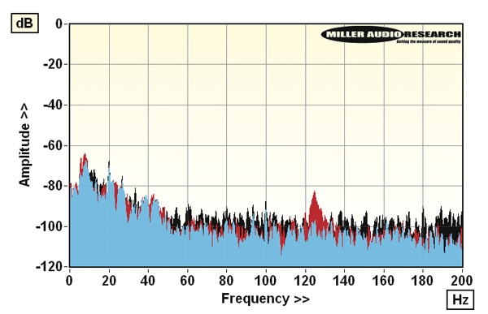

Thorens brought back direct drive with the TD 124 DD, its first deck of this kind in decades, and it now carries that foundation over to the Thorens TD 404 DD, which relies on a very close derivative of the same motor. The US magazine Stereophile has published the bench-test report on this model and its TP 160 tonearm, written by Paul Miller, to check what lies behind its on-paper figures.

## The Thorens TD 404 DD, a direct drive developed with Yahorng

The TD 404 DD's motor comes from Yahorng, one of the two large Taiwanese suppliers in the field, with whom Thorens worked closely on details such as the firmware that manages the 12-pole Hall-effect sensors and the choice of a self-lubricating stainless steel bearing spindle with a Delrin thrust pad.

In practice, the 12-pole, 24 V motor, together with the radial magnet attached to the underside of the 3.8 kg alloy platter, produces enough torque for the platter to reach speed in one or two seconds. The brand's electronic brake also brings it to a stop almost instantly.

## Very stable speed and low bearing rumble

Absolute speed, adjusted with the built-in strobe, is practically spot-on, with a –0.05% error. Low-rate stability is also notable, with a 0.02% peak-weighted wow. Where nuances appear is in the discrete high-rate sidebands, at ±20 Hz, ±27 Hz and ±33 Hz, which add up to a 0.035% peak-weighted flutter.

Those peaks correlate with modes visible on the unweighted rumble spectrum and, in all likelihood, originate in the direct-drive motor itself. Even so, through-spindle rumble stays at –70.0 dB (DIN-B weighted, reference 1 kHz at 5 cm/s), an excellent figure that is competitive with the stainless steel and phosphor-bronze bearing assemblies used by the best belt-drive turntables, despite some extra noise in the 20–45 Hz region.

Through-groove rumble, in practice the most relevant figure, goes even lower, to –72.5 dB, and can be reduced to –73.0 dB — with improved acoustic noise attenuation as well — if the vinyl is gently pressed onto the platter's silicone rubber pads with a lightweight clamp or puck. The CNC-machined alloy platter also has a 5 mm-thick damping ring underneath that makes the whole rotating mass very inert. The pad pattern, Beogram-like in spirit, looks attractive, but it does not support the record across its entire surface and leaves pockets of air beneath.

## The TP 160 tonearm and its resonances

The TP 160 tonearm paired with the platter has an 18 g effective mass, somewhat higher than the TP 150 variant, and delivers a 7–8 Hz arm/cartridge resonance with Thorens's optional TAS 1600 moving-coil pickup. Its J-shaped tube draws on the brand's earlier "TP" models, just as the auto-lift mechanism was seen on previous decks such as the TD 1601; the magnetically stabilized knife-edge bearing and the spring-loaded antiskating, however, are new on the TP 160.

J-shaped arms are, by design, more complex in their bending and torsional modes than straight tubes, and the decay waterfall reflects this. The main bending mode sits around 120 Hz, with lower-Q resonances at 170 Hz and 230 Hz and a sharper break at 310 Hz. The short-lived high-Q mode at 1.3 kHz had already been detected on other turntables using Thorens's auto-lift system, although the TP 160's overall pattern of resonances is less cluttered than that of other J-shaped designs tested.

## What it means for the buyer

It is worth remembering that this report is a measurements sidebar: it includes no listening impressions, only laboratory data on speed, rumble and resonances. Even so, those numbers are precisely what set the foundations of a turntable, because stable speed and a low noise floor determine how much detail actually reaches the stylus.

For anyone who values analog high fidelity, the TD 404 DD leaves two things clear: –70 dB of rumble is a solid figure even against high-end belt-drive turntables, and the small step of pressing the vinyl with a lightweight clamp can slightly improve the result. On the tonearm side, an 18 g effective mass and a 7–8 Hz resonance with the TAS 1600 serve as a guide when matching the right cartridge.
